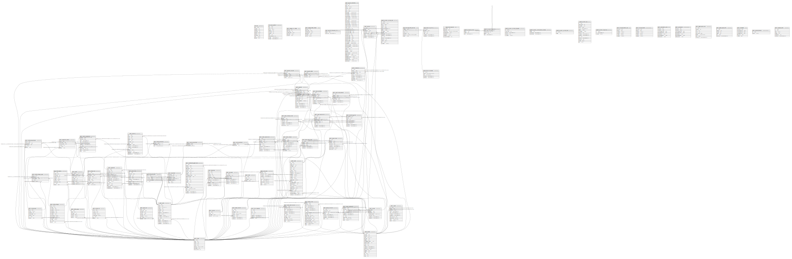

# olymp

## Tables

| Name | Columns | Comment | Type |
| ---- | ------- | ------- | ---- |
| [cron.job](cron.job.md) | 9 |  | BASE TABLE |
| [cron.job_run_details](cron.job_run_details.md) | 10 |  | BASE TABLE |
| [public.hypopg_list_indexes](public.hypopg_list_indexes.md) | 5 |  | VIEW |
| [public.hypopg_hidden_indexes](public.hypopg_hidden_indexes.md) | 6 |  | VIEW |
| [public.pg_stat_statements_info](public.pg_stat_statements_info.md) | 2 |  | VIEW |
| [public.pg_stat_statements](public.pg_stat_statements.md) | 43 |  | VIEW |
| [public.event_lesson_demand](public.event_lesson_demand.md) | 7 | @omit create,update,delete @simpleCollections only | BASE TABLE |
| [public.event_instance](public.event_instance.md) | 10 | @omit create,delete @simpleCollections only | BASE TABLE |
| [public.event_registration](public.event_registration.md) | 9 | @omit update @simpleCollections both | BASE TABLE |
| [public.payment](public.payment.md) | 15 | @omit create @simpleCollections only | BASE TABLE |
| [public.transaction](public.transaction.md) | 9 | @omit create,update,delete | BASE TABLE |
| [public.users](public.users.md) | 15 | @omit create,update,delete | BASE TABLE |
| [graphile_worker._private_jobs](graphile_worker._private_jobs.md) | 17 |  | BASE TABLE |
| [public.account](public.account.md) | 7 | @omit create,update,delete @simpleCollections only | BASE TABLE |
| [public.posting](public.posting.md) | 8 | @omit create,update,delete @simpleCollections only | BASE TABLE |
| [public.upozorneni](public.upozorneni.md) | 15 |  | BASE TABLE |
| [public.attachment](public.attachment.md) | 7 | @omit update | BASE TABLE |
| [public.person](public.person.md) | 18 | @omit create | BASE TABLE |
| [public.couple](public.couple.md) | 11 | @simpleCollections only | BASE TABLE |
| [public.event](public.event.md) | 25 | @omit create | BASE TABLE |
| [public.event_target_cohort](public.event_target_cohort.md) | 6 | @omit create,update,delete @simpleCollections only | BASE TABLE |
| [public.event_trainer](public.event_trainer.md) | 8 | @omit create,update,delete @simpleCollections only | BASE TABLE |
| [public.cohort_subscription](public.cohort_subscription.md) | 10 | @omit create,update,delete @simpleCollections only | BASE TABLE |
| [public.event_instance_trainer](public.event_instance_trainer.md) | 7 | @omit create,update,delete @simpleCollections only | BASE TABLE |
| [public.tenant](public.tenant.md) | 8 | @omit create,delete @simpleCollections only | BASE TABLE |
| [public.payment_debtor](public.payment_debtor.md) | 4 | @omit create,update,delete @simpleCollections only | BASE TABLE |
| [public.payment_recipient](public.payment_recipient.md) | 5 | @omit create,update,delete @simpleCollections only | BASE TABLE |
| [public.event_attendance](public.event_attendance.md) | 9 | @omit create,update,delete @simpleCollections only | BASE TABLE |
| [public.membership_application](public.membership_application.md) | 22 | @simpleCollections only | BASE TABLE |
| [public.tenant_membership](public.tenant_membership.md) | 10 | @simpleCollections only | BASE TABLE |
| [app_private.app_table_overview](app_private.app_table_overview.md) | 6 |  | VIEW |
| [app_private.crm_activity](app_private.crm_activity.md) | 6 | @omit delete | BASE TABLE |
| [app_private.crm_prospect](app_private.crm_prospect.md) | 5 | @omit create | BASE TABLE |
| [app_private.meta_fks](app_private.meta_fks.md) | 7 |  | VIEW |
| [app_private.pary_navrh](app_private.pary_navrh.md) | 5 | @omit create,update,delete | BASE TABLE |
| [app_private.skupiny](app_private.skupiny.md) | 10 |  | BASE TABLE |
| [graphile_migrate.current](graphile_migrate.current.md) | 3 |  | BASE TABLE |
| [graphile_migrate.migrations](graphile_migrate.migrations.md) | 4 |  | BASE TABLE |
| [graphile_worker._private_job_queues](graphile_worker._private_job_queues.md) | 5 |  | BASE TABLE |
| [graphile_worker._private_known_crontabs](graphile_worker._private_known_crontabs.md) | 3 |  | BASE TABLE |
| [graphile_worker._private_tasks](graphile_worker._private_tasks.md) | 2 |  | BASE TABLE |
| [graphile_worker.jobs](graphile_worker.jobs.md) | 15 |  | VIEW |
| [graphile_worker.migrations](graphile_worker.migrations.md) | 3 |  | BASE TABLE |
| [public.accounting_period](public.accounting_period.md) | 8 | @omit  | BASE TABLE |
| [public.aktuality](public.aktuality.md) | 15 |  | BASE TABLE |
| [public.tenant_administrator](public.tenant_administrator.md) | 12 | @simpleCollections only | BASE TABLE |
| [public.tenant_trainer](public.tenant_trainer.md) | 17 | @simpleCollections only | BASE TABLE |
| [public.allowed_tenants_view](public.allowed_tenants_view.md) | 6 | @omit | VIEW |
| [public.allowed_tenants](public.allowed_tenants.md) | 6 | @omit | MATERIALIZED VIEW |
| [public.cohort_membership](public.cohort_membership.md) | 11 | @simpleCollections only | BASE TABLE |
| [public.auth_details_view](public.auth_details_view.md) | 7 | @omit | VIEW |
| [public.auth_details](public.auth_details.md) | 7 | @omit | MATERIALIZED VIEW |
| [public.cohort](public.cohort.md) | 9 | @simpleCollections only | BASE TABLE |
| [public.cohort_group](public.cohort_group.md) | 6 |  | BASE TABLE |
| [public.dokumenty](public.dokumenty.md) | 11 | @simpleCollections only | BASE TABLE |
| [public.form_responses](public.form_responses.md) | 7 | @omit update,delete | BASE TABLE |
| [public.galerie_dir](public.galerie_dir.md) | 8 | @omit create,update,delete | BASE TABLE |
| [public.galerie_foto](public.galerie_foto.md) | 10 | @omit create,update,delete | BASE TABLE |
| [public.location](public.location.md) | 4 |  | BASE TABLE |
| [public.location_attachment](public.location_attachment.md) | 2 | @omit create,update,delete | BASE TABLE |
| [public.otp_token](public.otp_token.md) | 8 | @omit | BASE TABLE |
| [public.person_invitation](public.person_invitation.md) | 8 | @omit update @simpleCollections only | BASE TABLE |
| [public.pghero_query_stats](public.pghero_query_stats.md) | 8 | @omit | BASE TABLE |
| [public.pghero_space_stats](public.pghero_space_stats.md) | 6 | @omit | BASE TABLE |
| [public.platby_category](public.platby_category.md) | 13 | @omit create,update,delete | BASE TABLE |
| [public.platby_category_group](public.platby_category_group.md) | 5 | @omit | BASE TABLE |
| [public.platby_group](public.platby_group.md) | 7 | @omit | BASE TABLE |
| [public.platby_group_skupina](public.platby_group_skupina.md) | 5 | @omit | BASE TABLE |
| [public.platby_item](public.platby_item.md) | 10 | @omit create,update,delete | BASE TABLE |
| [public.platby_raw](public.platby_raw.md) | 7 | @omit | BASE TABLE |
| [public.room](public.room.md) | 4 |  | BASE TABLE |
| [public.room_attachment](public.room_attachment.md) | 2 | @omit create,update,delete | BASE TABLE |
| [public.scoreboard](public.scoreboard.md) | 6 | @foreignKey (person_id) references person (id) @simpleCollections only | VIEW |
| [public.tenant_attachment](public.tenant_attachment.md) | 3 | @omit create,update,delete | BASE TABLE |
| [public.tenant_location](public.tenant_location.md) | 8 | @simpleCollections only | BASE TABLE |
| [public.upozorneni_skupiny](public.upozorneni_skupiny.md) | 6 | @omit create,update,delete | BASE TABLE |
| [public.user_proxy](public.user_proxy.md) | 10 | @simpleCollections only | BASE TABLE |
| [public.account_balances](public.account_balances.md) | 2 | @omit | MATERIALIZED VIEW |
| [public.http_cache](public.http_cache.md) | 3 | @omit | BASE TABLE |

## Stored procedures and functions

| Name | ReturnType | Arguments | Type |
| ---- | ------- | ------- | ---- |
| postgraphile_watch.notify_watchers_ddl | event_trigger |  | FUNCTION |
| postgraphile_watch.notify_watchers_drop | event_trigger |  | FUNCTION |
| public.create_credit_transaction_for_person | transaction | v_person_id bigint, v_description text, v_amount numeric, v_currency text, v_date timestamp with time zone DEFAULT now() | FUNCTION |
| public.event_trainer_name | text | t event_trainer | FUNCTION |
| cron.schedule | int8 | schedule text, command text | FUNCTION |
| cron.unschedule | bool | job_id bigint | FUNCTION |
| cron.job_cache_invalidate | trigger |  | FUNCTION |
| cron.schedule | int8 | job_name text, schedule text, command text | FUNCTION |
| cron.alter_job | void | job_id bigint, schedule text DEFAULT NULL::text, command text DEFAULT NULL::text, database text DEFAULT NULL::text, username text DEFAULT NULL::text, active boolean DEFAULT NULL::boolean | FUNCTION |
| cron.schedule_in_database | int8 | job_name text, schedule text, command text, database text, username text DEFAULT NULL::text, active boolean DEFAULT true | FUNCTION |
| cron.unschedule | bool | job_name text | FUNCTION |
| public.gbt_enum_picksplit | internal | internal, internal | FUNCTION |
| public.gbt_enum_union | gbtreekey8 | internal, internal | FUNCTION |
| public.gbt_enum_same | internal | gbtreekey8, gbtreekey8, internal | FUNCTION |
| public.gbtreekey4_in | gbtreekey4 | cstring | FUNCTION |
| public.gbtreekey4_out | cstring | gbtreekey4 | FUNCTION |
| public.gbtreekey8_in | gbtreekey8 | cstring | FUNCTION |
| public.gbtreekey8_out | cstring | gbtreekey8 | FUNCTION |
| public.gbtreekey16_in | gbtreekey16 | cstring | FUNCTION |
| public.gbtreekey16_out | cstring | gbtreekey16 | FUNCTION |
| public.gbtreekey32_in | gbtreekey32 | cstring | FUNCTION |
| public.gbtreekey32_out | cstring | gbtreekey32 | FUNCTION |
| public.gbtreekey_var_in | gbtreekey_var | cstring | FUNCTION |
| public.gbtreekey_var_out | cstring | gbtreekey_var | FUNCTION |
| public.cash_dist | money | money, money | FUNCTION |
| public.date_dist | int4 | date, date | FUNCTION |
| public.float4_dist | float4 | real, real | FUNCTION |
| app_private.tg_http_cache__prune_expired | trigger |  | FUNCTION |
| public.float8_dist | float8 | double precision, double precision | FUNCTION |
| public.int2_dist | int2 | smallint, smallint | FUNCTION |
| public.int4_dist | int4 | integer, integer | FUNCTION |
| public.int8_dist | int8 | bigint, bigint | FUNCTION |
| public.interval_dist | interval | interval, interval | FUNCTION |
| public.oid_dist | oid | oid, oid | FUNCTION |
| public.time_dist | interval | time without time zone, time without time zone | FUNCTION |
| public.ts_dist | interval | timestamp without time zone, timestamp without time zone | FUNCTION |
| public.tstz_dist | interval | timestamp with time zone, timestamp with time zone | FUNCTION |
| public.gbt_oid_consistent | bool | internal, oid, smallint, oid, internal | FUNCTION |
| public.gbt_oid_distance | float8 | internal, oid, smallint, oid, internal | FUNCTION |
| public.gbt_oid_fetch | internal | internal | FUNCTION |
| public.gbt_oid_compress | internal | internal | FUNCTION |
| public.gbt_decompress | internal | internal | FUNCTION |
| public.gbt_var_decompress | internal | internal | FUNCTION |
| public.gbt_var_fetch | internal | internal | FUNCTION |
| public.gbt_oid_penalty | internal | internal, internal, internal | FUNCTION |
| public.gbt_oid_picksplit | internal | internal, internal | FUNCTION |
| public.gbt_oid_union | gbtreekey8 | internal, internal | FUNCTION |
| public.gbt_oid_same | internal | gbtreekey8, gbtreekey8, internal | FUNCTION |
| public.gbt_int2_consistent | bool | internal, smallint, smallint, oid, internal | FUNCTION |
| public.gbt_int2_distance | float8 | internal, smallint, smallint, oid, internal | FUNCTION |
| public.gbt_int2_compress | internal | internal | FUNCTION |
| public.gbt_int2_fetch | internal | internal | FUNCTION |
| public.gbt_int2_penalty | internal | internal, internal, internal | FUNCTION |
| public.gbt_int2_picksplit | internal | internal, internal | FUNCTION |
| public.gbt_int2_union | gbtreekey4 | internal, internal | FUNCTION |
| public.gbt_int2_same | internal | gbtreekey4, gbtreekey4, internal | FUNCTION |
| public.gbt_int4_consistent | bool | internal, integer, smallint, oid, internal | FUNCTION |
| public.gbt_int4_distance | float8 | internal, integer, smallint, oid, internal | FUNCTION |
| public.gbt_int4_compress | internal | internal | FUNCTION |
| public.gbt_int4_fetch | internal | internal | FUNCTION |
| public.gbt_int4_penalty | internal | internal, internal, internal | FUNCTION |
| public.gbt_int4_picksplit | internal | internal, internal | FUNCTION |
| public.gbt_int4_union | gbtreekey8 | internal, internal | FUNCTION |
| public.gbt_int4_same | internal | gbtreekey8, gbtreekey8, internal | FUNCTION |
| public.gbt_int8_consistent | bool | internal, bigint, smallint, oid, internal | FUNCTION |
| public.gbt_int8_distance | float8 | internal, bigint, smallint, oid, internal | FUNCTION |
| public.gbt_int8_compress | internal | internal | FUNCTION |
| public.gbt_int8_fetch | internal | internal | FUNCTION |
| public.gbt_int8_penalty | internal | internal, internal, internal | FUNCTION |
| public.gbt_int8_picksplit | internal | internal, internal | FUNCTION |
| public.gbt_int8_union | gbtreekey16 | internal, internal | FUNCTION |
| public.gbt_int8_same | internal | gbtreekey16, gbtreekey16, internal | FUNCTION |
| public.gbt_float4_consistent | bool | internal, real, smallint, oid, internal | FUNCTION |
| public.gbt_float4_distance | float8 | internal, real, smallint, oid, internal | FUNCTION |
| public.gbt_float4_compress | internal | internal | FUNCTION |
| public.gbt_float4_fetch | internal | internal | FUNCTION |
| public.gbt_float4_penalty | internal | internal, internal, internal | FUNCTION |
| public.gbt_float4_picksplit | internal | internal, internal | FUNCTION |
| public.gbt_float4_union | gbtreekey8 | internal, internal | FUNCTION |
| public.gbt_float4_same | internal | gbtreekey8, gbtreekey8, internal | FUNCTION |
| public.gbt_float8_consistent | bool | internal, double precision, smallint, oid, internal | FUNCTION |
| public.gbt_float8_distance | float8 | internal, double precision, smallint, oid, internal | FUNCTION |
| public.gbt_float8_compress | internal | internal | FUNCTION |
| public.gbt_float8_fetch | internal | internal | FUNCTION |
| public.gbt_float8_penalty | internal | internal, internal, internal | FUNCTION |
| public.gbt_float8_picksplit | internal | internal, internal | FUNCTION |
| public.gbt_float8_union | gbtreekey16 | internal, internal | FUNCTION |
| public.gbt_float8_same | internal | gbtreekey16, gbtreekey16, internal | FUNCTION |
| public.gbt_ts_consistent | bool | internal, timestamp without time zone, smallint, oid, internal | FUNCTION |
| public.gbt_ts_distance | float8 | internal, timestamp without time zone, smallint, oid, internal | FUNCTION |
| public.gbt_tstz_consistent | bool | internal, timestamp with time zone, smallint, oid, internal | FUNCTION |
| public.gbt_tstz_distance | float8 | internal, timestamp with time zone, smallint, oid, internal | FUNCTION |
| public.gbt_ts_compress | internal | internal | FUNCTION |
| public.gbt_tstz_compress | internal | internal | FUNCTION |
| public.gbt_ts_fetch | internal | internal | FUNCTION |
| public.gbt_ts_penalty | internal | internal, internal, internal | FUNCTION |
| public.gbt_ts_picksplit | internal | internal, internal | FUNCTION |
| public.gbt_ts_union | gbtreekey16 | internal, internal | FUNCTION |
| public.gbt_ts_same | internal | gbtreekey16, gbtreekey16, internal | FUNCTION |
| public.gbt_time_consistent | bool | internal, time without time zone, smallint, oid, internal | FUNCTION |
| public.gbt_time_distance | float8 | internal, time without time zone, smallint, oid, internal | FUNCTION |
| public.gbt_timetz_consistent | bool | internal, time with time zone, smallint, oid, internal | FUNCTION |
| public.gbt_time_compress | internal | internal | FUNCTION |
| public.gbt_timetz_compress | internal | internal | FUNCTION |
| public.gbt_time_fetch | internal | internal | FUNCTION |
| public.gbt_time_penalty | internal | internal, internal, internal | FUNCTION |
| public.gbt_time_picksplit | internal | internal, internal | FUNCTION |
| public.gbt_time_union | gbtreekey16 | internal, internal | FUNCTION |
| public.gbt_time_same | internal | gbtreekey16, gbtreekey16, internal | FUNCTION |
| public.gbt_date_consistent | bool | internal, date, smallint, oid, internal | FUNCTION |
| public.gbt_date_distance | float8 | internal, date, smallint, oid, internal | FUNCTION |
| public.gbt_date_compress | internal | internal | FUNCTION |
| public.gbt_date_fetch | internal | internal | FUNCTION |
| public.gbt_date_penalty | internal | internal, internal, internal | FUNCTION |
| public.gbt_date_picksplit | internal | internal, internal | FUNCTION |
| public.gbt_date_union | gbtreekey8 | internal, internal | FUNCTION |
| public.gbt_date_same | internal | gbtreekey8, gbtreekey8, internal | FUNCTION |
| public.gbt_intv_consistent | bool | internal, interval, smallint, oid, internal | FUNCTION |
| public.gbt_intv_distance | float8 | internal, interval, smallint, oid, internal | FUNCTION |
| public.gbt_intv_compress | internal | internal | FUNCTION |
| public.gbt_intv_decompress | internal | internal | FUNCTION |
| public.gbt_intv_fetch | internal | internal | FUNCTION |
| public.gbt_intv_penalty | internal | internal, internal, internal | FUNCTION |
| public.gbt_intv_picksplit | internal | internal, internal | FUNCTION |
| public.gbt_intv_union | gbtreekey32 | internal, internal | FUNCTION |
| public.gbt_intv_same | internal | gbtreekey32, gbtreekey32, internal | FUNCTION |
| public.gbt_cash_consistent | bool | internal, money, smallint, oid, internal | FUNCTION |
| public.gbt_cash_distance | float8 | internal, money, smallint, oid, internal | FUNCTION |
| public.gbt_cash_compress | internal | internal | FUNCTION |
| public.gbt_cash_fetch | internal | internal | FUNCTION |
| public.gbt_cash_penalty | internal | internal, internal, internal | FUNCTION |
| public.gbt_cash_picksplit | internal | internal, internal | FUNCTION |
| public.gbt_cash_union | gbtreekey16 | internal, internal | FUNCTION |
| public.gbt_cash_same | internal | gbtreekey16, gbtreekey16, internal | FUNCTION |
| public.gbt_macad_consistent | bool | internal, macaddr, smallint, oid, internal | FUNCTION |
| public.gbt_macad_compress | internal | internal | FUNCTION |
| public.gbt_macad_fetch | internal | internal | FUNCTION |
| public.gbt_macad_penalty | internal | internal, internal, internal | FUNCTION |
| public.gbt_macad_picksplit | internal | internal, internal | FUNCTION |
| public.gbt_macad_union | gbtreekey16 | internal, internal | FUNCTION |
| public.gbt_macad_same | internal | gbtreekey16, gbtreekey16, internal | FUNCTION |
| public.gbt_text_consistent | bool | internal, text, smallint, oid, internal | FUNCTION |
| public.gbt_bpchar_consistent | bool | internal, character, smallint, oid, internal | FUNCTION |
| public.gbt_text_compress | internal | internal | FUNCTION |
| public.gbt_bpchar_compress | internal | internal | FUNCTION |
| public.gbt_text_penalty | internal | internal, internal, internal | FUNCTION |
| public.gbt_text_picksplit | internal | internal, internal | FUNCTION |
| public.gbt_text_union | gbtreekey_var | internal, internal | FUNCTION |
| public.gbt_text_same | internal | gbtreekey_var, gbtreekey_var, internal | FUNCTION |
| public.gbt_bytea_consistent | bool | internal, bytea, smallint, oid, internal | FUNCTION |
| public.gbt_bytea_compress | internal | internal | FUNCTION |
| public.gbt_bytea_penalty | internal | internal, internal, internal | FUNCTION |
| public.gbt_bytea_picksplit | internal | internal, internal | FUNCTION |
| public.gbt_bytea_union | gbtreekey_var | internal, internal | FUNCTION |
| public.gbt_bytea_same | internal | gbtreekey_var, gbtreekey_var, internal | FUNCTION |
| public.gbt_numeric_consistent | bool | internal, numeric, smallint, oid, internal | FUNCTION |
| public.gbt_numeric_compress | internal | internal | FUNCTION |
| public.gbt_numeric_penalty | internal | internal, internal, internal | FUNCTION |
| public.gbt_numeric_picksplit | internal | internal, internal | FUNCTION |
| public.gbt_numeric_union | gbtreekey_var | internal, internal | FUNCTION |
| public.gbt_numeric_same | internal | gbtreekey_var, gbtreekey_var, internal | FUNCTION |
| public.gbt_bit_consistent | bool | internal, bit, smallint, oid, internal | FUNCTION |
| public.gbt_bit_compress | internal | internal | FUNCTION |
| public.gbt_bit_penalty | internal | internal, internal, internal | FUNCTION |
| public.gbt_bit_picksplit | internal | internal, internal | FUNCTION |
| public.gbt_bit_union | gbtreekey_var | internal, internal | FUNCTION |
| public.gbt_bit_same | internal | gbtreekey_var, gbtreekey_var, internal | FUNCTION |
| public.gbt_inet_consistent | bool | internal, inet, smallint, oid, internal | FUNCTION |
| public.gbt_inet_compress | internal | internal | FUNCTION |
| public.gbt_inet_penalty | internal | internal, internal, internal | FUNCTION |
| public.gbt_inet_picksplit | internal | internal, internal | FUNCTION |
| public.gbt_inet_union | gbtreekey16 | internal, internal | FUNCTION |
| public.gbt_inet_same | internal | gbtreekey16, gbtreekey16, internal | FUNCTION |
| public.gbt_uuid_consistent | bool | internal, uuid, smallint, oid, internal | FUNCTION |
| public.gbt_uuid_fetch | internal | internal | FUNCTION |
| public.gbt_uuid_compress | internal | internal | FUNCTION |
| public.gbt_uuid_penalty | internal | internal, internal, internal | FUNCTION |
| public.gbt_uuid_picksplit | internal | internal, internal | FUNCTION |
| public.gbt_uuid_union | gbtreekey32 | internal, internal | FUNCTION |
| public.gbt_uuid_same | internal | gbtreekey32, gbtreekey32, internal | FUNCTION |
| public.gbt_macad8_consistent | bool | internal, macaddr8, smallint, oid, internal | FUNCTION |
| public.gbt_macad8_compress | internal | internal | FUNCTION |
| public.gbt_macad8_fetch | internal | internal | FUNCTION |
| public.gbt_macad8_penalty | internal | internal, internal, internal | FUNCTION |
| public.gbt_macad8_picksplit | internal | internal, internal | FUNCTION |
| public.gbt_macad8_union | gbtreekey16 | internal, internal | FUNCTION |
| public.gbt_macad8_same | internal | gbtreekey16, gbtreekey16, internal | FUNCTION |
| public.gbt_enum_consistent | bool | internal, anyenum, smallint, oid, internal | FUNCTION |
| public.gbt_enum_compress | internal | internal | FUNCTION |
| public.gbt_enum_fetch | internal | internal | FUNCTION |
| public.gbt_enum_penalty | internal | internal, internal, internal | FUNCTION |
| public.gbtreekey2_in | gbtreekey2 | cstring | FUNCTION |
| public.gbtreekey2_out | cstring | gbtreekey2 | FUNCTION |
| public.gbt_bool_consistent | bool | internal, boolean, smallint, oid, internal | FUNCTION |
| public.gbt_bool_compress | internal | internal | FUNCTION |
| public.gbt_bool_fetch | internal | internal | FUNCTION |
| public.gbt_bool_penalty | internal | internal, internal, internal | FUNCTION |
| public.gbt_bool_picksplit | internal | internal, internal | FUNCTION |
| public.gbt_bool_union | gbtreekey2 | internal, internal | FUNCTION |
| public.gbt_bool_same | internal | gbtreekey2, gbtreekey2, internal | FUNCTION |
| public.hypopg_reset_index | void |  | FUNCTION |
| public.hypopg_reset | void |  | FUNCTION |
| public.hypopg_create_index | record | sql_order text, OUT indexrelid oid, OUT indexname text | FUNCTION |
| public.hypopg_drop_index | bool | indexid oid | FUNCTION |
| public.hypopg | record | OUT indexname text, OUT indexrelid oid, OUT indrelid oid, OUT innatts integer, OUT indisunique boolean, OUT indkey int2vector, OUT indcollation oidvector, OUT indclass oidvector, OUT indoption oidvector, OUT indexprs pg_node_tree, OUT indpred pg_node_tree, OUT amid oid | FUNCTION |
| public.hypopg_relation_size | int8 | indexid oid | FUNCTION |
| public.hypopg_get_indexdef | text | indexid oid | FUNCTION |
| public.hypopg_hide_index | bool | indexid oid | FUNCTION |
| public.hypopg_unhide_index | bool | indexid oid | FUNCTION |
| public.hypopg_unhide_all_indexes | void |  | FUNCTION |
| public.hypopg_hidden_indexes | oid |  | FUNCTION |
| public.pg_stat_statements_reset | void | userid oid DEFAULT 0, dbid oid DEFAULT 0, queryid bigint DEFAULT 0 | FUNCTION |
| public.pg_stat_statements_info | record | OUT dealloc bigint, OUT stats_reset timestamp with time zone | FUNCTION |
| public.pg_stat_statements | record | showtext boolean, OUT userid oid, OUT dbid oid, OUT toplevel boolean, OUT queryid bigint, OUT query text, OUT plans bigint, OUT total_plan_time double precision, OUT min_plan_time double precision, OUT max_plan_time double precision, OUT mean_plan_time double precision, OUT stddev_plan_time double precision, OUT calls bigint, OUT total_exec_time double precision, OUT min_exec_time double precision, OUT max_exec_time double precision, OUT mean_exec_time double precision, OUT stddev_exec_time double precision, OUT rows bigint, OUT shared_blks_hit bigint, OUT shared_blks_read bigint, OUT shared_blks_dirtied bigint, OUT shared_blks_written bigint, OUT local_blks_hit bigint, OUT local_blks_read bigint, OUT local_blks_dirtied bigint, OUT local_blks_written bigint, OUT temp_blks_read bigint, OUT temp_blks_written bigint, OUT blk_read_time double precision, OUT blk_write_time double precision, OUT temp_blk_read_time double precision, OUT temp_blk_write_time double precision, OUT wal_records bigint, OUT wal_fpi bigint, OUT wal_bytes numeric, OUT jit_functions bigint, OUT jit_generation_time double precision, OUT jit_inlining_count bigint, OUT jit_inlining_time double precision, OUT jit_optimization_count bigint, OUT jit_optimization_time double precision, OUT jit_emission_count bigint, OUT jit_emission_time double precision | FUNCTION |
| public.hmac | bytea | text, text, text | FUNCTION |
| public.hmac | bytea | bytea, bytea, text | FUNCTION |
| public.crypt | text | text, text | FUNCTION |
| public.gen_salt | text | text | FUNCTION |
| public.gen_salt | text | text, integer | FUNCTION |
| public.encrypt | bytea | bytea, bytea, text | FUNCTION |
| public.decrypt | bytea | bytea, bytea, text | FUNCTION |
| public.encrypt_iv | bytea | bytea, bytea, bytea, text | FUNCTION |
| public.decrypt_iv | bytea | bytea, bytea, bytea, text | FUNCTION |
| public.gen_random_bytes | bytea | integer | FUNCTION |
| public.gen_random_uuid | uuid |  | FUNCTION |
| public.pgp_sym_encrypt | bytea | text, text | FUNCTION |
| public.pgp_sym_encrypt_bytea | bytea | bytea, text | FUNCTION |
| public.pgp_sym_encrypt | bytea | text, text, text | FUNCTION |
| public.pgp_sym_encrypt_bytea | bytea | bytea, text, text | FUNCTION |
| public.pgp_sym_decrypt | text | bytea, text | FUNCTION |
| public.pgp_sym_decrypt_bytea | bytea | bytea, text | FUNCTION |
| public.pgp_sym_decrypt | text | bytea, text, text | FUNCTION |
| public.pgp_sym_decrypt_bytea | bytea | bytea, text, text | FUNCTION |
| public.pgp_pub_encrypt | bytea | text, bytea | FUNCTION |
| public.pgp_pub_encrypt_bytea | bytea | bytea, bytea | FUNCTION |
| public.pgp_pub_encrypt | bytea | text, bytea, text | FUNCTION |
| public.pgp_pub_encrypt_bytea | bytea | bytea, bytea, text | FUNCTION |
| public.pgp_pub_decrypt | text | bytea, bytea | FUNCTION |
| public.digest | bytea | text, text | FUNCTION |
| public.pgp_pub_decrypt_bytea | bytea | bytea, bytea | FUNCTION |
| public.pgp_pub_decrypt | text | bytea, bytea, text | FUNCTION |
| public.pgp_pub_decrypt_bytea | bytea | bytea, bytea, text | FUNCTION |
| public.pgp_pub_decrypt | text | bytea, bytea, text, text | FUNCTION |
| public.pgp_pub_decrypt_bytea | bytea | bytea, bytea, text, text | FUNCTION |
| public.pgp_key_id | text | bytea | FUNCTION |
| public.armor | text | bytea | FUNCTION |
| public.armor | text | bytea, text[], text[] | FUNCTION |
| public.dearmor | bytea | text | FUNCTION |
| public.pgp_armor_headers | record | text, OUT key text, OUT value text | FUNCTION |
| public.plpgsql_check_function_tb | record | funcoid regprocedure, relid regclass DEFAULT 0, fatal_errors boolean DEFAULT true, other_warnings boolean DEFAULT true, performance_warnings boolean DEFAULT false, extra_warnings boolean DEFAULT true, security_warnings boolean DEFAULT false, compatibility_warnings boolean DEFAULT false, oldtable name DEFAULT NULL::name, newtable name DEFAULT NULL::name, anyelememttype regtype DEFAULT 'integer'::regtype, anyenumtype regtype DEFAULT '-'::regtype, anyrangetype regtype DEFAULT 'int4range'::regtype, anycompatibletype regtype DEFAULT 'integer'::regtype, anycompatiblerangetype regtype DEFAULT 'int4range'::regtype, without_warnings boolean DEFAULT false, all_warnings boolean DEFAULT false, use_incomment_options boolean DEFAULT true, incomment_options_usage_warning boolean DEFAULT false, constant_tracing boolean DEFAULT true | FUNCTION |
| public.plpgsql_check_function | text | funcoid regprocedure, relid regclass DEFAULT 0, format text DEFAULT 'text'::text, fatal_errors boolean DEFAULT true, other_warnings boolean DEFAULT true, performance_warnings boolean DEFAULT false, extra_warnings boolean DEFAULT true, security_warnings boolean DEFAULT false, compatibility_warnings boolean DEFAULT false, oldtable name DEFAULT NULL::name, newtable name DEFAULT NULL::name, anyelememttype regtype DEFAULT 'integer'::regtype, anyenumtype regtype DEFAULT '-'::regtype, anyrangetype regtype DEFAULT 'int4range'::regtype, anycompatibletype regtype DEFAULT 'integer'::regtype, anycompatiblerangetype regtype DEFAULT 'int4range'::regtype, without_warnings boolean DEFAULT false, all_warnings boolean DEFAULT false, use_incomment_options boolean DEFAULT true, incomment_options_usage_warning boolean DEFAULT false, constant_tracing boolean DEFAULT true | FUNCTION |
| public.plpgsql_check_function_tb | record | name text, relid regclass DEFAULT 0, fatal_errors boolean DEFAULT true, other_warnings boolean DEFAULT true, performance_warnings boolean DEFAULT false, extra_warnings boolean DEFAULT true, security_warnings boolean DEFAULT false, compatibility_warnings boolean DEFAULT false, oldtable name DEFAULT NULL::name, newtable name DEFAULT NULL::name, anyelememttype regtype DEFAULT 'integer'::regtype, anyenumtype regtype DEFAULT '-'::regtype, anyrangetype regtype DEFAULT 'int4range'::regtype, anycompatibletype regtype DEFAULT 'integer'::regtype, anycompatiblerangetype regtype DEFAULT 'int4range'::regtype, without_warnings boolean DEFAULT false, all_warnings boolean DEFAULT false, use_incomment_options boolean DEFAULT true, incomment_options_usage_warning boolean DEFAULT false, constant_tracing boolean DEFAULT true | FUNCTION |
| public.plpgsql_check_function | text | name text, relid regclass DEFAULT 0, format text DEFAULT 'text'::text, fatal_errors boolean DEFAULT true, other_warnings boolean DEFAULT true, performance_warnings boolean DEFAULT false, extra_warnings boolean DEFAULT true, security_warnings boolean DEFAULT false, compatibility_warnings boolean DEFAULT false, oldtable name DEFAULT NULL::name, newtable name DEFAULT NULL::name, anyelememttype regtype DEFAULT 'integer'::regtype, anyenumtype regtype DEFAULT '-'::regtype, anyrangetype regtype DEFAULT 'int4range'::regtype, anycompatibletype regtype DEFAULT 'integer'::regtype, anycompatiblerangetype regtype DEFAULT 'int4range'::regtype, without_warnings boolean DEFAULT false, all_warnings boolean DEFAULT false, use_incomment_options boolean DEFAULT true, incomment_options_usage_warning boolean DEFAULT false, constant_tracing boolean DEFAULT true | FUNCTION |
| public.__plpgsql_show_dependency_tb | record | funcoid regprocedure, relid regclass DEFAULT 0, anyelememttype regtype DEFAULT 'integer'::regtype, anyenumtype regtype DEFAULT '-'::regtype, anyrangetype regtype DEFAULT 'int4range'::regtype, anycompatibletype regtype DEFAULT 'integer'::regtype, anycompatiblerangetype regtype DEFAULT 'int4range'::regtype | FUNCTION |
| public.__plpgsql_show_dependency_tb | record | name text, relid regclass DEFAULT 0, anyelememttype regtype DEFAULT 'integer'::regtype, anyenumtype regtype DEFAULT '-'::regtype, anyrangetype regtype DEFAULT 'int4range'::regtype, anycompatibletype regtype DEFAULT 'integer'::regtype, anycompatiblerangetype regtype DEFAULT 'int4range'::regtype | FUNCTION |
| public.plpgsql_show_dependency_tb | record | funcoid regprocedure, relid regclass DEFAULT 0, anyelememttype regtype DEFAULT 'integer'::regtype, anyenumtype regtype DEFAULT '-'::regtype, anyrangetype regtype DEFAULT 'int4range'::regtype, anycompatibletype regtype DEFAULT 'integer'::regtype, anycompatiblerangetype regtype DEFAULT 'int4range'::regtype | FUNCTION |
| public.plpgsql_show_dependency_tb | record | fnname text, relid regclass DEFAULT 0, anyelememttype regtype DEFAULT 'integer'::regtype, anyenumtype regtype DEFAULT '-'::regtype, anyrangetype regtype DEFAULT 'int4range'::regtype, anycompatibletype regtype DEFAULT 'integer'::regtype, anycompatiblerangetype regtype DEFAULT 'int4range'::regtype | FUNCTION |
| public.plpgsql_profiler_function_tb | record | funcoid regprocedure | FUNCTION |
| public.plpgsql_profiler_function_tb | record | name text | FUNCTION |
| public.plpgsql_profiler_function_statements_tb | record | funcoid regprocedure | FUNCTION |
| public.plpgsql_profiler_function_statements_tb | record | name text | FUNCTION |
| public.plpgsql_profiler_install_fake_queryid_hook | void |  | FUNCTION |
| public.plpgsql_profiler_remove_fake_queryid_hook | void |  | FUNCTION |
| public.plpgsql_profiler_reset_all | void |  | FUNCTION |
| public.plpgsql_profiler_reset | void | funcoid regprocedure | FUNCTION |
| public.plpgsql_coverage_statements | float8 | funcoid regprocedure | FUNCTION |
| public.plpgsql_coverage_statements | float8 | name text | FUNCTION |
| public.plpgsql_coverage_branches | float8 | funcoid regprocedure | FUNCTION |
| public.plpgsql_coverage_branches | float8 | name text | FUNCTION |
| public.plpgsql_check_pragma | int4 | VARIADIC name text[] | FUNCTION |
| public.plpgsql_profiler_functions_all | record |  | FUNCTION |
| public.plpgsql_check_profiler | bool | enable boolean DEFAULT NULL::boolean | FUNCTION |
| public.plpgsql_check_tracer | bool | enable boolean DEFAULT NULL::boolean, verbosity text DEFAULT NULL::text | FUNCTION |
| app_private.calculate_transaction_effective_date | timestamptz | t transaction | FUNCTION |
| public.current_tenant_id | int8 |  | FUNCTION |
| app_private.can_trainer_edit_event | bool | eid bigint | FUNCTION |
| app_private.create_jwt_token | jwt_token | u users | FUNCTION |
| app_private.create_latest_lesson_payments | payment |  | FUNCTION |
| app_private.drop_policies | void | tbl text | FUNCTION |
| app_private.event_registration_person_ids | int8 | e event_registration | FUNCTION |
| app_private.index_advisor | record | query text | FUNCTION |
| app_private.log_in_as | record | u users | FUNCTION |
| app_private.tg__timestamps | trigger |  | FUNCTION |
| app_private.tg_account_balances__update | trigger |  | FUNCTION |
| app_private.tg_auth_details__update | trigger |  | FUNCTION |
| app_private.tg_event_instance__create_attendance | trigger |  | FUNCTION |
| app_private.tg_event_registration__create_attendance | trigger |  | FUNCTION |
| app_private.tg_event_registration__delete_attendance | trigger |  | FUNCTION |
| app_private.tg_cohort_membership__on_status | trigger |  | FUNCTION |
| app_private.tg_event_target_cohort__register_members | trigger |  | FUNCTION |
| app_private.tg_event_target_cohort__unregister_members | trigger |  | FUNCTION |
| app_private.tg_payment__fill_accounting_period | trigger |  | FUNCTION |
| app_private.tg_person_invitation__send | trigger |  | FUNCTION |
| app_private.tg_tenant_membership__on_status | trigger |  | FUNCTION |
| app_private.tg_transaction__effective_date | trigger |  | FUNCTION |
| app_private.tg_users__encrypt_password | trigger |  | FUNCTION |
| app_private.tg_users__trim_login | trigger |  | FUNCTION |
| graphile_worker.add_job | _private_jobs | identifier text, payload json DEFAULT NULL::json, queue_name text DEFAULT NULL::text, run_at timestamp with time zone DEFAULT NULL::timestamp with time zone, max_attempts integer DEFAULT NULL::integer, job_key text DEFAULT NULL::text, priority integer DEFAULT NULL::integer, flags text[] DEFAULT NULL::text[], job_key_mode text DEFAULT 'replace'::text | FUNCTION |
| graphile_worker.add_jobs | _private_jobs | specs graphile_worker.job_spec[], job_key_preserve_run_at boolean DEFAULT false | FUNCTION |
| graphile_worker.complete_jobs | _private_jobs | job_ids bigint[] | FUNCTION |
| graphile_worker.force_unlock_workers | void | worker_ids text[] | FUNCTION |
| graphile_worker.permanently_fail_jobs | _private_jobs | job_ids bigint[], error_message text DEFAULT NULL::text | FUNCTION |
| graphile_worker.remove_job | _private_jobs | job_key text | FUNCTION |
| graphile_worker.reschedule_jobs | _private_jobs | job_ids bigint[], run_at timestamp with time zone DEFAULT NULL::timestamp with time zone, priority integer DEFAULT NULL::integer, attempts integer DEFAULT NULL::integer, max_attempts integer DEFAULT NULL::integer | FUNCTION |
| public.account_balance | numeric | a account | FUNCTION |
| public.archived_announcements | upozorneni |  | FUNCTION |
| public.attachment_directories | text |  | FUNCTION |
| public.cancel_registration | void | registration_id bigint | FUNCTION |
| public.account_assets | numeric | a account, since timestamp with time zone, until timestamp with time zone | FUNCTION |
| public.account_liabilities | numeric | a account, since timestamp with time zone, until timestamp with time zone | FUNCTION |
| public.current_user_id | int8 |  | FUNCTION |
| public.attachment_directory | text | attachment attachment | FUNCTION |
| public.create_event | event | INOUT info event, instances event_instance[], trainers event_trainer[], cohorts event_target_cohort[], registrations event_registration[] | FUNCTION |
| public.create_event_instance_payment | payment | i event_instance | FUNCTION |
| public.confirm_membership_application | person | application_id bigint | FUNCTION |
| public.couple_event_instances | event_instance | p couple | FUNCTION |
| public.create_next_cohort_subscription_payment | payment | c cohort_subscription | FUNCTION |
| public.current_couple_ids | int8 |  | FUNCTION |
| public.delete_event_instance | event_instance | id bigint, OUT deleted event_instance | FUNCTION |
| public.create_person | person | person_id bigint, INOUT p person, is_member boolean, is_trainer boolean, is_admin boolean, send_invitation boolean, join_date timestamp with time zone | FUNCTION |
| public.current_person_ids | _int8 |  | FUNCTION |
| public.edit_registration | event_registration | registration_id bigint, note text | FUNCTION |
| public.event_instance_attendance_summary | record | e event_instance | FUNCTION |
| public.event_my_registrations | event_registration | e event | FUNCTION |
| public.event_registrants | person | e event | FUNCTION |
| public.event_remaining_lessons | int4 | e event | FUNCTION |
| public.event_instances_for_range | event_instance | only_type event_type, start_range timestamp with time zone, end_range timestamp with time zone DEFAULT NULL::timestamp with time zone, only_mine boolean DEFAULT false | FUNCTION |
| public.event_instance_trainer_name | text | t event_instance_trainer | FUNCTION |
| public.event_is_registration_open | bool | e event | FUNCTION |
| public.event_remaining_person_spots | int4 | e event | FUNCTION |
| public.event_trainer_lessons_remaining | int4 | e event_trainer | FUNCTION |
| public.invitation_info | text | token uuid | FUNCTION |
| public.login | record | login character varying, passwd character varying, OUT usr users, OUT jwt jwt_token | FUNCTION |
| public.filtered_people | person | in_cohort bigint, is_trainer boolean, is_admin boolean, in_cohorts bigint[] DEFAULT NULL::bigint[] | FUNCTION |
| public.get_current_tenant | tenant |  | FUNCTION |
| public.get_current_user | users |  | FUNCTION |
| public.on_update_author_aktuality | trigger |  | FUNCTION |
| public.on_update_author_upozorneni | trigger |  | FUNCTION |
| public.my_announcements | upozorneni | archive boolean DEFAULT false | FUNCTION |
| public.my_couple_ids | int8 |  | FUNCTION |
| public.my_person_ids | int8 |  | FUNCTION |
| public.my_tenant_ids | int8 |  | FUNCTION |
| public.my_event_instances_for_range | event_instance | only_type event_type, start_range timestamp with time zone, end_range timestamp with time zone DEFAULT NULL::timestamp with time zone, only_mine boolean DEFAULT false | FUNCTION |
| public.payment_debtor_is_unpaid | bool | p payment_debtor | FUNCTION |
| public.otp_login | record | token uuid, OUT usr users, OUT jwt jwt_token | FUNCTION |
| public.payment_debtor_price | price | p payment_debtor | FUNCTION |
| public.person_account | account | p_id bigint, c text, OUT acc account | FUNCTION |
| public.person_cohort_ids | _int8 | p person | FUNCTION |
| public.person_recent_attendance | event_attendance | p person | FUNCTION |
| public.person_weekly_attendance | record | p person | FUNCTION |
| public.refresh_jwt | jwt_token |  | FUNCTION |
| public.register_to_event | event_registration | INOUT registration event_registration, lessons event_lesson_demand[] | FUNCTION |
| public.person_name | text | p person | FUNCTION |
| public.person_all_couples | couple | p person | FUNCTION |
| public.person_is_admin | bool | p person | FUNCTION |
| public.person_is_member | bool | p person | FUNCTION |
| public.person_is_trainer | bool | p person | FUNCTION |
| public.register_without_invitation | record | email text, login text, passwd text, OUT usr users, OUT jwt jwt_token | FUNCTION |
| public.reject_membership_application | membership_application | application_id bigint | FUNCTION |
| public.register_to_event_many | event_registration | registrations register_to_event_type[] | FUNCTION |
| public.register_using_invitation | record | email text, login text, passwd text, token uuid, OUT usr users, OUT jwt jwt_token | FUNCTION |
| public.reset_password | void | email character varying | FUNCTION |
| public.resolve_payment_with_credit | payment | p payment | FUNCTION |
| public.sticky_announcements | upozorneni |  | FUNCTION |
| public.tenant_couples | couple | t tenant | FUNCTION |
| public.update_event_attendance | event_attendance | instance_id bigint, person_id bigint, status attendance_type, note text | FUNCTION |
| public.verify_function | void | f regproc, relid regclass DEFAULT 0 | FUNCTION |
| public.array_accum | anycompatiblearray | anycompatiblearray | a |
| public.submit_form | void | type text, data jsonb, url text | FUNCTION |
| public.upsert_event | event | INOUT info event, instances event_instance[], trainers event_trainer[], cohorts event_target_cohort[], registrations event_registration[] | FUNCTION |
| public.tenant_account | account | c text, OUT acc account | FUNCTION |
| app_private.cron_update_memberships | void |  | FUNCTION |
| public.digest | bytea | bytea, text | FUNCTION |
| public.create_missing_cohort_subscription_payments | payment | c cohort_subscription | FUNCTION |
| public.person_active_couples | couple | p person | FUNCTION |
| public.set_lesson_demand | event_lesson_demand | registration_id bigint, trainer_id bigint, lesson_count integer | FUNCTION |
| public.log_in_as | record | id bigint, OUT usr users, OUT jwt jwt_token | FUNCTION |
| public.move_event_instance | event_instance | id bigint, since timestamp with time zone, until timestamp with time zone, trainer_person_id bigint, location_id bigint, location_text text | FUNCTION |
| public.change_password | void | new_pass text | FUNCTION |

## Relations

---

> Generated by [tbls](https://github.com/k1LoW/tbls)
