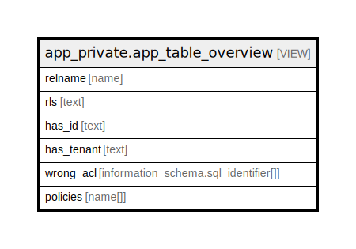

# app_private.app_table_overview

## Description

<details>
<summary><strong>Table Definition</strong></summary>

```sql
CREATE VIEW app_table_overview AS (
 SELECT c.relname,
        CASE c.relrowsecurity
            WHEN true THEN ''::text
            ELSE 'NO RLS'::text
        END AS rls,
        CASE (EXISTS ( SELECT 1
               FROM information_schema.columns
              WHERE (((columns.table_name)::name = c.relname) AND ((columns.table_schema)::name = n.nspname) AND ((columns.column_name)::name = 'id'::name))))
            WHEN true THEN ''::text
            ELSE 'NO ID'::text
        END AS has_id,
        CASE (EXISTS ( SELECT 1
               FROM information_schema.columns
              WHERE (((columns.table_name)::name = c.relname) AND ((columns.table_schema)::name = n.nspname) AND ((columns.column_name)::name = 'tenant_id'::name))))
            WHEN true THEN ''::text
            ELSE 'NO TENANT'::text
        END AS has_tenant,
        CASE ( SELECT (array_agg(role_table_grants.grantee ORDER BY role_table_grants.grantee))::text[] AS array_agg
               FROM information_schema.role_table_grants
              WHERE (((role_table_grants.table_name)::name = c.relname) AND ((role_table_grants.table_schema)::name = 'public'::name) AND ((role_table_grants.privilege_type)::text = 'SELECT'::text))
              GROUP BY role_table_grants.table_name)
            WHEN ARRAY['anonymous'::text, 'olymp'::text] THEN NULL::information_schema.sql_identifier[]
            ELSE ( SELECT array_agg(role_table_grants.grantee ORDER BY role_table_grants.grantee) AS array_agg
               FROM information_schema.role_table_grants
              WHERE (((role_table_grants.table_name)::name = c.relname) AND ((role_table_grants.table_schema)::name = 'public'::name) AND ((role_table_grants.privilege_type)::text = 'SELECT'::text))
              GROUP BY role_table_grants.table_name)
        END AS wrong_acl,
    ARRAY( SELECT p.polname
           FROM pg_policy p
          WHERE (p.polrelid = c.oid)) AS policies
   FROM (pg_class c
     JOIN pg_namespace n ON ((n.oid = c.relnamespace)))
  WHERE ((c.relkind = 'r'::"char") AND (n.nspname = 'public'::name))
  ORDER BY c.relname
)
```

</details>

## Columns

| Name | Type | Default | Nullable | Children | Parents | Comment |
| ---- | ---- | ------- | -------- | -------- | ------- | ------- |
| relname | name |  | true |  |  |  |
| rls | text |  | true |  |  |  |
| has_id | text |  | true |  |  |  |
| has_tenant | text |  | true |  |  |  |
| wrong_acl | information_schema.sql_identifier[] |  | true |  |  |  |
| policies | name[] |  | true |  |  |  |

## Referenced Tables

| Name | Columns | Comment | Type |
| ---- | ------- | ------- | ---- |
| [information_schema.columns](information_schema.columns.md) | 0 |  |  |
| [information_schema.role_table_grants](information_schema.role_table_grants.md) | 0 |  |  |
| [pg_policy](pg_policy.md) | 0 |  |  |
| [pg_class](pg_class.md) | 0 |  |  |
| [pg_namespace](pg_namespace.md) | 0 |  |  |

## Relations



---

> Generated by [tbls](https://github.com/k1LoW/tbls)
