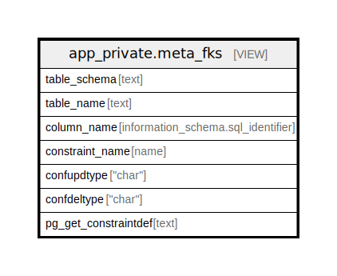

# app_private.meta_fks

## Description

<details>
<summary><strong>Table Definition</strong></summary>

```sql
CREATE VIEW meta_fks AS (
 SELECT table_schema,
    table_name,
    column_name,
    constraint_name,
    confupdtype,
    confdeltype,
    pg_get_constraintdef
   FROM ( SELECT ((c.connamespace)::regnamespace)::text AS table_schema,
            ((c.conrelid)::regclass)::text AS table_name,
            con.column_name,
            c.conname AS constraint_name,
            c.confupdtype,
            c.confdeltype,
            pg_get_constraintdef(c.oid) AS pg_get_constraintdef
           FROM (((pg_constraint c
             JOIN pg_namespace ON ((pg_namespace.oid = c.connamespace)))
             JOIN pg_class ON ((c.conrelid = pg_class.oid)))
             LEFT JOIN information_schema.constraint_column_usage con ON (((c.conname = (con.constraint_name)::name) AND (pg_namespace.nspname = (con.constraint_schema)::name))))) all_constraints
  WHERE (table_schema = ANY (ARRAY['public'::text, 'app_private'::text]))
  ORDER BY table_schema, table_name, column_name, constraint_name
)
```

</details>

## Columns

| Name | Type | Default | Nullable | Children | Parents | Comment |
| ---- | ---- | ------- | -------- | -------- | ------- | ------- |
| table_schema | text |  | true |  |  |  |
| table_name | text |  | true |  |  |  |
| column_name | information_schema.sql_identifier |  | true |  |  |  |
| constraint_name | name |  | true |  |  |  |
| confupdtype | "char" |  | true |  |  |  |
| confdeltype | "char" |  | true |  |  |  |
| pg_get_constraintdef | text |  | true |  |  |  |

## Referenced Tables

| Name | Columns | Comment | Type |
| ---- | ------- | ------- | ---- |
| [pg_constraint](pg_constraint.md) | 0 |  |  |
| [pg_namespace](pg_namespace.md) | 0 |  |  |
| [pg_class](pg_class.md) | 0 |  |  |
| [information_schema.constraint_column_usage](information_schema.constraint_column_usage.md) | 0 |  |  |

## Relations



---

> Generated by [tbls](https://github.com/k1LoW/tbls)
