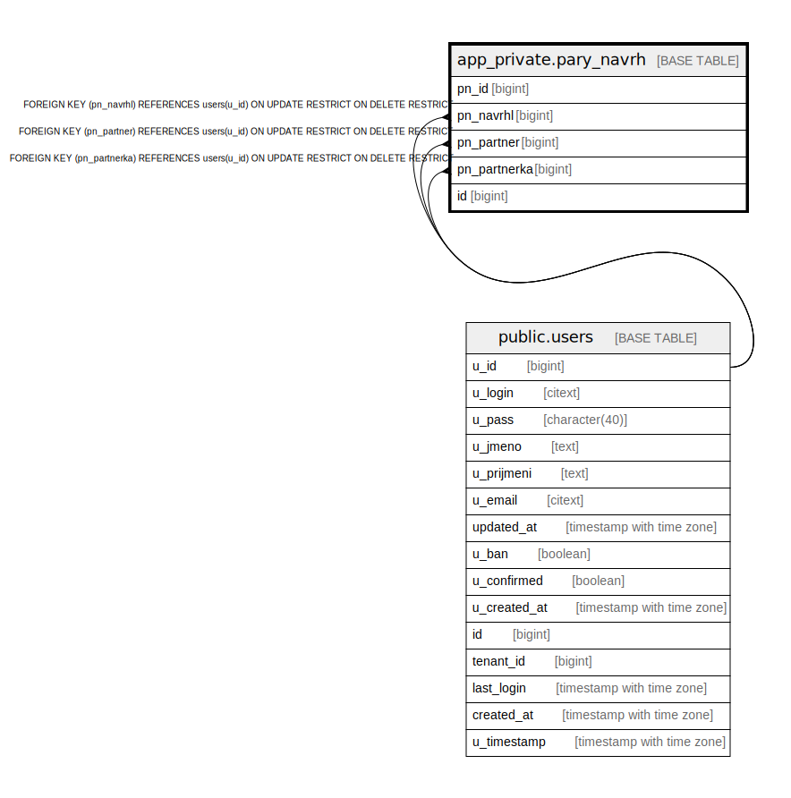

# app_private.pary_navrh

## Description

@omit create,update,delete

## Columns

| Name | Type | Default | Nullable | Extra Definition | Children | Parents | Comment |
| ---- | ---- | ------- | -------- | ---------------- | -------- | ------- | ------- |
| pn_id | bigint | nextval('app_private.pary_navrh_pn_id_seq'::regclass) | false |  |  |  |  |
| pn_navrhl | bigint |  | false |  |  | [public.users](public.users.md) |  |
| pn_partner | bigint |  | false |  |  | [public.users](public.users.md) |  |
| pn_partnerka | bigint |  | false |  |  | [public.users](public.users.md) |  |
| id | bigint |  | false | GENERATED ALWAYS AS pn_id STORED |  |  |  |

## Constraints

| Name | Type | Definition |
| ---- | ---- | ---------- |
| idx_24662_primary | PRIMARY KEY | PRIMARY KEY (pn_id) |
| pary_navrh_unique_id | UNIQUE | UNIQUE (id) |
| pary_navrh_pn_navrhl_fkey | FOREIGN KEY | FOREIGN KEY (pn_navrhl) REFERENCES users(u_id) ON UPDATE RESTRICT ON DELETE RESTRICT |
| pary_navrh_pn_partner_fkey | FOREIGN KEY | FOREIGN KEY (pn_partner) REFERENCES users(u_id) ON UPDATE RESTRICT ON DELETE RESTRICT |
| pary_navrh_pn_partnerka_fkey | FOREIGN KEY | FOREIGN KEY (pn_partnerka) REFERENCES users(u_id) ON UPDATE RESTRICT ON DELETE RESTRICT |

## Indexes

| Name | Definition |
| ---- | ---------- |
| idx_24662_primary | CREATE UNIQUE INDEX idx_24662_primary ON app_private.pary_navrh USING btree (pn_id) |
| pary_navrh_unique_id | CREATE UNIQUE INDEX pary_navrh_unique_id ON app_private.pary_navrh USING btree (id) |

## Relations

---

> Generated by [tbls](https://github.com/k1LoW/tbls)
