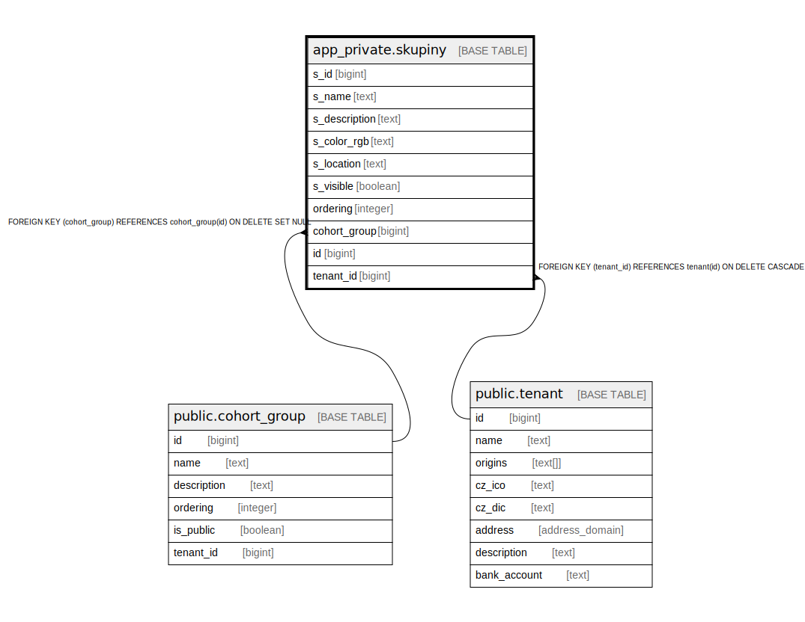

# app_private.skupiny

## Description

## Columns

| Name | Type | Default | Nullable | Extra Definition | Children | Parents | Comment |
| ---- | ---- | ------- | -------- | ---------------- | -------- | ------- | ------- |
| s_id | bigint | nextval('app_private.skupiny_s_id_seq'::regclass) | false |  |  |  |  |
| s_name | text |  | false |  |  |  |  |
| s_description | text | ''::text | false |  |  |  |  |
| s_color_rgb | text |  | false |  |  |  |  |
| s_location | text | ''::text | false |  |  |  |  |
| s_visible | boolean | true | false |  |  |  |  |
| ordering | integer | 1 | false |  |  |  |  |
| cohort_group | bigint |  | true |  |  | [public.cohort_group](public.cohort_group.md) |  |
| id | bigint |  | false | GENERATED ALWAYS AS s_id STORED |  |  |  |
| tenant_id | bigint | current_tenant_id() | false |  |  | [public.tenant](public.tenant.md) |  |

## Constraints

| Name | Type | Definition |
| ---- | ---- | ---------- |
| idx_24756_primary | PRIMARY KEY | PRIMARY KEY (s_id) |
| skupiny_unique_id | UNIQUE | UNIQUE (id) |
| skupiny_cohort_group_fkey | FOREIGN KEY | FOREIGN KEY (cohort_group) REFERENCES cohort_group(id) ON DELETE SET NULL |
| skupiny_tenant_id_fkey | FOREIGN KEY | FOREIGN KEY (tenant_id) REFERENCES tenant(id) ON DELETE CASCADE |

## Indexes

| Name | Definition |
| ---- | ---------- |
| idx_24756_primary | CREATE UNIQUE INDEX idx_24756_primary ON app_private.skupiny USING btree (s_id) |
| skupiny_unique_id | CREATE UNIQUE INDEX skupiny_unique_id ON app_private.skupiny USING btree (id) |

## Relations

---

> Generated by [tbls](https://github.com/k1LoW/tbls)
