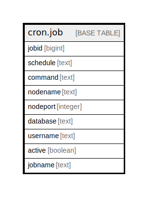

# cron.job

## Description

## Columns

| Name | Type | Default | Nullable | Children | Parents | Comment |
| ---- | ---- | ------- | -------- | -------- | ------- | ------- |
| jobid | bigint | nextval('cron.jobid_seq'::regclass) | false |  |  |  |
| schedule | text |  | false |  |  |  |
| command | text |  | false |  |  |  |
| nodename | text | 'localhost'::text | false |  |  |  |
| nodeport | integer | inet_server_port() | false |  |  |  |
| database | text | current_database() | false |  |  |  |
| username | text | CURRENT_USER | false |  |  |  |
| active | boolean | true | false |  |  |  |
| jobname | text |  | true |  |  |  |

## Constraints

| Name | Type | Definition |
| ---- | ---- | ---------- |
| job_pkey | PRIMARY KEY | PRIMARY KEY (jobid) |
| jobname_username_uniq | UNIQUE | UNIQUE (jobname, username) |

## Indexes

| Name | Definition |
| ---- | ---------- |
| job_pkey | CREATE UNIQUE INDEX job_pkey ON cron.job USING btree (jobid) |
| jobname_username_uniq | CREATE UNIQUE INDEX jobname_username_uniq ON cron.job USING btree (jobname, username) |

## Triggers

| Name | Definition |
| ---- | ---------- |
| cron_job_cache_invalidate | CREATE TRIGGER cron_job_cache_invalidate AFTER INSERT OR DELETE OR UPDATE OR TRUNCATE ON cron.job FOR EACH STATEMENT EXECUTE FUNCTION cron.job_cache_invalidate() |

## Relations

---

> Generated by [tbls](https://github.com/k1LoW/tbls)
