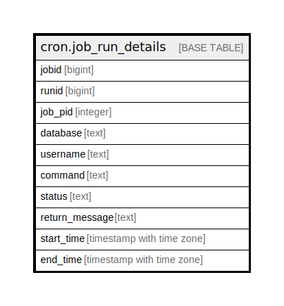

# cron.job_run_details

## Description

## Columns

| Name | Type | Default | Nullable | Children | Parents | Comment |
| ---- | ---- | ------- | -------- | -------- | ------- | ------- |
| jobid | bigint |  | true |  |  |  |
| runid | bigint | nextval('cron.runid_seq'::regclass) | false |  |  |  |
| job_pid | integer |  | true |  |  |  |
| database | text |  | true |  |  |  |
| username | text |  | true |  |  |  |
| command | text |  | true |  |  |  |
| status | text |  | true |  |  |  |
| return_message | text |  | true |  |  |  |
| start_time | timestamp with time zone |  | true |  |  |  |
| end_time | timestamp with time zone |  | true |  |  |  |

## Constraints

| Name | Type | Definition |
| ---- | ---- | ---------- |
| job_run_details_pkey | PRIMARY KEY | PRIMARY KEY (runid) |

## Indexes

| Name | Definition |
| ---- | ---------- |
| job_run_details_pkey | CREATE UNIQUE INDEX job_run_details_pkey ON cron.job_run_details USING btree (runid) |

## Relations

---

> Generated by [tbls](https://github.com/k1LoW/tbls)
