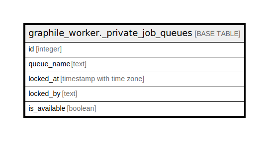

# graphile_worker._private_job_queues

## Description

## Columns

| Name | Type | Default | Nullable | Extra Definition | Children | Parents | Comment |
| ---- | ---- | ------- | -------- | ---------------- | -------- | ------- | ------- |
| id | integer |  | false |  |  |  |  |
| queue_name | text |  | false |  |  |  |  |
| locked_at | timestamp with time zone |  | true |  |  |  |  |
| locked_by | text |  | true |  |  |  |  |
| is_available | boolean |  | false | GENERATED ALWAYS AS (locked_at IS NULL) STORED |  |  |  |

## Constraints

| Name | Type | Definition |
| ---- | ---- | ---------- |
| job_queues_queue_name_check | CHECK | CHECK ((length(queue_name) <= 128)) |
| job_queues_pkey1 | PRIMARY KEY | PRIMARY KEY (id) |
| job_queues_queue_name_key | UNIQUE | UNIQUE (queue_name) |

## Indexes

| Name | Definition |
| ---- | ---------- |
| job_queues_pkey1 | CREATE UNIQUE INDEX job_queues_pkey1 ON graphile_worker._private_job_queues USING btree (id) |
| job_queues_queue_name_key | CREATE UNIQUE INDEX job_queues_queue_name_key ON graphile_worker._private_job_queues USING btree (queue_name) |

## Relations

---

> Generated by [tbls](https://github.com/k1LoW/tbls)
