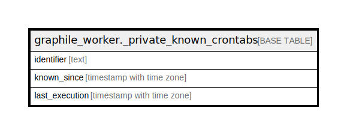

# graphile_worker._private_known_crontabs

## Description

## Columns

| Name | Type | Default | Nullable | Children | Parents | Comment |
| ---- | ---- | ------- | -------- | -------- | ------- | ------- |
| identifier | text |  | false |  |  |  |
| known_since | timestamp with time zone |  | false |  |  |  |
| last_execution | timestamp with time zone |  | true |  |  |  |

## Constraints

| Name | Type | Definition |
| ---- | ---- | ---------- |
| known_crontabs_pkey | PRIMARY KEY | PRIMARY KEY (identifier) |

## Indexes

| Name | Definition |
| ---- | ---------- |
| known_crontabs_pkey | CREATE UNIQUE INDEX known_crontabs_pkey ON graphile_worker._private_known_crontabs USING btree (identifier) |

## Relations

---

> Generated by [tbls](https://github.com/k1LoW/tbls)
