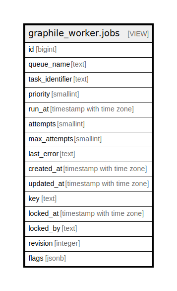

# graphile_worker.jobs

## Description

<details>
<summary><strong>Table Definition</strong></summary>

```sql
CREATE VIEW jobs AS (
 SELECT jobs.id,
    job_queues.queue_name,
    tasks.identifier AS task_identifier,
    jobs.priority,
    jobs.run_at,
    jobs.attempts,
    jobs.max_attempts,
    jobs.last_error,
    jobs.created_at,
    jobs.updated_at,
    jobs.key,
    jobs.locked_at,
    jobs.locked_by,
    jobs.revision,
    jobs.flags
   FROM ((graphile_worker._private_jobs jobs
     JOIN graphile_worker._private_tasks tasks ON ((tasks.id = jobs.task_id)))
     LEFT JOIN graphile_worker._private_job_queues job_queues ON ((job_queues.id = jobs.job_queue_id)))
)
```

</details>

## Columns

| Name | Type | Default | Nullable | Children | Parents | Comment |
| ---- | ---- | ------- | -------- | -------- | ------- | ------- |
| id | bigint |  | true |  |  |  |
| queue_name | text |  | true |  |  |  |
| task_identifier | text |  | true |  |  |  |
| priority | smallint |  | true |  |  |  |
| run_at | timestamp with time zone |  | true |  |  |  |
| attempts | smallint |  | true |  |  |  |
| max_attempts | smallint |  | true |  |  |  |
| last_error | text |  | true |  |  |  |
| created_at | timestamp with time zone |  | true |  |  |  |
| updated_at | timestamp with time zone |  | true |  |  |  |
| key | text |  | true |  |  |  |
| locked_at | timestamp with time zone |  | true |  |  |  |
| locked_by | text |  | true |  |  |  |
| revision | integer |  | true |  |  |  |
| flags | jsonb |  | true |  |  |  |

## Referenced Tables

| Name | Columns | Comment | Type |
| ---- | ------- | ------- | ---- |
| [graphile_worker._private_jobs](graphile_worker._private_jobs.md) | 17 |  | BASE TABLE |
| [graphile_worker._private_tasks](graphile_worker._private_tasks.md) | 2 |  | BASE TABLE |
| [graphile_worker._private_job_queues](graphile_worker._private_job_queues.md) | 5 |  | BASE TABLE |

## Relations



---

> Generated by [tbls](https://github.com/k1LoW/tbls)
