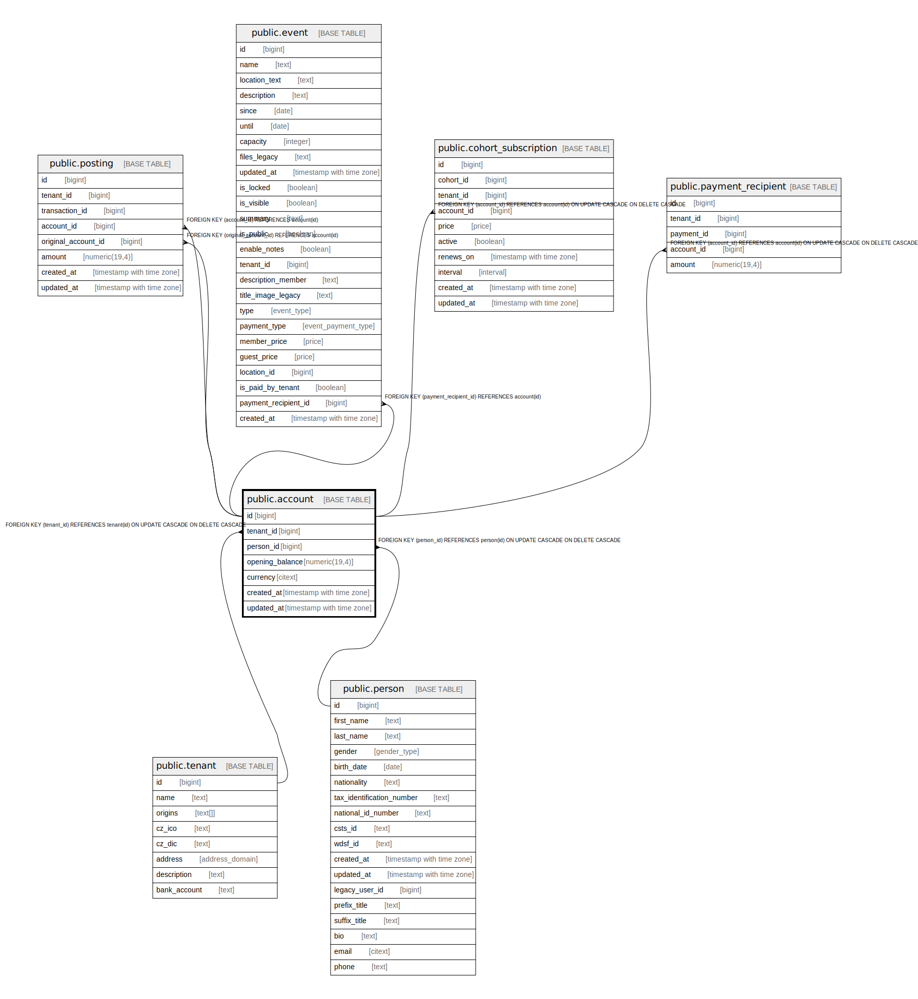

# public.account

## Description

@omit create,update,delete  
@simpleCollections only

## Columns

| Name | Type | Default | Nullable | Children | Parents | Comment |
| ---- | ---- | ------- | -------- | -------- | ------- | ------- |
| id | bigint |  | false | [public.posting](public.posting.md) [public.event](public.event.md) [public.cohort_subscription](public.cohort_subscription.md) [public.payment_recipient](public.payment_recipient.md) |  |  |
| tenant_id | bigint | current_tenant_id() | false |  | [public.tenant](public.tenant.md) |  |
| person_id | bigint |  | true |  | [public.person](public.person.md) |  |
| opening_balance | numeric(19,4) | 0.0 | false |  |  |  |
| currency | citext | 'CZK'::citext | false |  |  |  |
| created_at | timestamp with time zone | now() | false |  |  |  |
| updated_at | timestamp with time zone | now() | false |  |  |  |

## Constraints

| Name | Type | Definition |
| ---- | ---- | ---------- |
| account_pkey | PRIMARY KEY | PRIMARY KEY (id) |
| account_tenant_id_person_id_currency_idx | UNIQUE | UNIQUE NULLS NOT DISTINCT (tenant_id, person_id, currency) |
| account_person_id_fkey | FOREIGN KEY | FOREIGN KEY (person_id) REFERENCES person(id) ON UPDATE CASCADE ON DELETE CASCADE |
| account_tenant_id_fkey | FOREIGN KEY | FOREIGN KEY (tenant_id) REFERENCES tenant(id) ON UPDATE CASCADE ON DELETE CASCADE |

## Indexes

| Name | Definition |
| ---- | ---------- |
| account_pkey | CREATE UNIQUE INDEX account_pkey ON public.account USING btree (id) |
| account_tenant_id_person_id_currency_idx | CREATE UNIQUE INDEX account_tenant_id_person_id_currency_idx ON public.account USING btree (tenant_id, person_id, currency) NULLS NOT DISTINCT |

## Triggers

| Name | Definition |
| ---- | ---------- |
| _100_timestamps | CREATE TRIGGER _100_timestamps BEFORE INSERT OR UPDATE ON public.account FOR EACH ROW EXECUTE FUNCTION app_private.tg__timestamps() |
| _900_fix_balance_accounts | CREATE TRIGGER _900_fix_balance_accounts AFTER INSERT OR DELETE OR UPDATE OF opening_balance OR TRUNCATE ON public.account FOR EACH STATEMENT EXECUTE FUNCTION app_private.tg_account_balances__update() |

## Relations

---

> Generated by [tbls](https://github.com/k1LoW/tbls)
