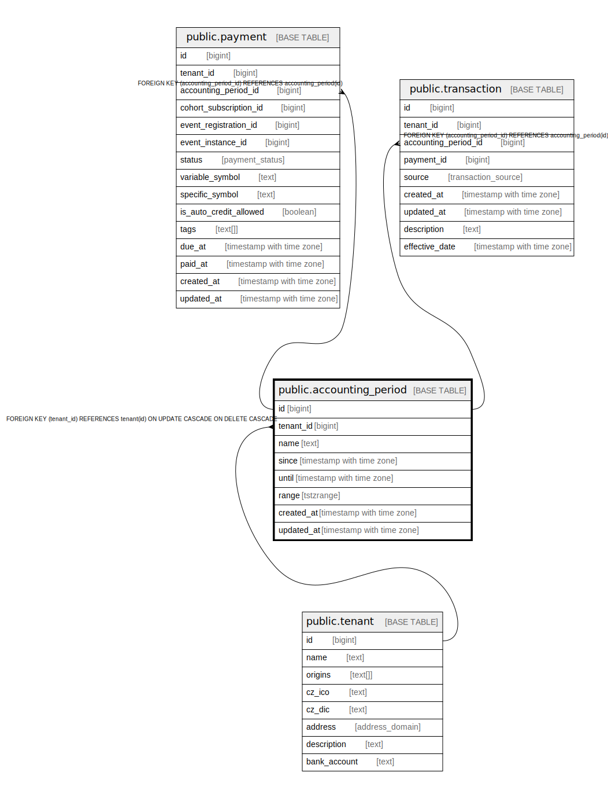

# public.accounting_period

## Description

@omit 

## Columns

| Name | Type | Default | Nullable | Extra Definition | Children | Parents | Comment |
| ---- | ---- | ------- | -------- | ---------------- | -------- | ------- | ------- |
| id | bigint |  | false |  | [public.payment](public.payment.md) [public.transaction](public.transaction.md) |  |  |
| tenant_id | bigint | current_tenant_id() | false |  |  | [public.tenant](public.tenant.md) |  |
| name | text | ''::text | false |  |  |  |  |
| since | timestamp with time zone |  | false |  |  |  |  |
| until | timestamp with time zone |  | false |  |  |  |  |
| range | tstzrange |  | false | GENERATED ALWAYS AS tstzrange(since, until, '[]'::text) STORED |  |  |  |
| created_at | timestamp with time zone | now() | false |  |  |  |  |
| updated_at | timestamp with time zone | now() | false |  |  |  |  |

## Constraints

| Name | Type | Definition |
| ---- | ---- | ---------- |
| accounting_period_pkey | PRIMARY KEY | PRIMARY KEY (id) |
| accounting_period_tenant_id_fkey | FOREIGN KEY | FOREIGN KEY (tenant_id) REFERENCES tenant(id) ON UPDATE CASCADE ON DELETE CASCADE |

## Indexes

| Name | Definition |
| ---- | ---------- |
| accounting_period_pkey | CREATE UNIQUE INDEX accounting_period_pkey ON public.accounting_period USING btree (id) |

## Triggers

| Name | Definition |
| ---- | ---------- |
| _100_timestamps | CREATE TRIGGER _100_timestamps BEFORE INSERT OR UPDATE ON public.accounting_period FOR EACH ROW EXECUTE FUNCTION app_private.tg__timestamps() |

## Relations

---

> Generated by [tbls](https://github.com/k1LoW/tbls)
