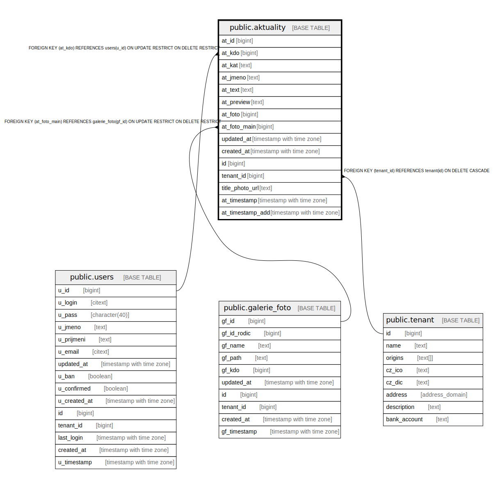

# public.aktuality

## Description

## Columns

| Name | Type | Default | Nullable | Extra Definition | Children | Parents | Comment |
| ---- | ---- | ------- | -------- | ---------------- | -------- | ------- | ------- |
| at_id | bigint | nextval('aktuality_at_id_seq'::regclass) | false |  |  |  |  |
| at_kdo | bigint |  | true |  |  | [public.users](public.users.md) |  |
| at_kat | text | '1'::text | false |  |  |  | @deprecated |
| at_jmeno | text |  | false |  |  |  |  |
| at_text | text |  | false |  |  |  |  |
| at_preview | text |  | false |  |  |  |  |
| at_foto | bigint |  | true |  |  |  |  |
| at_foto_main | bigint |  | true |  |  | [public.galerie_foto](public.galerie_foto.md) |  |
| updated_at | timestamp with time zone |  | true |  |  |  |  |
| created_at | timestamp with time zone | now() | true |  |  |  |  |
| id | bigint |  | false | GENERATED ALWAYS AS at_id STORED |  |  |  |
| tenant_id | bigint | current_tenant_id() | false |  |  | [public.tenant](public.tenant.md) |  |
| title_photo_url | text |  | true |  |  |  |  |
| at_timestamp | timestamp with time zone |  | false | GENERATED ALWAYS AS updated_at STORED |  |  |  |
| at_timestamp_add | timestamp with time zone |  | false | GENERATED ALWAYS AS created_at STORED |  |  |  |

## Constraints

| Name | Type | Definition |
| ---- | ---- | ---------- |
| aktuality_unique_id | UNIQUE | UNIQUE (id) |
| idx_24575_primary | PRIMARY KEY | PRIMARY KEY (at_id) |
| aktuality_at_foto_main_fkey | FOREIGN KEY | FOREIGN KEY (at_foto_main) REFERENCES galerie_foto(gf_id) ON UPDATE RESTRICT ON DELETE RESTRICT |
| aktuality_at_kdo_fkey | FOREIGN KEY | FOREIGN KEY (at_kdo) REFERENCES users(u_id) ON UPDATE RESTRICT ON DELETE RESTRICT |
| aktuality_tenant_id_fkey | FOREIGN KEY | FOREIGN KEY (tenant_id) REFERENCES tenant(id) ON DELETE CASCADE |

## Indexes

| Name | Definition |
| ---- | ---------- |
| aktuality_unique_id | CREATE UNIQUE INDEX aktuality_unique_id ON public.aktuality USING btree (id) |
| idx_24575_primary | CREATE UNIQUE INDEX idx_24575_primary ON public.aktuality USING btree (at_id) |
| idx_24575_aktuality_at_kdo_fkey | CREATE INDEX idx_24575_aktuality_at_kdo_fkey ON public.aktuality USING btree (at_kdo) |
| idx_24575_at_timestamp_add | CREATE INDEX idx_24575_at_timestamp_add ON public.aktuality USING btree (created_at) |
| tenant_id | CREATE INDEX tenant_id ON public.aktuality USING btree (tenant_id) |

## Triggers

| Name | Definition |
| ---- | ---------- |
| _100_timestamps | CREATE TRIGGER _100_timestamps BEFORE INSERT OR UPDATE ON public.aktuality FOR EACH ROW EXECUTE FUNCTION app_private.tg__timestamps() |
| on_update_author | CREATE TRIGGER on_update_author BEFORE UPDATE ON public.aktuality FOR EACH ROW EXECUTE FUNCTION on_update_author_aktuality() |

## Relations

---

> Generated by [tbls](https://github.com/k1LoW/tbls)
