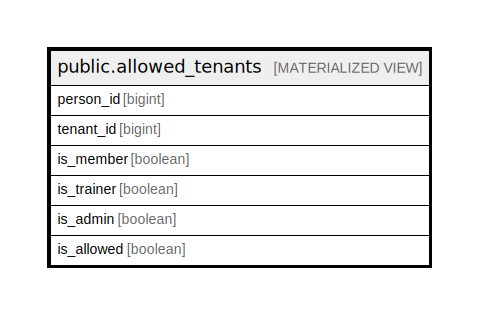

# public.allowed_tenants

## Description

@omit

<details>
<summary><strong>Table Definition</strong></summary>

```sql
CREATE MATERIALIZED VIEW allowed_tenants AS (
 SELECT person_id,
    tenant_id,
    is_member,
    is_trainer,
    is_admin,
    is_allowed
   FROM allowed_tenants_view
)
```

</details>

## Columns

| Name | Type | Default | Nullable | Children | Parents | Comment |
| ---- | ---- | ------- | -------- | -------- | ------- | ------- |
| person_id | bigint |  | true |  |  |  |
| tenant_id | bigint |  | true |  |  |  |
| is_member | boolean |  | true |  |  |  |
| is_trainer | boolean |  | true |  |  |  |
| is_admin | boolean |  | true |  |  |  |
| is_allowed | boolean |  | true |  |  |  |

## Referenced Tables

| Name | Columns | Comment | Type |
| ---- | ------- | ------- | ---- |
| [public.allowed_tenants_view](public.allowed_tenants_view.md) | 6 | @omit | VIEW |

## Indexes

| Name | Definition |
| ---- | ---------- |
| allowed_tenants_person_id_tenant_id_idx | CREATE UNIQUE INDEX allowed_tenants_person_id_tenant_id_idx ON public.allowed_tenants USING btree (person_id, tenant_id) |

## Relations



---

> Generated by [tbls](https://github.com/k1LoW/tbls)
