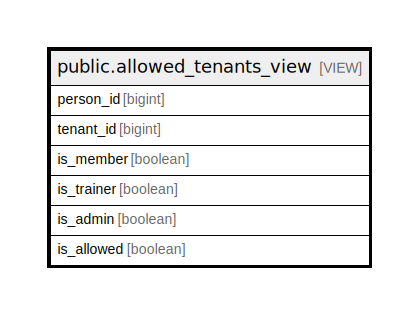

# public.allowed_tenants_view

## Description

@omit

<details>
<summary><strong>Table Definition</strong></summary>

```sql
CREATE VIEW allowed_tenants_view AS (
 SELECT person.id AS person_id,
    tenant.id AS tenant_id,
    (max(member.id) IS NOT NULL) AS is_member,
    (max(trainer.id) IS NOT NULL) AS is_trainer,
    (max(admin.id) IS NOT NULL) AS is_admin,
    ((max(member.id) IS NOT NULL) OR (max(trainer.id) IS NOT NULL) OR (max(admin.id) IS NOT NULL)) AS is_allowed
   FROM ((((person
     CROSS JOIN tenant)
     LEFT JOIN tenant_membership member ON (((member.tenant_id = tenant.id) AND (member.person_id = person.id) AND (member.status = 'active'::relationship_status))))
     LEFT JOIN tenant_trainer trainer ON (((trainer.tenant_id = tenant.id) AND (trainer.person_id = person.id) AND (trainer.status = 'active'::relationship_status))))
     LEFT JOIN tenant_administrator admin ON (((admin.tenant_id = tenant.id) AND (admin.person_id = person.id) AND (admin.status = 'active'::relationship_status))))
  WHERE ((member.id IS NOT NULL) OR (trainer.id IS NOT NULL) OR (admin.id IS NOT NULL))
  GROUP BY person.id, tenant.id
)
```

</details>

## Columns

| Name | Type | Default | Nullable | Children | Parents | Comment |
| ---- | ---- | ------- | -------- | -------- | ------- | ------- |
| person_id | bigint |  | true |  |  |  |
| tenant_id | bigint |  | true |  |  |  |
| is_member | boolean |  | true |  |  |  |
| is_trainer | boolean |  | true |  |  |  |
| is_admin | boolean |  | true |  |  |  |
| is_allowed | boolean |  | true |  |  |  |

## Referenced Tables

| Name | Columns | Comment | Type |
| ---- | ------- | ------- | ---- |
| [public.person](public.person.md) | 18 | @omit create | BASE TABLE |
| [public.tenant](public.tenant.md) | 8 | @omit create,delete<br>@simpleCollections only | BASE TABLE |
| [public.tenant_membership](public.tenant_membership.md) | 10 | @simpleCollections only | BASE TABLE |
| [public.tenant_trainer](public.tenant_trainer.md) | 17 | @simpleCollections only | BASE TABLE |
| [public.tenant_administrator](public.tenant_administrator.md) | 12 | @simpleCollections only | BASE TABLE |

## Relations



---

> Generated by [tbls](https://github.com/k1LoW/tbls)
