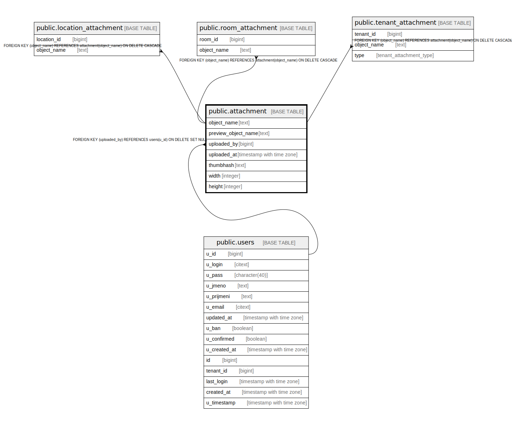

# public.attachment

## Description

@omit update

## Columns

| Name | Type | Default | Nullable | Children | Parents | Comment |
| ---- | ---- | ------- | -------- | -------- | ------- | ------- |
| object_name | text |  | false | [public.location_attachment](public.location_attachment.md) [public.room_attachment](public.room_attachment.md) [public.tenant_attachment](public.tenant_attachment.md) |  |  |
| preview_object_name | text |  | true |  |  |  |
| uploaded_by | bigint | current_user_id() | true |  | [public.users](public.users.md) |  |
| uploaded_at | timestamp with time zone | now() | false |  |  |  |
| thumbhash | text |  | true |  |  |  |
| width | integer |  | true |  |  |  |
| height | integer |  | true |  |  |  |

## Constraints

| Name | Type | Definition |
| ---- | ---- | ---------- |
| attachment_pkey | PRIMARY KEY | PRIMARY KEY (object_name) |
| attachment_uploaded_by_fkey | FOREIGN KEY | FOREIGN KEY (uploaded_by) REFERENCES users(u_id) ON DELETE SET NULL |

## Indexes

| Name | Definition |
| ---- | ---------- |
| attachment_pkey | CREATE UNIQUE INDEX attachment_pkey ON public.attachment USING btree (object_name) |

## Relations

---

> Generated by [tbls](https://github.com/k1LoW/tbls)
