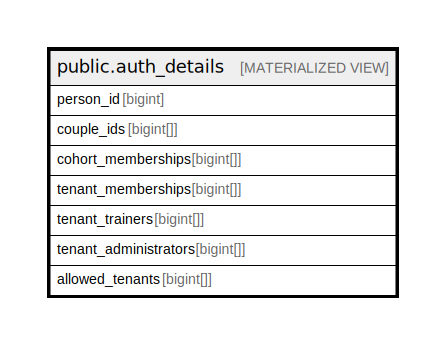

# public.auth_details

## Description

@omit

<details>
<summary><strong>Table Definition</strong></summary>

```sql
CREATE MATERIALIZED VIEW auth_details AS (
 SELECT auth_details_view.person_id,
    auth_details_view.couple_ids,
    auth_details_view.cohort_memberships,
    auth_details_view.tenant_memberships,
    auth_details_view.tenant_trainers,
    auth_details_view.tenant_administrators,
    auth_details_view.allowed_tenants
   FROM auth_details_view
)
```

</details>

## Columns

| Name | Type | Default | Nullable | Children | Parents | Comment |
| ---- | ---- | ------- | -------- | -------- | ------- | ------- |
| person_id | bigint |  | true |  |  |  |
| couple_ids | bigint[] |  | true |  |  |  |
| cohort_memberships | bigint[] |  | true |  |  |  |
| tenant_memberships | bigint[] |  | true |  |  |  |
| tenant_trainers | bigint[] |  | true |  |  |  |
| tenant_administrators | bigint[] |  | true |  |  |  |
| allowed_tenants | bigint[] |  | true |  |  |  |

## Referenced Tables

| Name | Columns | Comment | Type |
| ---- | ------- | ------- | ---- |
| [public.auth_details_view](public.auth_details_view.md) | 7 | @omit | VIEW |

## Indexes

| Name | Definition |
| ---- | ---------- |
| auth_details_person_id_idx | CREATE UNIQUE INDEX auth_details_person_id_idx ON public.auth_details USING btree (person_id) |

## Relations



---

> Generated by [tbls](https://github.com/k1LoW/tbls)
