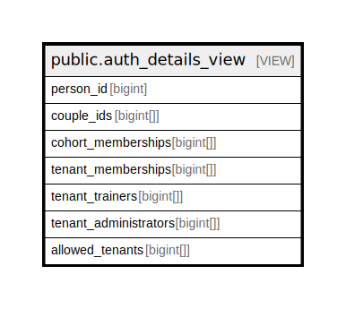

# public.auth_details_view

## Description

@omit

<details>
<summary><strong>Table Definition</strong></summary>

```sql
CREATE VIEW auth_details_view AS (
 SELECT person.id AS person_id,
    array_remove(array_agg(couple.id), NULL::bigint) AS couple_ids,
    array_remove(array_agg(cohort_membership.cohort_id), NULL::bigint) AS cohort_memberships,
    array_remove(array_agg(tenant_membership.tenant_id), NULL::bigint) AS tenant_memberships,
    array_remove(array_agg(tenant_trainer.tenant_id), NULL::bigint) AS tenant_trainers,
    array_remove(array_agg(tenant_administrator.tenant_id), NULL::bigint) AS tenant_administrators,
    array_remove(((array_agg(tenant_administrator.tenant_id) || array_agg(tenant_trainer.tenant_id)) || array_agg(tenant_membership.tenant_id)), NULL::bigint) AS allowed_tenants
   FROM (((((person
     LEFT JOIN couple ON ((((person.id = couple.man_id) OR (person.id = couple.woman_id)) AND (couple.status = 'active'::relationship_status))))
     LEFT JOIN cohort_membership ON (((person.id = cohort_membership.person_id) AND (cohort_membership.status = 'active'::relationship_status))))
     LEFT JOIN tenant_membership ON (((person.id = tenant_membership.person_id) AND (tenant_membership.status = 'active'::relationship_status))))
     LEFT JOIN tenant_trainer ON (((person.id = tenant_trainer.person_id) AND (tenant_trainer.status = 'active'::relationship_status))))
     LEFT JOIN tenant_administrator ON (((person.id = tenant_administrator.person_id) AND (tenant_administrator.status = 'active'::relationship_status))))
  GROUP BY person.id
)
```

</details>

## Columns

| Name | Type | Default | Nullable | Children | Parents | Comment |
| ---- | ---- | ------- | -------- | -------- | ------- | ------- |
| person_id | bigint |  | true |  |  |  |
| couple_ids | bigint[] |  | true |  |  |  |
| cohort_memberships | bigint[] |  | true |  |  |  |
| tenant_memberships | bigint[] |  | true |  |  |  |
| tenant_trainers | bigint[] |  | true |  |  |  |
| tenant_administrators | bigint[] |  | true |  |  |  |
| allowed_tenants | bigint[] |  | true |  |  |  |

## Referenced Tables

| Name | Columns | Comment | Type |
| ---- | ------- | ------- | ---- |
| [public.person](public.person.md) | 18 | @omit create | BASE TABLE |
| [public.couple](public.couple.md) | 11 | @simpleCollections only | BASE TABLE |
| [public.cohort_membership](public.cohort_membership.md) | 11 | @simpleCollections only | BASE TABLE |
| [public.tenant_membership](public.tenant_membership.md) | 10 | @simpleCollections only | BASE TABLE |
| [public.tenant_trainer](public.tenant_trainer.md) | 17 | @simpleCollections only | BASE TABLE |
| [public.tenant_administrator](public.tenant_administrator.md) | 12 | @simpleCollections only | BASE TABLE |

## Relations



---

> Generated by [tbls](https://github.com/k1LoW/tbls)
