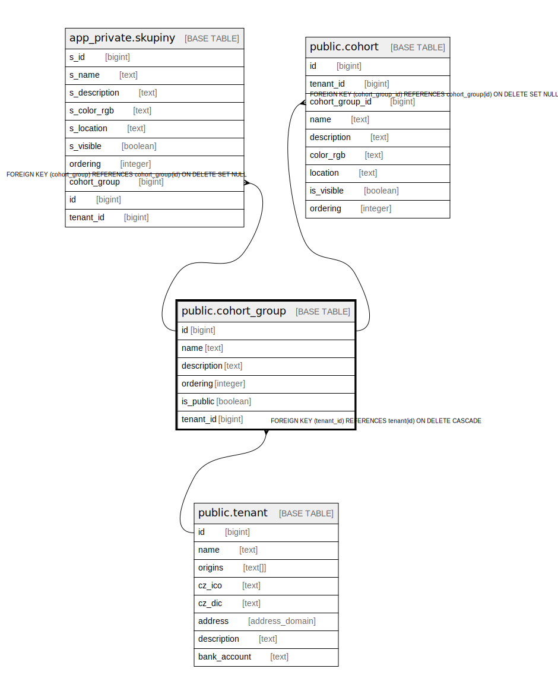

# public.cohort_group

## Description

## Columns

| Name | Type | Default | Nullable | Children | Parents | Comment |
| ---- | ---- | ------- | -------- | -------- | ------- | ------- |
| id | bigint |  | false | [app_private.skupiny](app_private.skupiny.md) [public.cohort](public.cohort.md) |  |  |
| name | text |  | false |  |  |  |
| description | text | ''::text | false |  |  |  |
| ordering | integer | 1 | false |  |  |  |
| is_public | boolean | true | false |  |  |  |
| tenant_id | bigint | current_tenant_id() | false |  | [public.tenant](public.tenant.md) |  |

## Constraints

| Name | Type | Definition |
| ---- | ---- | ---------- |
| cohort_group_pkey | PRIMARY KEY | PRIMARY KEY (id) |
| cohort_group_tenant_id_fkey | FOREIGN KEY | FOREIGN KEY (tenant_id) REFERENCES tenant(id) ON DELETE CASCADE |

## Indexes

| Name | Definition |
| ---- | ---------- |
| cohort_group_pkey | CREATE UNIQUE INDEX cohort_group_pkey ON public.cohort_group USING btree (id) |

## Relations

---

> Generated by [tbls](https://github.com/k1LoW/tbls)
