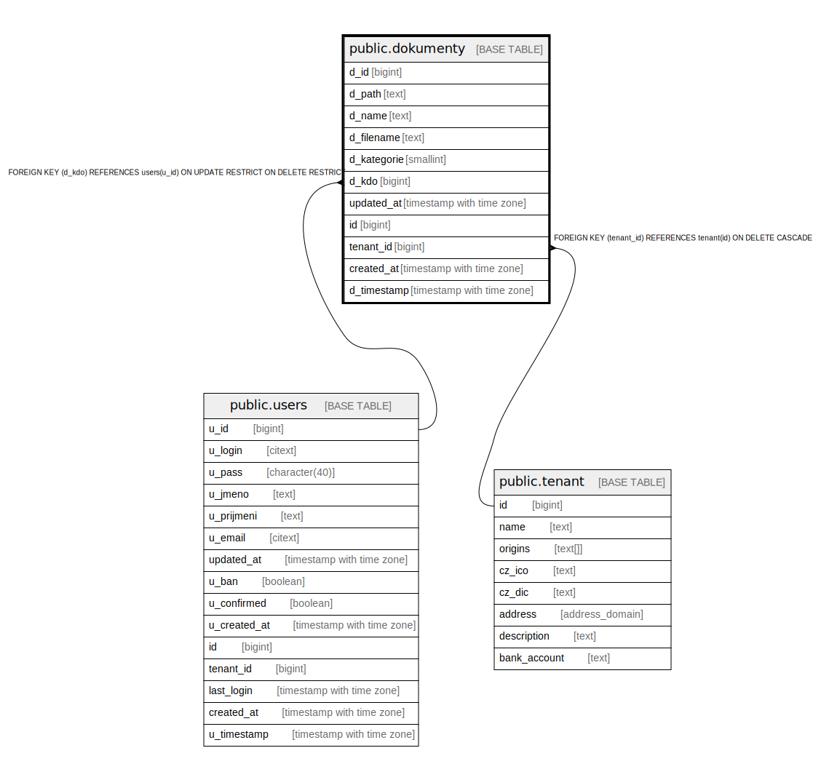

# public.dokumenty

## Description

@simpleCollections only

## Columns

| Name | Type | Default | Nullable | Extra Definition | Children | Parents | Comment |
| ---- | ---- | ------- | -------- | ---------------- | -------- | ------- | ------- |
| d_id | bigint | nextval('dokumenty_d_id_seq'::regclass) | false |  |  |  |  |
| d_path | text |  | false |  |  |  |  |
| d_name | text |  | false |  |  |  |  |
| d_filename | text |  | false |  |  |  |  |
| d_kategorie | smallint |  | false |  |  |  |  |
| d_kdo | bigint |  | false |  |  | [public.users](public.users.md) |  |
| updated_at | timestamp with time zone | CURRENT_TIMESTAMP | true |  |  |  |  |
| id | bigint |  | false | GENERATED ALWAYS AS d_id STORED |  |  |  |
| tenant_id | bigint | current_tenant_id() | false |  |  | [public.tenant](public.tenant.md) |  |
| created_at | timestamp with time zone | CURRENT_TIMESTAMP | true |  |  |  |  |
| d_timestamp | timestamp with time zone |  | true | GENERATED ALWAYS AS updated_at STORED |  |  |  |

## Constraints

| Name | Type | Definition |
| ---- | ---- | ---------- |
| dokumenty_unique_id | UNIQUE | UNIQUE (id) |
| idx_24593_primary | PRIMARY KEY | PRIMARY KEY (d_id) |
| dokumenty_d_kdo_fkey | FOREIGN KEY | FOREIGN KEY (d_kdo) REFERENCES users(u_id) ON UPDATE RESTRICT ON DELETE RESTRICT |
| dokumenty_tenant_id_fkey | FOREIGN KEY | FOREIGN KEY (tenant_id) REFERENCES tenant(id) ON DELETE CASCADE |

## Indexes

| Name | Definition |
| ---- | ---------- |
| dokumenty_unique_id | CREATE UNIQUE INDEX dokumenty_unique_id ON public.dokumenty USING btree (id) |
| idx_24593_primary | CREATE UNIQUE INDEX idx_24593_primary ON public.dokumenty USING btree (d_id) |
| idx_24593_d_path | CREATE UNIQUE INDEX idx_24593_d_path ON public.dokumenty USING btree (d_path) |

## Triggers

| Name | Definition |
| ---- | ---------- |
| _100_timestamps | CREATE TRIGGER _100_timestamps BEFORE INSERT OR UPDATE ON public.dokumenty FOR EACH ROW EXECUTE FUNCTION app_private.tg__timestamps() |

## Relations

---

> Generated by [tbls](https://github.com/k1LoW/tbls)
