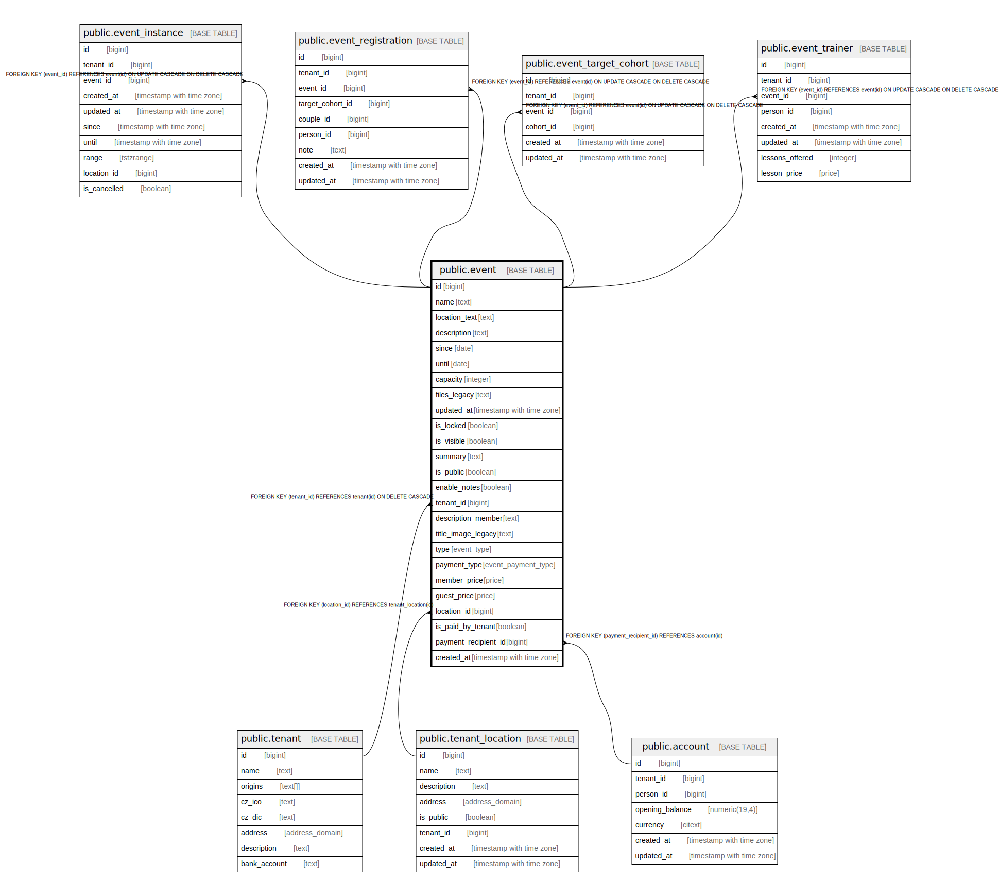

# public.event

## Description

@omit create

## Columns

| Name | Type | Default | Nullable | Children | Parents | Comment |
| ---- | ---- | ------- | -------- | -------- | ------- | ------- |
| id | bigint |  | false | [public.event_instance](public.event_instance.md) [public.event_registration](public.event_registration.md) [public.event_target_cohort](public.event_target_cohort.md) [public.event_trainer](public.event_trainer.md) |  |  |
| name | text |  | false |  |  |  |
| location_text | text |  | false |  |  |  |
| description | text |  | false |  |  |  |
| since | date |  | true |  |  |  |
| until | date |  | true |  |  |  |
| capacity | integer | '0'::bigint | false |  |  |  |
| files_legacy | text | ''::text | false |  |  |  |
| updated_at | timestamp with time zone |  | true |  |  |  |
| is_locked | boolean | false | false |  |  |  |
| is_visible | boolean | false | false |  |  |  |
| summary | text | ''::text | false |  |  |  |
| is_public | boolean | false | false |  |  |  |
| enable_notes | boolean | false | false |  |  |  |
| tenant_id | bigint | current_tenant_id() | false |  | [public.tenant](public.tenant.md) |  |
| description_member | text | ''::text | false |  |  |  |
| title_image_legacy | text |  | true |  |  |  |
| type | event_type | 'camp'::event_type | false |  |  |  |
| payment_type | event_payment_type | 'none'::event_payment_type | false |  |  |  |
| member_price | price | NULL::price_type | true |  |  |  |
| guest_price | price | NULL::price_type | true |  |  |  |
| location_id | bigint |  | true |  | [public.tenant_location](public.tenant_location.md) |  |
| is_paid_by_tenant | boolean | true | false |  |  |  |
| payment_recipient_id | bigint |  | true |  | [public.account](public.account.md) |  |
| created_at | timestamp with time zone | CURRENT_TIMESTAMP | true |  |  |  |

## Constraints

| Name | Type | Definition |
| ---- | ---- | ---------- |
| event_payment_recipient_id_fkey | FOREIGN KEY | FOREIGN KEY (payment_recipient_id) REFERENCES account(id) |
| idx_24557_primary | PRIMARY KEY | PRIMARY KEY (id) |
| event_location_id_fkey | FOREIGN KEY | FOREIGN KEY (location_id) REFERENCES tenant_location(id) |
| event_tenant_id_fkey | FOREIGN KEY | FOREIGN KEY (tenant_id) REFERENCES tenant(id) ON DELETE CASCADE |

## Indexes

| Name | Definition |
| ---- | ---------- |
| idx_24557_primary | CREATE UNIQUE INDEX idx_24557_primary ON public.event USING btree (id) |
| event_type_idx | CREATE INDEX event_type_idx ON public.event USING btree (type) |
| idx_e_tenant | CREATE INDEX idx_e_tenant ON public.event USING btree (tenant_id) |
| idx_event_tenant_visible | CREATE INDEX idx_event_tenant_visible ON public.event USING btree (is_visible, tenant_id) |
| is_visible | CREATE INDEX is_visible ON public.event USING btree (is_visible) |
| since | CREATE INDEX since ON public.event USING btree (since) |
| idx_event_tenant | CREATE INDEX idx_event_tenant ON public.event USING btree (tenant_id, is_visible) |

## Triggers

| Name | Definition |
| ---- | ---------- |
| _100_timestamps | CREATE TRIGGER _100_timestamps BEFORE INSERT OR UPDATE ON public.event FOR EACH ROW EXECUTE FUNCTION app_private.tg__timestamps() |

## Relations

---

> Generated by [tbls](https://github.com/k1LoW/tbls)
