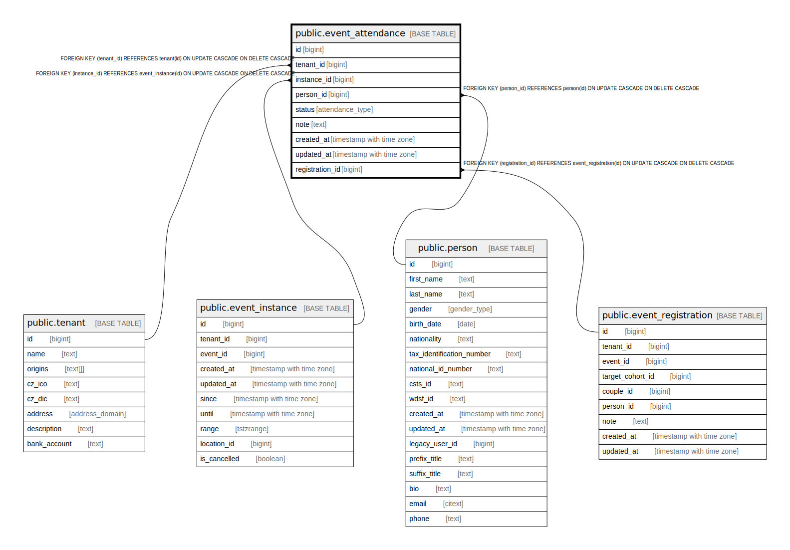

# public.event_attendance

## Description

@omit create,update,delete  
@simpleCollections only

## Columns

| Name | Type | Default | Nullable | Children | Parents | Comment |
| ---- | ---- | ------- | -------- | -------- | ------- | ------- |
| id | bigint |  | false |  |  |  |
| tenant_id | bigint | current_tenant_id() | false |  | [public.tenant](public.tenant.md) |  |
| instance_id | bigint |  | false |  | [public.event_instance](public.event_instance.md) |  |
| person_id | bigint |  | false |  | [public.person](public.person.md) |  |
| status | attendance_type | 'unknown'::attendance_type | false |  |  |  |
| note | text |  | true |  |  |  |
| created_at | timestamp with time zone | now() | false |  |  |  |
| updated_at | timestamp with time zone | now() | false |  |  |  |
| registration_id | bigint |  | false |  | [public.event_registration](public.event_registration.md) |  |

## Constraints

| Name | Type | Definition |
| ---- | ---- | ---------- |
| event_attendance_pkey | PRIMARY KEY | PRIMARY KEY (id) |
| event_attendance_unique_event_person_key | UNIQUE | UNIQUE (registration_id, instance_id, person_id) |
| event_attendance_instance_id_fkey | FOREIGN KEY | FOREIGN KEY (instance_id) REFERENCES event_instance(id) ON UPDATE CASCADE ON DELETE CASCADE |
| event_attendance_registration_id_fkey | FOREIGN KEY | FOREIGN KEY (registration_id) REFERENCES event_registration(id) ON UPDATE CASCADE ON DELETE CASCADE |
| event_attendance_person_id_fkey | FOREIGN KEY | FOREIGN KEY (person_id) REFERENCES person(id) ON UPDATE CASCADE ON DELETE CASCADE |
| event_attendance_tenant_id_fkey | FOREIGN KEY | FOREIGN KEY (tenant_id) REFERENCES tenant(id) ON UPDATE CASCADE ON DELETE CASCADE |

## Indexes

| Name | Definition |
| ---- | ---------- |
| event_attendance_pkey | CREATE UNIQUE INDEX event_attendance_pkey ON public.event_attendance USING btree (id) |
| event_attendance_unique_event_person_key | CREATE UNIQUE INDEX event_attendance_unique_event_person_key ON public.event_attendance USING btree (registration_id, instance_id, person_id) |
| event_attendance_instance_id_idx | CREATE INDEX event_attendance_instance_id_idx ON public.event_attendance USING btree (instance_id) |
| event_attendance_person_id_idx | CREATE INDEX event_attendance_person_id_idx ON public.event_attendance USING btree (person_id) |

## Triggers

| Name | Definition |
| ---- | ---------- |
| _100_timestamps | CREATE TRIGGER _100_timestamps BEFORE INSERT OR UPDATE ON public.event_attendance FOR EACH ROW EXECUTE FUNCTION app_private.tg__timestamps() |

## Relations

---

> Generated by [tbls](https://github.com/k1LoW/tbls)
