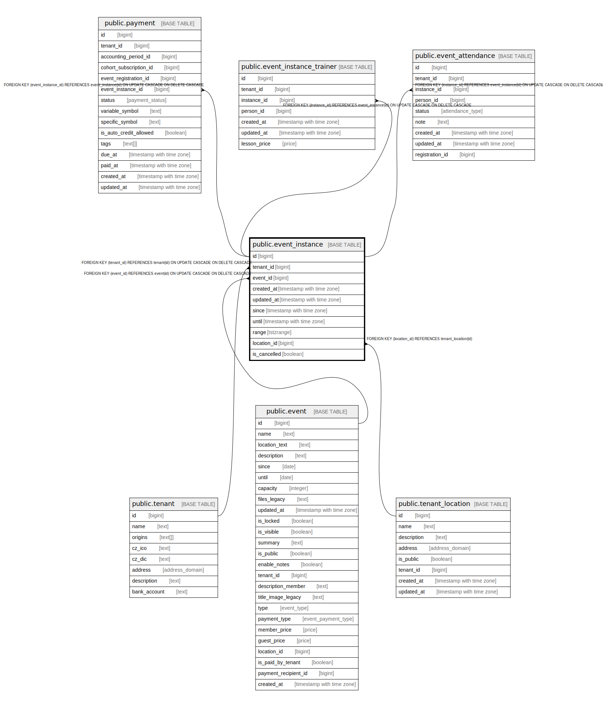

# public.event_instance

## Description

@omit create,delete  
@simpleCollections only

## Columns

| Name | Type | Default | Nullable | Extra Definition | Children | Parents | Comment |
| ---- | ---- | ------- | -------- | ---------------- | -------- | ------- | ------- |
| id | bigint |  | false |  | [public.payment](public.payment.md) [public.event_instance_trainer](public.event_instance_trainer.md) [public.event_attendance](public.event_attendance.md) |  |  |
| tenant_id | bigint | current_tenant_id() | false |  |  | [public.tenant](public.tenant.md) |  |
| event_id | bigint |  | false |  |  | [public.event](public.event.md) |  |
| created_at | timestamp with time zone | now() | false |  |  |  |  |
| updated_at | timestamp with time zone | now() | false |  |  |  |  |
| since | timestamp with time zone |  | false |  |  |  |  |
| until | timestamp with time zone |  | false |  |  |  |  |
| range | tstzrange |  | false | GENERATED ALWAYS AS tstzrange(since, until, '[]'::text) STORED |  |  |  |
| location_id | bigint |  | true |  |  | [public.tenant_location](public.tenant_location.md) |  |
| is_cancelled | boolean | false | true |  |  |  |  |

## Constraints

| Name | Type | Definition |
| ---- | ---- | ---------- |
| event_instance_pkey | PRIMARY KEY | PRIMARY KEY (id) |
| event_instance_event_id_fkey | FOREIGN KEY | FOREIGN KEY (event_id) REFERENCES event(id) ON UPDATE CASCADE ON DELETE CASCADE |
| event_instance_location_id_fkey | FOREIGN KEY | FOREIGN KEY (location_id) REFERENCES tenant_location(id) |
| event_instance_tenant_id_fkey | FOREIGN KEY | FOREIGN KEY (tenant_id) REFERENCES tenant(id) ON UPDATE CASCADE ON DELETE CASCADE |

## Indexes

| Name | Definition |
| ---- | ---------- |
| event_instance_pkey | CREATE UNIQUE INDEX event_instance_pkey ON public.event_instance USING btree (id) |
| event_instance_event_id_idx | CREATE INDEX event_instance_event_id_idx ON public.event_instance USING btree (event_id) |
| event_instance_since_idx | CREATE INDEX event_instance_since_idx ON public.event_instance USING btree (since) |
| event_instance_range_idx | CREATE INDEX event_instance_range_idx ON public.event_instance USING btree (tenant_id, since, until) |

## Triggers

| Name | Definition |
| ---- | ---------- |
| _100_timestamps | CREATE TRIGGER _100_timestamps BEFORE INSERT OR UPDATE ON public.event_instance FOR EACH ROW EXECUTE FUNCTION app_private.tg__timestamps() |
| _500_create_attendance | CREATE TRIGGER _500_create_attendance AFTER INSERT ON public.event_instance FOR EACH ROW EXECUTE FUNCTION app_private.tg_event_instance__create_attendance() |

## Relations

---

> Generated by [tbls](https://github.com/k1LoW/tbls)
