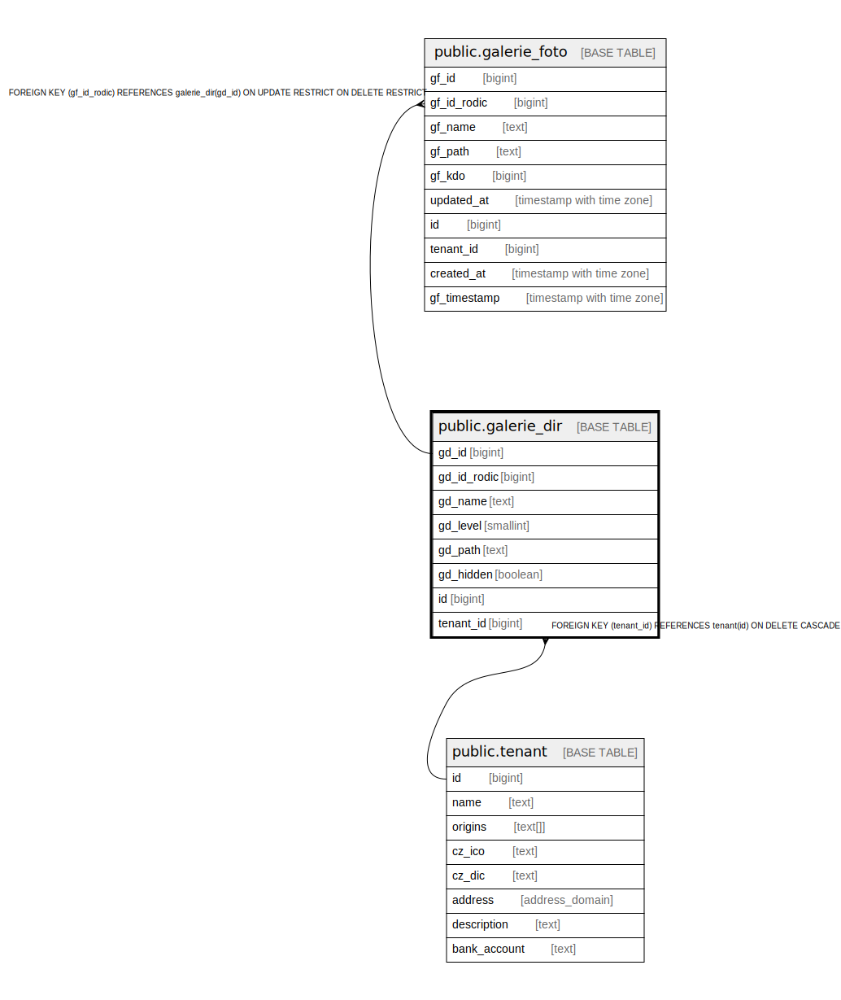

# public.galerie_dir

## Description

@omit create,update,delete

## Columns

| Name | Type | Default | Nullable | Extra Definition | Children | Parents | Comment |
| ---- | ---- | ------- | -------- | ---------------- | -------- | ------- | ------- |
| gd_id | bigint | nextval('galerie_dir_gd_id_seq'::regclass) | false |  | [public.galerie_foto](public.galerie_foto.md) |  |  |
| gd_id_rodic | bigint |  | false |  |  |  |  |
| gd_name | text |  | false |  |  |  |  |
| gd_level | smallint | '1'::smallint | false |  |  |  |  |
| gd_path | text |  | false |  |  |  |  |
| gd_hidden | boolean | true | false |  |  |  |  |
| id | bigint |  | false | GENERATED ALWAYS AS gd_id STORED |  |  |  |
| tenant_id | bigint | current_tenant_id() | false |  |  | [public.tenant](public.tenant.md) |  |

## Constraints

| Name | Type | Definition |
| ---- | ---- | ---------- |
| galerie_dir_unique_id | UNIQUE | UNIQUE (id) |
| idx_24602_primary | PRIMARY KEY | PRIMARY KEY (gd_id) |
| galerie_dir_tenant_id_fkey | FOREIGN KEY | FOREIGN KEY (tenant_id) REFERENCES tenant(id) ON DELETE CASCADE |

## Indexes

| Name | Definition |
| ---- | ---------- |
| galerie_dir_unique_id | CREATE UNIQUE INDEX galerie_dir_unique_id ON public.galerie_dir USING btree (id) |
| idx_24602_primary | CREATE UNIQUE INDEX idx_24602_primary ON public.galerie_dir USING btree (gd_id) |

## Relations

---

> Generated by [tbls](https://github.com/k1LoW/tbls)
