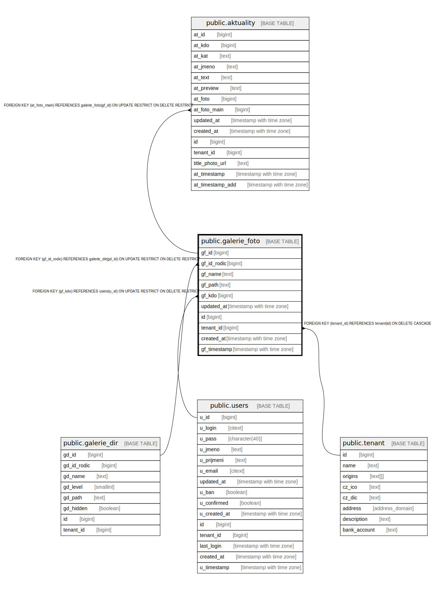

# public.galerie_foto

## Description

@omit create,update,delete

## Columns

| Name | Type | Default | Nullable | Extra Definition | Children | Parents | Comment |
| ---- | ---- | ------- | -------- | ---------------- | -------- | ------- | ------- |
| gf_id | bigint | nextval('galerie_foto_gf_id_seq'::regclass) | false |  | [public.aktuality](public.aktuality.md) |  |  |
| gf_id_rodic | bigint |  | false |  |  | [public.galerie_dir](public.galerie_dir.md) |  |
| gf_name | text |  | false |  |  |  |  |
| gf_path | text |  | false |  |  |  |  |
| gf_kdo | bigint |  | false |  |  | [public.users](public.users.md) |  |
| updated_at | timestamp with time zone |  | true |  |  |  |  |
| id | bigint |  | false | GENERATED ALWAYS AS gf_id STORED |  |  |  |
| tenant_id | bigint | current_tenant_id() | false |  |  | [public.tenant](public.tenant.md) |  |
| created_at | timestamp with time zone | CURRENT_TIMESTAMP | true |  |  |  |  |
| gf_timestamp | timestamp with time zone |  | true | GENERATED ALWAYS AS updated_at STORED |  |  |  |

## Constraints

| Name | Type | Definition |
| ---- | ---- | ---------- |
| galerie_foto_unique_id | UNIQUE | UNIQUE (id) |
| galerie_foto_gf_id_rodic_fkey | FOREIGN KEY | FOREIGN KEY (gf_id_rodic) REFERENCES galerie_dir(gd_id) ON UPDATE RESTRICT ON DELETE RESTRICT |
| idx_24613_primary | PRIMARY KEY | PRIMARY KEY (gf_id) |
| galerie_foto_gf_kdo_fkey | FOREIGN KEY | FOREIGN KEY (gf_kdo) REFERENCES users(u_id) ON UPDATE RESTRICT ON DELETE RESTRICT |
| galerie_foto_tenant_id_fkey | FOREIGN KEY | FOREIGN KEY (tenant_id) REFERENCES tenant(id) ON DELETE CASCADE |

## Indexes

| Name | Definition |
| ---- | ---------- |
| galerie_foto_unique_id | CREATE UNIQUE INDEX galerie_foto_unique_id ON public.galerie_foto USING btree (id) |
| idx_24613_primary | CREATE UNIQUE INDEX idx_24613_primary ON public.galerie_foto USING btree (gf_id) |
| idx_24613_galerie_foto_gf_kdo_fkey | CREATE INDEX idx_24613_galerie_foto_gf_kdo_fkey ON public.galerie_foto USING btree (gf_kdo) |

## Triggers

| Name | Definition |
| ---- | ---------- |
| _100_timestamps | CREATE TRIGGER _100_timestamps BEFORE INSERT OR UPDATE ON public.galerie_foto FOR EACH ROW EXECUTE FUNCTION app_private.tg__timestamps() |

## Relations

---

> Generated by [tbls](https://github.com/k1LoW/tbls)
