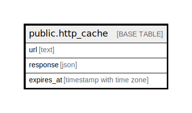

# public.http_cache

## Description

@omit

## Columns

| Name | Type | Default | Nullable | Children | Parents | Comment |
| ---- | ---- | ------- | -------- | -------- | ------- | ------- |
| url | text |  | false |  |  |  |
| response | json |  | false |  |  |  |
| expires_at | timestamp with time zone |  | false |  |  |  |

## Constraints

| Name | Type | Definition |
| ---- | ---- | ---------- |
| http_cache_pkey | PRIMARY KEY | PRIMARY KEY (url) |

## Indexes

| Name | Definition |
| ---- | ---------- |
| http_cache_pkey | CREATE UNIQUE INDEX http_cache_pkey ON public.http_cache USING btree (url) |

## Triggers

| Name | Definition |
| ---- | ---------- |
| _500_prune_expired | CREATE TRIGGER _500_prune_expired AFTER INSERT OR UPDATE ON public.http_cache FOR EACH STATEMENT EXECUTE FUNCTION app_private.tg_http_cache__prune_expired() |

## Relations

---

> Generated by [tbls](https://github.com/k1LoW/tbls)
