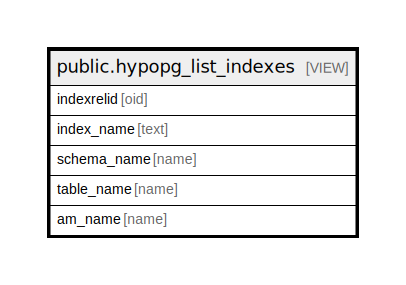

# public.hypopg_list_indexes

## Description

<details>
<summary><strong>Table Definition</strong></summary>

```sql
CREATE VIEW hypopg_list_indexes AS (
 SELECT h.indexrelid,
    h.indexname AS index_name,
    n.nspname AS schema_name,
    COALESCE(c.relname, '<dropped>'::name) AS table_name,
    am.amname AS am_name
   FROM (((hypopg() h(indexname, indexrelid, indrelid, innatts, indisunique, indkey, indcollation, indclass, indoption, indexprs, indpred, amid)
     LEFT JOIN pg_class c ON ((c.oid = h.indrelid)))
     LEFT JOIN pg_namespace n ON ((n.oid = c.relnamespace)))
     LEFT JOIN pg_am am ON ((am.oid = h.amid)))
)
```

</details>

## Columns

| Name | Type | Default | Nullable | Children | Parents | Comment |
| ---- | ---- | ------- | -------- | -------- | ------- | ------- |
| indexrelid | oid |  | true |  |  |  |
| index_name | text |  | true |  |  |  |
| schema_name | name |  | true |  |  |  |
| table_name | name |  | true |  |  |  |
| am_name | name |  | true |  |  |  |

## Referenced Tables

| Name | Columns | Comment | Type |
| ---- | ------- | ------- | ---- |
| [hypopg](hypopg.md) | 0 |  |  |
| [pg_class](pg_class.md) | 0 |  |  |
| [pg_namespace](pg_namespace.md) | 0 |  |  |
| [pg_am](pg_am.md) | 0 |  |  |

## Relations



---

> Generated by [tbls](https://github.com/k1LoW/tbls)
