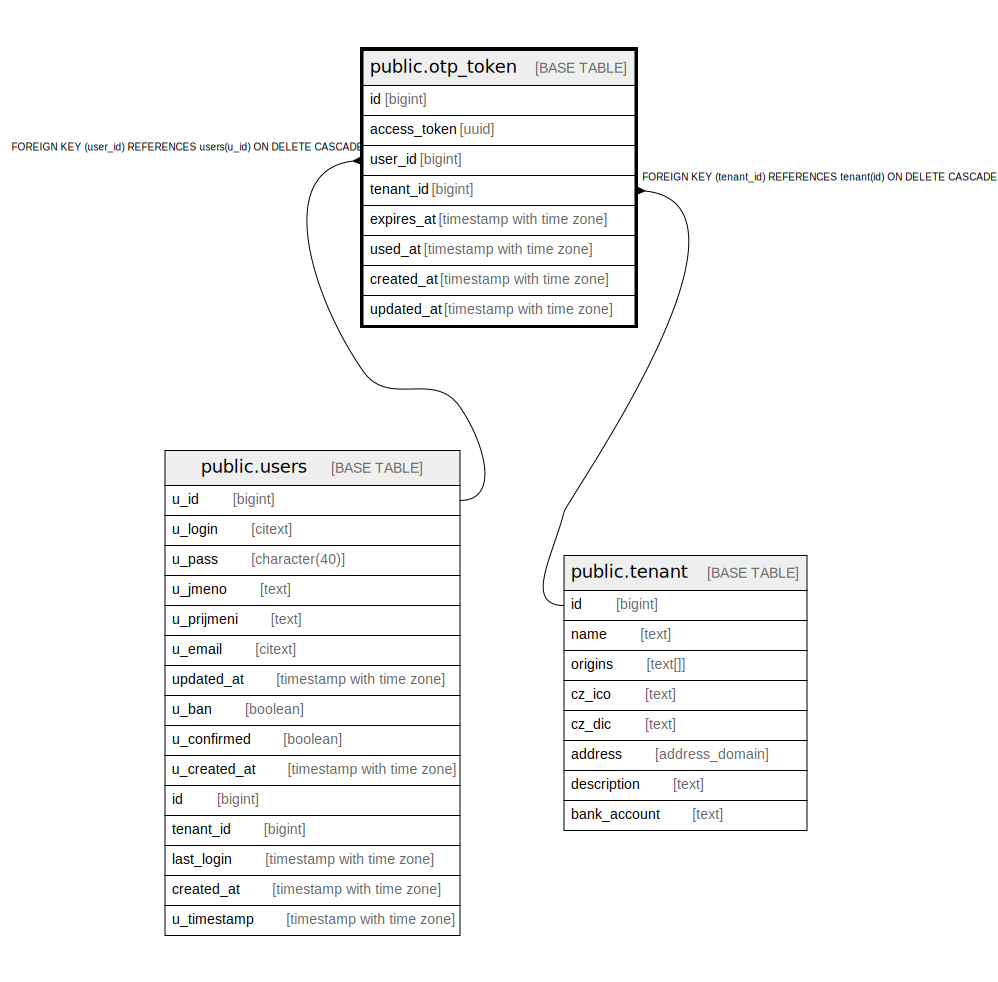

# public.otp_token

## Description

@omit

## Columns

| Name | Type | Default | Nullable | Children | Parents | Comment |
| ---- | ---- | ------- | -------- | -------- | ------- | ------- |
| id | bigint |  | false |  |  |  |
| access_token | uuid | gen_random_uuid() | false |  |  |  |
| user_id | bigint |  | true |  | [public.users](public.users.md) |  |
| tenant_id | bigint | current_tenant_id() | false |  | [public.tenant](public.tenant.md) |  |
| expires_at | timestamp with time zone | (now() + '24:00:00'::interval) | false |  |  |  |
| used_at | timestamp with time zone |  | true |  |  |  |
| created_at | timestamp with time zone | now() | false |  |  |  |
| updated_at | timestamp with time zone | now() | false |  |  |  |

## Constraints

| Name | Type | Definition |
| ---- | ---- | ---------- |
| otp_token_user_id_fkey | FOREIGN KEY | FOREIGN KEY (user_id) REFERENCES users(u_id) ON DELETE CASCADE |
| otp_token_access_token_key | UNIQUE | UNIQUE (access_token) |
| otp_token_pkey | PRIMARY KEY | PRIMARY KEY (id) |
| otp_token_tenant_id_fkey | FOREIGN KEY | FOREIGN KEY (tenant_id) REFERENCES tenant(id) ON DELETE CASCADE |

## Indexes

| Name | Definition |
| ---- | ---------- |
| otp_token_access_token_key | CREATE UNIQUE INDEX otp_token_access_token_key ON public.otp_token USING btree (access_token) |
| otp_token_pkey | CREATE UNIQUE INDEX otp_token_pkey ON public.otp_token USING btree (id) |

## Relations

---

> Generated by [tbls](https://github.com/k1LoW/tbls)
