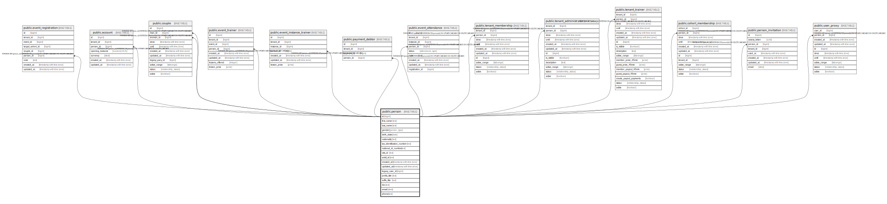

# public.person

## Description

@omit create

## Columns

| Name | Type | Default | Nullable | Children | Parents | Comment |
| ---- | ---- | ------- | -------- | -------- | ------- | ------- |
| id | bigint |  | false | [public.event_registration](public.event_registration.md) [public.account](public.account.md) [public.couple](public.couple.md) [public.event_trainer](public.event_trainer.md) [public.event_instance_trainer](public.event_instance_trainer.md) [public.payment_debtor](public.payment_debtor.md) [public.event_attendance](public.event_attendance.md) [public.tenant_membership](public.tenant_membership.md) [public.tenant_administrator](public.tenant_administrator.md) [public.tenant_trainer](public.tenant_trainer.md) [public.cohort_membership](public.cohort_membership.md) [public.person_invitation](public.person_invitation.md) [public.user_proxy](public.user_proxy.md) |  |  |
| first_name | text |  | false |  |  |  |
| last_name | text |  | false |  |  |  |
| gender | gender_type |  | false |  |  |  |
| birth_date | date |  | true |  |  |  |
| nationality | text |  | false |  |  |  |
| tax_identification_number | text |  | true |  |  |  |
| national_id_number | text |  | true |  |  |  |
| csts_id | text |  | true |  |  |  |
| wdsf_id | text |  | true |  |  |  |
| created_at | timestamp with time zone | now() | false |  |  |  |
| updated_at | timestamp with time zone | now() | false |  |  |  |
| legacy_user_id | bigint |  | true |  |  | @omit |
| prefix_title | text | ''::text | false |  |  |  |
| suffix_title | text | ''::text | false |  |  |  |
| bio | text | ''::text | false |  |  |  |
| email | citext |  | true |  |  |  |
| phone | text |  | true |  |  |  |

## Constraints

| Name | Type | Definition |
| ---- | ---- | ---------- |
| person_pkey | PRIMARY KEY | PRIMARY KEY (id) |

## Indexes

| Name | Definition |
| ---- | ---------- |
| person_pkey | CREATE UNIQUE INDEX person_pkey ON public.person USING btree (id) |

## Triggers

| Name | Definition |
| ---- | ---------- |
| _100_timestamps | CREATE TRIGGER _100_timestamps BEFORE INSERT OR UPDATE ON public.person FOR EACH ROW EXECUTE FUNCTION app_private.tg__timestamps() |

## Relations

---

> Generated by [tbls](https://github.com/k1LoW/tbls)
