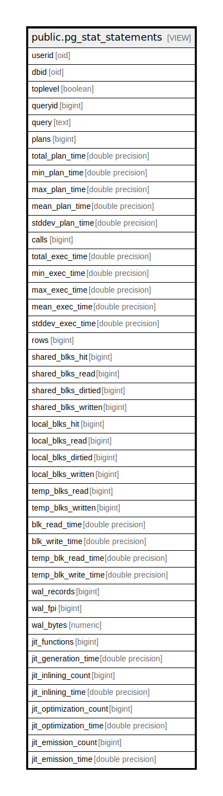

# public.pg_stat_statements

## Description

<details>
<summary><strong>Table Definition</strong></summary>

```sql
CREATE VIEW pg_stat_statements AS (
 SELECT userid,
    dbid,
    toplevel,
    queryid,
    query,
    plans,
    total_plan_time,
    min_plan_time,
    max_plan_time,
    mean_plan_time,
    stddev_plan_time,
    calls,
    total_exec_time,
    min_exec_time,
    max_exec_time,
    mean_exec_time,
    stddev_exec_time,
    rows,
    shared_blks_hit,
    shared_blks_read,
    shared_blks_dirtied,
    shared_blks_written,
    local_blks_hit,
    local_blks_read,
    local_blks_dirtied,
    local_blks_written,
    temp_blks_read,
    temp_blks_written,
    blk_read_time,
    blk_write_time,
    temp_blk_read_time,
    temp_blk_write_time,
    wal_records,
    wal_fpi,
    wal_bytes,
    jit_functions,
    jit_generation_time,
    jit_inlining_count,
    jit_inlining_time,
    jit_optimization_count,
    jit_optimization_time,
    jit_emission_count,
    jit_emission_time
   FROM pg_stat_statements(true) pg_stat_statements(userid, dbid, toplevel, queryid, query, plans, total_plan_time, min_plan_time, max_plan_time, mean_plan_time, stddev_plan_time, calls, total_exec_time, min_exec_time, max_exec_time, mean_exec_time, stddev_exec_time, rows, shared_blks_hit, shared_blks_read, shared_blks_dirtied, shared_blks_written, local_blks_hit, local_blks_read, local_blks_dirtied, local_blks_written, temp_blks_read, temp_blks_written, blk_read_time, blk_write_time, temp_blk_read_time, temp_blk_write_time, wal_records, wal_fpi, wal_bytes, jit_functions, jit_generation_time, jit_inlining_count, jit_inlining_time, jit_optimization_count, jit_optimization_time, jit_emission_count, jit_emission_time)
)
```

</details>

## Columns

| Name | Type | Default | Nullable | Children | Parents | Comment |
| ---- | ---- | ------- | -------- | -------- | ------- | ------- |
| userid | oid |  | true |  |  |  |
| dbid | oid |  | true |  |  |  |
| toplevel | boolean |  | true |  |  |  |
| queryid | bigint |  | true |  |  |  |
| query | text |  | true |  |  |  |
| plans | bigint |  | true |  |  |  |
| total_plan_time | double precision |  | true |  |  |  |
| min_plan_time | double precision |  | true |  |  |  |
| max_plan_time | double precision |  | true |  |  |  |
| mean_plan_time | double precision |  | true |  |  |  |
| stddev_plan_time | double precision |  | true |  |  |  |
| calls | bigint |  | true |  |  |  |
| total_exec_time | double precision |  | true |  |  |  |
| min_exec_time | double precision |  | true |  |  |  |
| max_exec_time | double precision |  | true |  |  |  |
| mean_exec_time | double precision |  | true |  |  |  |
| stddev_exec_time | double precision |  | true |  |  |  |
| rows | bigint |  | true |  |  |  |
| shared_blks_hit | bigint |  | true |  |  |  |
| shared_blks_read | bigint |  | true |  |  |  |
| shared_blks_dirtied | bigint |  | true |  |  |  |
| shared_blks_written | bigint |  | true |  |  |  |
| local_blks_hit | bigint |  | true |  |  |  |
| local_blks_read | bigint |  | true |  |  |  |
| local_blks_dirtied | bigint |  | true |  |  |  |
| local_blks_written | bigint |  | true |  |  |  |
| temp_blks_read | bigint |  | true |  |  |  |
| temp_blks_written | bigint |  | true |  |  |  |
| blk_read_time | double precision |  | true |  |  |  |
| blk_write_time | double precision |  | true |  |  |  |
| temp_blk_read_time | double precision |  | true |  |  |  |
| temp_blk_write_time | double precision |  | true |  |  |  |
| wal_records | bigint |  | true |  |  |  |
| wal_fpi | bigint |  | true |  |  |  |
| wal_bytes | numeric |  | true |  |  |  |
| jit_functions | bigint |  | true |  |  |  |
| jit_generation_time | double precision |  | true |  |  |  |
| jit_inlining_count | bigint |  | true |  |  |  |
| jit_inlining_time | double precision |  | true |  |  |  |
| jit_optimization_count | bigint |  | true |  |  |  |
| jit_optimization_time | double precision |  | true |  |  |  |
| jit_emission_count | bigint |  | true |  |  |  |
| jit_emission_time | double precision |  | true |  |  |  |

## Referenced Tables

| Name | Columns | Comment | Type |
| ---- | ------- | ------- | ---- |
| [public.pg_stat_statements](public.pg_stat_statements.md) | 43 |  | VIEW |

## Relations



---

> Generated by [tbls](https://github.com/k1LoW/tbls)
