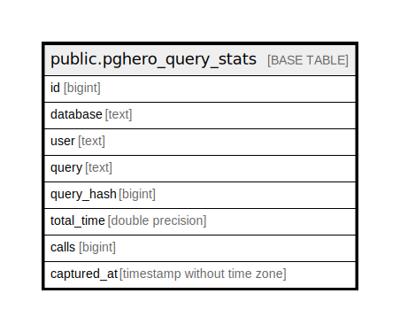

# public.pghero_query_stats

## Description

@omit

## Columns

| Name | Type | Default | Nullable | Children | Parents | Comment |
| ---- | ---- | ------- | -------- | -------- | ------- | ------- |
| id | bigint | nextval('pghero_query_stats_id_seq'::regclass) | false |  |  |  |
| database | text |  | true |  |  |  |
| user | text |  | true |  |  |  |
| query | text |  | true |  |  |  |
| query_hash | bigint |  | true |  |  |  |
| total_time | double precision |  | true |  |  |  |
| calls | bigint |  | true |  |  |  |
| captured_at | timestamp without time zone |  | true |  |  |  |

## Constraints

| Name | Type | Definition |
| ---- | ---- | ---------- |
| pghero_query_stats_pkey | PRIMARY KEY | PRIMARY KEY (id) |

## Indexes

| Name | Definition |
| ---- | ---------- |
| pghero_query_stats_pkey | CREATE UNIQUE INDEX pghero_query_stats_pkey ON public.pghero_query_stats USING btree (id) |
| pghero_query_stats_database_captured_at_idx | CREATE INDEX pghero_query_stats_database_captured_at_idx ON public.pghero_query_stats USING btree (database, captured_at) |

## Relations

---

> Generated by [tbls](https://github.com/k1LoW/tbls)
