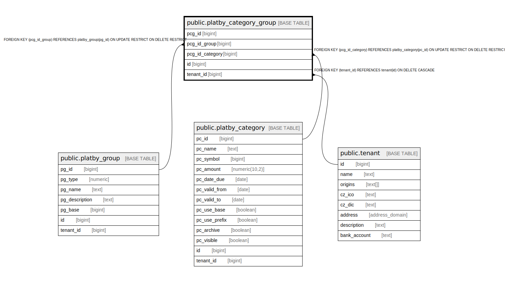

# public.platby_category_group

## Description

@omit

## Columns

| Name | Type | Default | Nullable | Extra Definition | Children | Parents | Comment |
| ---- | ---- | ------- | -------- | ---------------- | -------- | ------- | ------- |
| pcg_id | bigint | nextval('platby_category_group_pcg_id_seq'::regclass) | false |  |  |  |  |
| pcg_id_group | bigint |  | false |  |  | [public.platby_group](public.platby_group.md) |  |
| pcg_id_category | bigint |  | false |  |  | [public.platby_category](public.platby_category.md) |  |
| id | bigint |  | false | GENERATED ALWAYS AS pcg_id STORED |  |  |  |
| tenant_id | bigint | current_tenant_id() | false |  |  | [public.tenant](public.tenant.md) |  |

## Constraints

| Name | Type | Definition |
| ---- | ---- | ---------- |
| platby_category_group_pcg_id_category_fkey | FOREIGN KEY | FOREIGN KEY (pcg_id_category) REFERENCES platby_category(pc_id) ON UPDATE RESTRICT ON DELETE RESTRICT |
| idx_24690_primary | PRIMARY KEY | PRIMARY KEY (pcg_id) |
| platby_category_group_pcg_id_group_fkey | FOREIGN KEY | FOREIGN KEY (pcg_id_group) REFERENCES platby_group(pg_id) ON UPDATE RESTRICT ON DELETE RESTRICT |
| platby_category_group_unique_id | UNIQUE | UNIQUE (id) |
| platby_category_group_tenant_id_fkey | FOREIGN KEY | FOREIGN KEY (tenant_id) REFERENCES tenant(id) ON DELETE CASCADE |

## Indexes

| Name | Definition |
| ---- | ---------- |
| idx_24690_primary | CREATE UNIQUE INDEX idx_24690_primary ON public.platby_category_group USING btree (pcg_id) |
| platby_category_group_unique_id | CREATE UNIQUE INDEX platby_category_group_unique_id ON public.platby_category_group USING btree (id) |
| idx_24690_pcg_id_group | CREATE UNIQUE INDEX idx_24690_pcg_id_group ON public.platby_category_group USING btree (pcg_id_group, pcg_id_category) |

## Relations

---

> Generated by [tbls](https://github.com/k1LoW/tbls)
