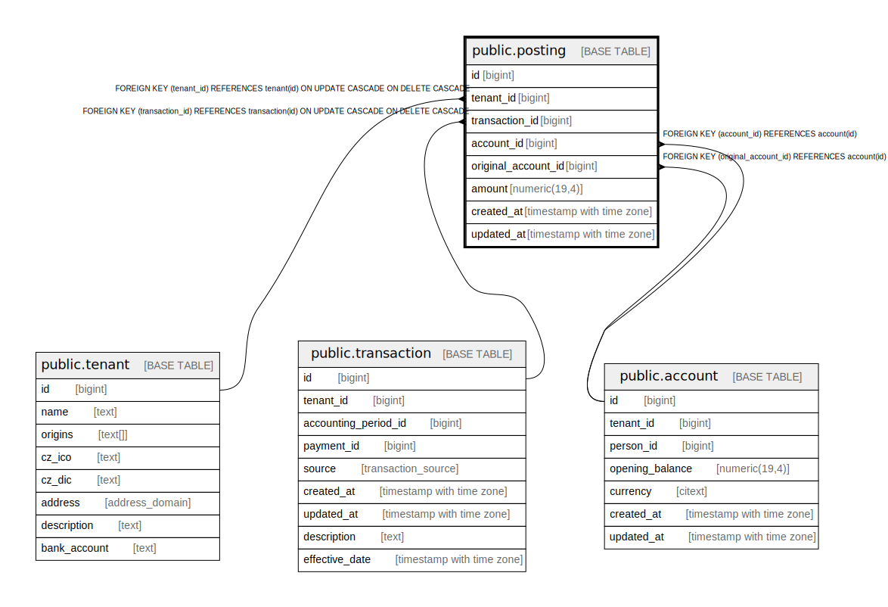

# public.posting

## Description

@omit create,update,delete  
@simpleCollections only

## Columns

| Name | Type | Default | Nullable | Children | Parents | Comment |
| ---- | ---- | ------- | -------- | -------- | ------- | ------- |
| id | bigint |  | false |  |  |  |
| tenant_id | bigint | current_tenant_id() | false |  | [public.tenant](public.tenant.md) |  |
| transaction_id | bigint |  | false |  | [public.transaction](public.transaction.md) |  |
| account_id | bigint |  | false |  | [public.account](public.account.md) |  |
| original_account_id | bigint |  | true |  | [public.account](public.account.md) |  |
| amount | numeric(19,4) |  | true |  |  |  |
| created_at | timestamp with time zone | now() | false |  |  |  |
| updated_at | timestamp with time zone | now() | false |  |  |  |

## Constraints

| Name | Type | Definition |
| ---- | ---- | ---------- |
| posting_account_id_fkey | FOREIGN KEY | FOREIGN KEY (account_id) REFERENCES account(id) |
| posting_original_account_id_fkey | FOREIGN KEY | FOREIGN KEY (original_account_id) REFERENCES account(id) |
| posting_pkey | PRIMARY KEY | PRIMARY KEY (id) |
| posting_tenant_id_fkey | FOREIGN KEY | FOREIGN KEY (tenant_id) REFERENCES tenant(id) ON UPDATE CASCADE ON DELETE CASCADE |
| posting_transaction_id_fkey | FOREIGN KEY | FOREIGN KEY (transaction_id) REFERENCES transaction(id) ON UPDATE CASCADE ON DELETE CASCADE |

## Indexes

| Name | Definition |
| ---- | ---------- |
| posting_pkey | CREATE UNIQUE INDEX posting_pkey ON public.posting USING btree (id) |

## Triggers

| Name | Definition |
| ---- | ---------- |
| _100_timestamps | CREATE TRIGGER _100_timestamps BEFORE INSERT OR UPDATE ON public.posting FOR EACH ROW EXECUTE FUNCTION app_private.tg__timestamps() |
| _900_fix_balance_entries | CREATE TRIGGER _900_fix_balance_entries AFTER INSERT OR DELETE OR UPDATE OF amount OR TRUNCATE ON public.posting FOR EACH STATEMENT EXECUTE FUNCTION app_private.tg_account_balances__update() |

## Relations

---

> Generated by [tbls](https://github.com/k1LoW/tbls)
