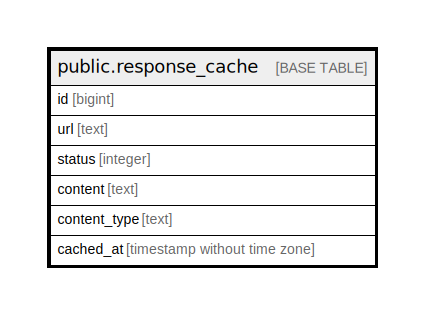

# public.response_cache

## Description

@omit

## Columns

| Name | Type | Default | Nullable | Children | Parents | Comment |
| ---- | ---- | ------- | -------- | -------- | ------- | ------- |
| id | bigint |  | false |  |  |  |
| url | text |  | false |  |  |  |
| status | integer |  | false |  |  |  |
| content | text |  | false |  |  |  |
| content_type | text |  | false |  |  |  |
| cached_at | timestamp without time zone | CURRENT_TIMESTAMP | true |  |  |  |

## Constraints

| Name | Type | Definition |
| ---- | ---- | ---------- |
| response_cache_pkey | PRIMARY KEY | PRIMARY KEY (id) |
| response_cache_url_key | UNIQUE | UNIQUE (url) |

## Indexes

| Name | Definition |
| ---- | ---------- |
| response_cache_pkey | CREATE UNIQUE INDEX response_cache_pkey ON public.response_cache USING btree (id) |
| response_cache_url_key | CREATE UNIQUE INDEX response_cache_url_key ON public.response_cache USING btree (url) |

## Relations

---

> Generated by [tbls](https://github.com/k1LoW/tbls)
