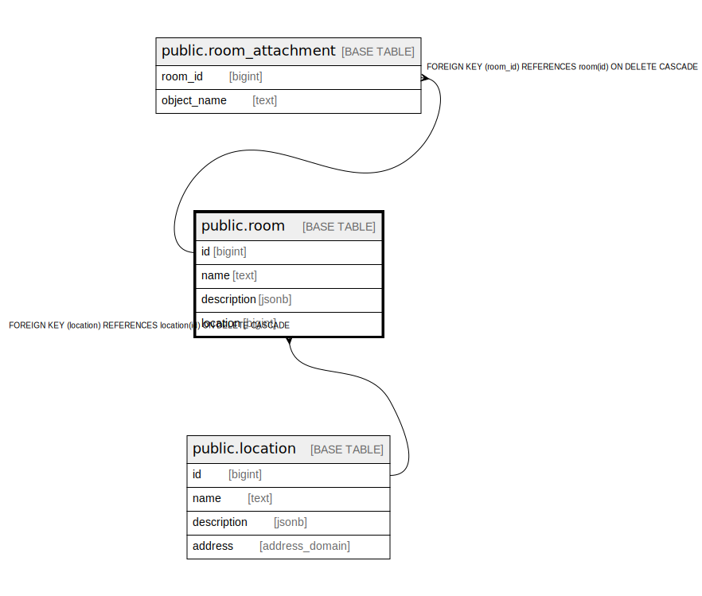

# public.room

## Description

## Columns

| Name | Type | Default | Nullable | Children | Parents | Comment |
| ---- | ---- | ------- | -------- | -------- | ------- | ------- |
| id | bigint |  | false | [public.room_attachment](public.room_attachment.md) |  |  |
| name | text |  | false |  |  |  |
| description | jsonb |  | false |  |  |  |
| location | bigint |  | true |  | [public.location](public.location.md) |  |

## Constraints

| Name | Type | Definition |
| ---- | ---- | ---------- |
| room_location_fkey | FOREIGN KEY | FOREIGN KEY (location) REFERENCES location(id) ON DELETE CASCADE |
| room_pkey | PRIMARY KEY | PRIMARY KEY (id) |

## Indexes

| Name | Definition |
| ---- | ---------- |
| room_pkey | CREATE UNIQUE INDEX room_pkey ON public.room USING btree (id) |

## Relations

---

> Generated by [tbls](https://github.com/k1LoW/tbls)
