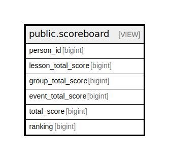

# public.scoreboard

## Description

@foreignKey (person_id) references person (id)  
@simpleCollections only

<details>
<summary><strong>Table Definition</strong></summary>

```sql
CREATE VIEW scoreboard AS (
 WITH members AS (
         SELECT person.id
           FROM (person
             JOIN cohort_membership ON ((cohort_membership.person_id = person.id)))
          WHERE (cohort_membership.active AND (cohort_membership.tenant_id = current_tenant_id()))
        ), attendances AS (
         SELECT event_attendance.person_id,
                CASE
                    WHEN (event.type = 'lesson'::event_type) THEN 1
                    ELSE 0
                END AS lesson_score,
                CASE
                    WHEN (event.type = 'group'::event_type) THEN floor(((EXTRACT(epoch FROM (i.until - i.since)) / (60)::numeric) / (45)::numeric))
                    ELSE (0)::numeric
                END AS group_score,
                CASE
                    WHEN (event.type = 'camp'::event_type) THEN (3 + (2 * ((EXTRACT(epoch FROM (i.until - i.since)) > (86400)::numeric))::integer))
                    ELSE 0
                END AS event_score,
            i.since
           FROM (((event_attendance
             JOIN event_registration ON ((event_registration.id = event_attendance.registration_id)))
             JOIN event ON ((event.id = event_registration.event_id)))
             JOIN event_instance i ON ((event_attendance.instance_id = i.id)))
          WHERE (((event_attendance.status = 'attended'::attendance_type) OR (event.type = 'lesson'::event_type)) AND (event.type <> 'reservation'::event_type) AND (NOT i.is_cancelled) AND (i.since > '2023-09-01 00:00:00+00'::timestamp with time zone) AND (i.until < date_trunc('day'::text, now())) AND (event_attendance.person_id IN ( SELECT members.id
                   FROM members)))
        ), per_day AS (
         SELECT attendances.person_id,
            LEAST(sum(attendances.lesson_score), (4)::bigint) AS lesson_score,
            sum(attendances.group_score) AS group_score,
            sum(attendances.event_score) AS event_score,
            (((LEAST(sum(attendances.lesson_score), (4)::bigint))::numeric + sum(attendances.group_score)) + (sum(attendances.event_score))::numeric) AS total_score,
            attendances.since
           FROM attendances
          GROUP BY attendances.person_id, attendances.since
        )
 SELECT person_id,
    (sum(lesson_score))::bigint AS lesson_total_score,
    (sum(group_score))::bigint AS group_total_score,
    (sum(event_score))::bigint AS event_total_score,
    (sum((((lesson_score)::numeric + group_score) + (event_score)::numeric)))::bigint AS total_score,
    rank() OVER (ORDER BY (sum(((lesson_score)::numeric + group_score))) DESC) AS ranking
   FROM per_day
  GROUP BY person_id
  ORDER BY ((sum((((lesson_score)::numeric + group_score) + (event_score)::numeric)))::bigint) DESC
)
```

</details>

## Columns

| Name | Type | Default | Nullable | Children | Parents | Comment |
| ---- | ---- | ------- | -------- | -------- | ------- | ------- |
| person_id | bigint |  | true |  |  |  |
| lesson_total_score | bigint |  | true |  |  |  |
| group_total_score | bigint |  | true |  |  |  |
| event_total_score | bigint |  | true |  |  |  |
| total_score | bigint |  | true |  |  |  |
| ranking | bigint |  | true |  |  |  |

## Referenced Tables

| Name | Columns | Comment | Type |
| ---- | ------- | ------- | ---- |
| [public.person](public.person.md) | 18 | @omit create | BASE TABLE |
| [public.cohort_membership](public.cohort_membership.md) | 11 | @simpleCollections only | BASE TABLE |
| [i.until](i.until.md) | 0 |  |  |
| [public.event_attendance](public.event_attendance.md) | 9 | @omit create,update,delete<br>@simpleCollections only | BASE TABLE |
| [public.event_registration](public.event_registration.md) | 9 | @omit update<br>@simpleCollections both | BASE TABLE |
| [public.event](public.event.md) | 25 | @omit create | BASE TABLE |
| [public.event_instance](public.event_instance.md) | 10 | @omit create,delete<br>@simpleCollections only | BASE TABLE |
| [attendances](attendances.md) | 0 |  |  |
| [per_day](per_day.md) | 0 |  |  |

## Relations



---

> Generated by [tbls](https://github.com/k1LoW/tbls)
