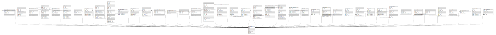

# public.tenant

## Description

@omit create,delete  
@simpleCollections only

## Columns

| Name | Type | Default | Nullable | Children | Parents | Comment |
| ---- | ---- | ------- | -------- | -------- | ------- | ------- |
| id | bigint |  | false | [public.event_lesson_demand](public.event_lesson_demand.md) [public.event_instance](public.event_instance.md) [public.event_registration](public.event_registration.md) [public.payment](public.payment.md) [public.transaction](public.transaction.md) [public.users](public.users.md) [public.account](public.account.md) [public.posting](public.posting.md) [public.upozorneni](public.upozorneni.md) [public.event](public.event.md) [public.event_target_cohort](public.event_target_cohort.md) [public.event_trainer](public.event_trainer.md) [public.cohort_subscription](public.cohort_subscription.md) [public.event_instance_trainer](public.event_instance_trainer.md) [public.payment_debtor](public.payment_debtor.md) [public.payment_recipient](public.payment_recipient.md) [public.event_attendance](public.event_attendance.md) [public.membership_application](public.membership_application.md) [public.tenant_membership](public.tenant_membership.md) [app_private.skupiny](app_private.skupiny.md) [public.accounting_period](public.accounting_period.md) [public.aktuality](public.aktuality.md) [public.tenant_administrator](public.tenant_administrator.md) [public.tenant_trainer](public.tenant_trainer.md) [public.cohort_membership](public.cohort_membership.md) [public.cohort](public.cohort.md) [public.cohort_group](public.cohort_group.md) [public.dokumenty](public.dokumenty.md) [public.form_responses](public.form_responses.md) [public.galerie_dir](public.galerie_dir.md) [public.galerie_foto](public.galerie_foto.md) [public.otp_token](public.otp_token.md) [public.person_invitation](public.person_invitation.md) [public.platby_category](public.platby_category.md) [public.platby_category_group](public.platby_category_group.md) [public.platby_group](public.platby_group.md) [public.platby_group_skupina](public.platby_group_skupina.md) [public.platby_item](public.platby_item.md) [public.platby_raw](public.platby_raw.md) [public.tenant_attachment](public.tenant_attachment.md) [public.tenant_location](public.tenant_location.md) [public.upozorneni_skupiny](public.upozorneni_skupiny.md) |  |  |
| name | text |  | false |  |  |  |
| origins | text[] | ARRAY[]::text[] | false |  |  |  |
| cz_ico | text | ''::text | false |  |  |  |
| cz_dic | text | ''::text | false |  |  |  |
| address | address_domain |  | true |  |  |  |
| description | text | ''::text | false |  |  |  |
| bank_account | text | ''::text | false |  |  |  |

## Constraints

| Name | Type | Definition |
| ---- | ---- | ---------- |
| tenant_pkey | PRIMARY KEY | PRIMARY KEY (id) |

## Indexes

| Name | Definition |
| ---- | ---------- |
| tenant_pkey | CREATE UNIQUE INDEX tenant_pkey ON public.tenant USING btree (id) |

## Relations

---

> Generated by [tbls](https://github.com/k1LoW/tbls)
