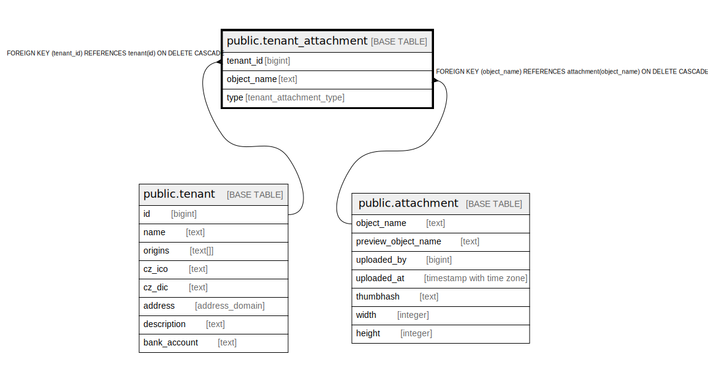

# public.tenant_attachment

## Description

@omit create,update,delete

## Columns

| Name | Type | Default | Nullable | Children | Parents | Comment |
| ---- | ---- | ------- | -------- | -------- | ------- | ------- |
| tenant_id | bigint |  | false |  | [public.tenant](public.tenant.md) |  |
| object_name | text |  | false |  | [public.attachment](public.attachment.md) |  |
| type | tenant_attachment_type |  | true |  |  |  |

## Constraints

| Name | Type | Definition |
| ---- | ---- | ---------- |
| tenant_attachment_object_name_fkey | FOREIGN KEY | FOREIGN KEY (object_name) REFERENCES attachment(object_name) ON DELETE CASCADE |
| tenant_attachment_pkey | PRIMARY KEY | PRIMARY KEY (tenant_id, object_name) |
| tenant_attachment_tenant_id_fkey | FOREIGN KEY | FOREIGN KEY (tenant_id) REFERENCES tenant(id) ON DELETE CASCADE |

## Indexes

| Name | Definition |
| ---- | ---------- |
| tenant_attachment_pkey | CREATE UNIQUE INDEX tenant_attachment_pkey ON public.tenant_attachment USING btree (tenant_id, object_name) |
| tenant_attachment_object_name_idx | CREATE INDEX tenant_attachment_object_name_idx ON public.tenant_attachment USING btree (object_name) |

## Relations

---

> Generated by [tbls](https://github.com/k1LoW/tbls)
