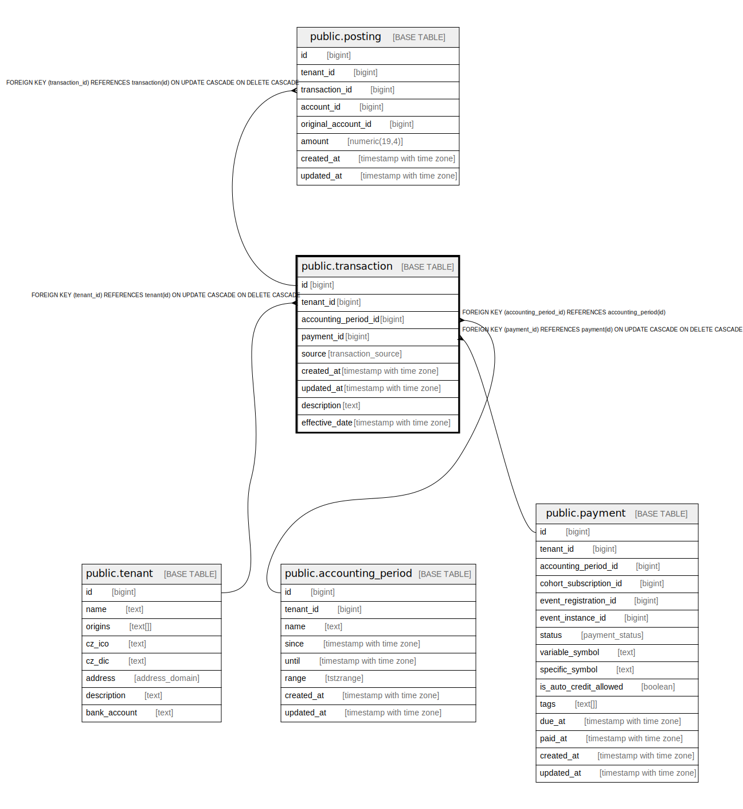

# public.transaction

## Description

@omit create,update,delete

## Columns

| Name | Type | Default | Nullable | Children | Parents | Comment |
| ---- | ---- | ------- | -------- | -------- | ------- | ------- |
| id | bigint |  | false | [public.posting](public.posting.md) |  |  |
| tenant_id | bigint | current_tenant_id() | false |  | [public.tenant](public.tenant.md) |  |
| accounting_period_id | bigint |  | false |  | [public.accounting_period](public.accounting_period.md) |  |
| payment_id | bigint |  | true |  | [public.payment](public.payment.md) |  |
| source | transaction_source |  | false |  |  |  |
| created_at | timestamp with time zone | now() | false |  |  |  |
| updated_at | timestamp with time zone | now() | false |  |  |  |
| description | text |  | true |  |  |  |
| effective_date | timestamp with time zone |  | false |  |  |  |

## Constraints

| Name | Type | Definition |
| ---- | ---- | ---------- |
| transaction_accounting_period_id_fkey | FOREIGN KEY | FOREIGN KEY (accounting_period_id) REFERENCES accounting_period(id) |
| transaction_payment_id_fkey | FOREIGN KEY | FOREIGN KEY (payment_id) REFERENCES payment(id) ON UPDATE CASCADE ON DELETE CASCADE |
| transaction_tenant_id_fkey | FOREIGN KEY | FOREIGN KEY (tenant_id) REFERENCES tenant(id) ON UPDATE CASCADE ON DELETE CASCADE |
| transaction_pkey | PRIMARY KEY | PRIMARY KEY (id) |

## Indexes

| Name | Definition |
| ---- | ---------- |
| transaction_pkey | CREATE UNIQUE INDEX transaction_pkey ON public.transaction USING btree (id) |

## Triggers

| Name | Definition |
| ---- | ---------- |
| _100_timestamps | CREATE TRIGGER _100_timestamps BEFORE INSERT OR UPDATE ON public.transaction FOR EACH ROW EXECUTE FUNCTION app_private.tg__timestamps() |
| _200_fill_accounting_period | CREATE TRIGGER _200_fill_accounting_period BEFORE INSERT ON public.transaction FOR EACH ROW EXECUTE FUNCTION app_private.tg_payment__fill_accounting_period() |
| _300_effective_date | CREATE TRIGGER _300_effective_date BEFORE INSERT OR UPDATE ON public.transaction FOR EACH ROW EXECUTE FUNCTION app_private.tg_transaction__effective_date() |

## Relations

---

> Generated by [tbls](https://github.com/k1LoW/tbls)
