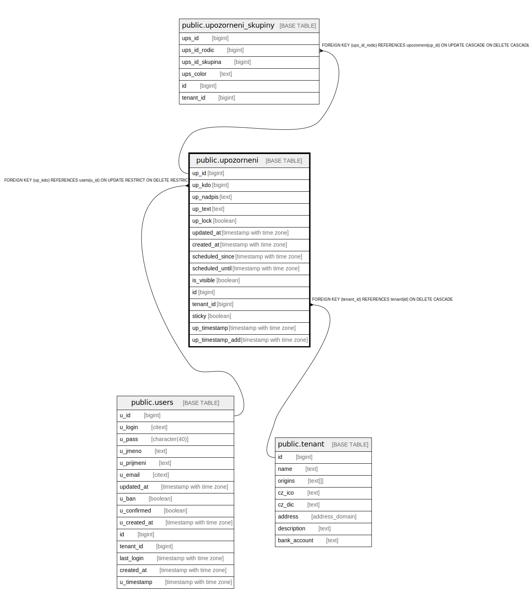

# public.upozorneni

## Description

## Columns

| Name | Type | Default | Nullable | Extra Definition | Children | Parents | Comment |
| ---- | ---- | ------- | -------- | ---------------- | -------- | ------- | ------- |
| up_id | bigint | nextval('upozorneni_up_id_seq'::regclass) | false |  | [public.upozorneni_skupiny](public.upozorneni_skupiny.md) |  |  |
| up_kdo | bigint |  | true |  |  | [public.users](public.users.md) |  |
| up_nadpis | text |  | false |  |  |  |  |
| up_text | text |  | false |  |  |  |  |
| up_lock | boolean | false | false |  |  |  |  |
| updated_at | timestamp with time zone |  | true |  |  |  |  |
| created_at | timestamp with time zone | CURRENT_TIMESTAMP | false |  |  |  |  |
| scheduled_since | timestamp with time zone |  | true |  |  |  |  |
| scheduled_until | timestamp with time zone |  | true |  |  |  |  |
| is_visible | boolean | true | true |  |  |  |  |
| id | bigint |  | false | GENERATED ALWAYS AS up_id STORED |  |  |  |
| tenant_id | bigint | current_tenant_id() | false |  |  | [public.tenant](public.tenant.md) |  |
| sticky | boolean | false | false |  |  |  |  |
| up_timestamp | timestamp with time zone |  | false | GENERATED ALWAYS AS updated_at STORED |  |  |  |
| up_timestamp_add | timestamp with time zone |  | false | GENERATED ALWAYS AS created_at STORED |  |  |  |

## Constraints

| Name | Type | Definition |
| ---- | ---- | ---------- |
| idx_24765_primary | PRIMARY KEY | PRIMARY KEY (up_id) |
| upozorneni_up_kdo_fkey | FOREIGN KEY | FOREIGN KEY (up_kdo) REFERENCES users(u_id) ON UPDATE RESTRICT ON DELETE RESTRICT |
| upozorneni_tenant_id_fkey | FOREIGN KEY | FOREIGN KEY (tenant_id) REFERENCES tenant(id) ON DELETE CASCADE |
| upozorneni_unique_id | UNIQUE | UNIQUE (id) |

## Indexes

| Name | Definition |
| ---- | ---------- |
| idx_24765_primary | CREATE UNIQUE INDEX idx_24765_primary ON public.upozorneni USING btree (up_id) |
| upozorneni_unique_id | CREATE UNIQUE INDEX upozorneni_unique_id ON public.upozorneni USING btree (id) |
| idx_24765_up_kdo | CREATE INDEX idx_24765_up_kdo ON public.upozorneni USING btree (up_kdo) |
| idx_24765_up_timestamp_add | CREATE INDEX idx_24765_up_timestamp_add ON public.upozorneni USING btree (created_at) |
| idx_up_tenant | CREATE INDEX idx_up_tenant ON public.upozorneni USING btree (tenant_id) |

## Triggers

| Name | Definition |
| ---- | ---------- |
| _100_timestamps | CREATE TRIGGER _100_timestamps BEFORE INSERT OR UPDATE ON public.upozorneni FOR EACH ROW EXECUTE FUNCTION app_private.tg__timestamps() |
| on_update_author_upozorneni | CREATE TRIGGER on_update_author_upozorneni BEFORE INSERT OR UPDATE ON public.upozorneni FOR EACH ROW EXECUTE FUNCTION on_update_author_upozorneni() |

## Relations

---

> Generated by [tbls](https://github.com/k1LoW/tbls)
