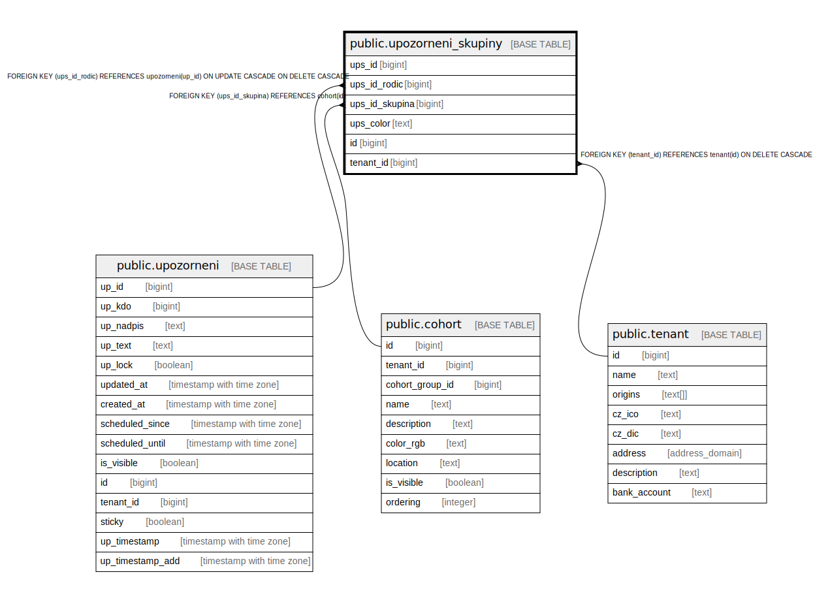

# public.upozorneni_skupiny

## Description

@omit create,update,delete

## Columns

| Name | Type | Default | Nullable | Extra Definition | Children | Parents | Comment |
| ---- | ---- | ------- | -------- | ---------------- | -------- | ------- | ------- |
| ups_id | bigint | nextval('upozorneni_skupiny_ups_id_seq'::regclass) | false |  |  |  |  |
| ups_id_rodic | bigint |  | false |  |  | [public.upozorneni](public.upozorneni.md) |  |
| ups_id_skupina | bigint |  | false |  |  | [public.cohort](public.cohort.md) |  |
| ups_color | text |  | false |  |  |  |  |
| id | bigint |  | false | GENERATED ALWAYS AS ups_id STORED |  |  |  |
| tenant_id | bigint | current_tenant_id() | false |  |  | [public.tenant](public.tenant.md) |  |

## Constraints

| Name | Type | Definition |
| ---- | ---- | ---------- |
| upozorneni_skupiny_ups_id_skupina_fkey | FOREIGN KEY | FOREIGN KEY (ups_id_skupina) REFERENCES cohort(id) |
| upozorneni_skupiny_ups_id_rodic_fkey | FOREIGN KEY | FOREIGN KEY (ups_id_rodic) REFERENCES upozorneni(up_id) ON UPDATE CASCADE ON DELETE CASCADE |
| idx_24777_primary | PRIMARY KEY | PRIMARY KEY (ups_id) |
| upozorneni_skupiny_tenant_id_fkey | FOREIGN KEY | FOREIGN KEY (tenant_id) REFERENCES tenant(id) ON DELETE CASCADE |
| upozorneni_skupiny_unique_id | UNIQUE | UNIQUE (id) |

## Indexes

| Name | Definition |
| ---- | ---------- |
| idx_24777_primary | CREATE UNIQUE INDEX idx_24777_primary ON public.upozorneni_skupiny USING btree (ups_id) |
| upozorneni_skupiny_unique_id | CREATE UNIQUE INDEX upozorneni_skupiny_unique_id ON public.upozorneni_skupiny USING btree (id) |
| idx_24777_upozorneni_skupiny_ups_id_rodic_fkey | CREATE INDEX idx_24777_upozorneni_skupiny_ups_id_rodic_fkey ON public.upozorneni_skupiny USING btree (ups_id_rodic) |
| idx_ups_tenant | CREATE INDEX idx_ups_tenant ON public.upozorneni_skupiny USING btree (tenant_id) |

## Relations

---

> Generated by [tbls](https://github.com/k1LoW/tbls)
