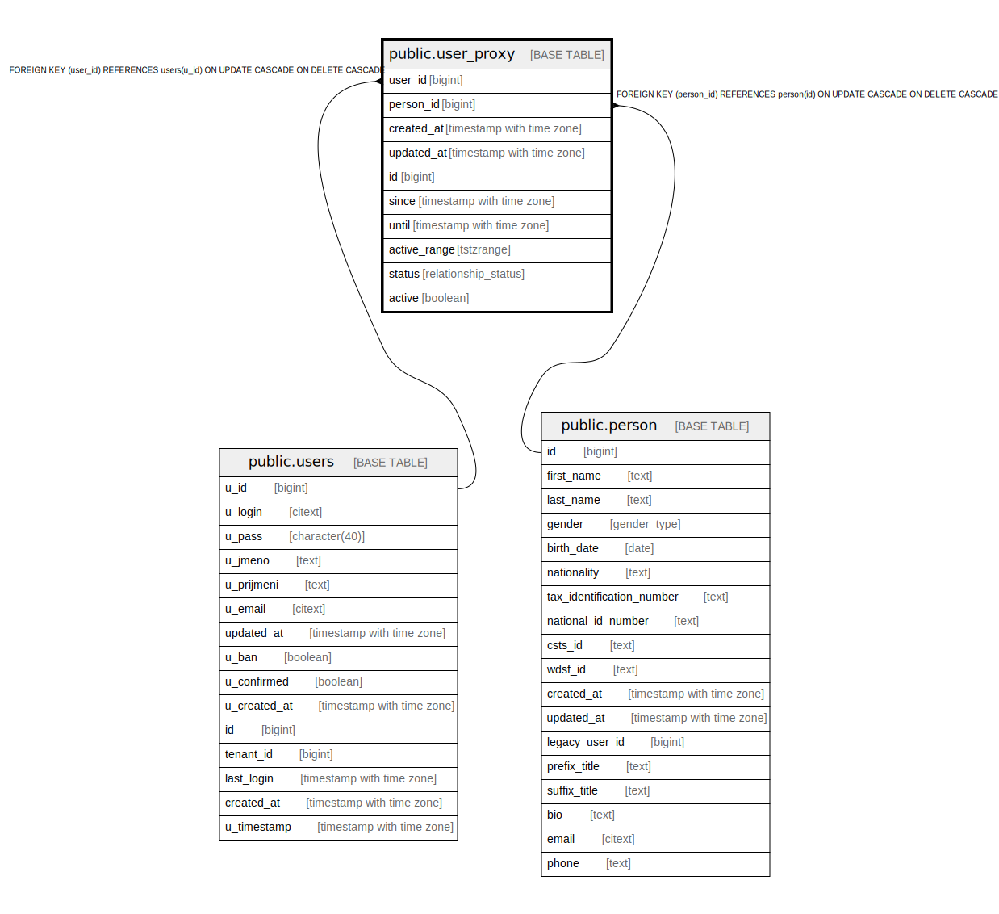

# public.user_proxy

## Description

@simpleCollections only

## Columns

| Name | Type | Default | Nullable | Extra Definition | Children | Parents | Comment |
| ---- | ---- | ------- | -------- | ---------------- | -------- | ------- | ------- |
| user_id | bigint |  | false |  |  | [public.users](public.users.md) |  |
| person_id | bigint |  | false |  |  | [public.person](public.person.md) |  |
| created_at | timestamp with time zone | now() | false |  |  |  |  |
| updated_at | timestamp with time zone | now() | false |  |  |  |  |
| id | bigint |  | false |  |  |  |  |
| since | timestamp with time zone |  | true |  |  |  |  |
| until | timestamp with time zone |  | true |  |  |  |  |
| active_range | tstzrange |  | false | GENERATED ALWAYS AS tstzrange(since, until, '[]'::text) STORED |  |  | @omit |
| status | relationship_status | 'active'::relationship_status | false |  |  |  |  |
| active | boolean |  | false | GENERATED ALWAYS AS (status = 'active'::relationship_status) STORED |  |  |  |

## Constraints

| Name | Type | Definition |
| ---- | ---- | ---------- |
| user_proxy_user_id_fkey | FOREIGN KEY | FOREIGN KEY (user_id) REFERENCES users(u_id) ON UPDATE CASCADE ON DELETE CASCADE |
| user_proxy_person_id_fkey | FOREIGN KEY | FOREIGN KEY (person_id) REFERENCES person(id) ON UPDATE CASCADE ON DELETE CASCADE |
| user_proxy_pkey | PRIMARY KEY | PRIMARY KEY (id) |

## Indexes

| Name | Definition |
| ---- | ---------- |
| user_proxy_pkey | CREATE UNIQUE INDEX user_proxy_pkey ON public.user_proxy USING btree (id) |
| user_proxy_person_id_idx | CREATE INDEX user_proxy_person_id_idx ON public.user_proxy USING btree (person_id) |
| user_proxy_range_idx | CREATE INDEX user_proxy_range_idx ON public.user_proxy USING gist (active_range, person_id, user_id) |
| user_proxy_user_id_idx | CREATE INDEX user_proxy_user_id_idx ON public.user_proxy USING btree (user_id) |

## Triggers

| Name | Definition |
| ---- | ---------- |
| _100_timestamps | CREATE TRIGGER _100_timestamps BEFORE INSERT OR UPDATE ON public.user_proxy FOR EACH ROW EXECUTE FUNCTION app_private.tg__timestamps() |

## Relations

---

> Generated by [tbls](https://github.com/k1LoW/tbls)
