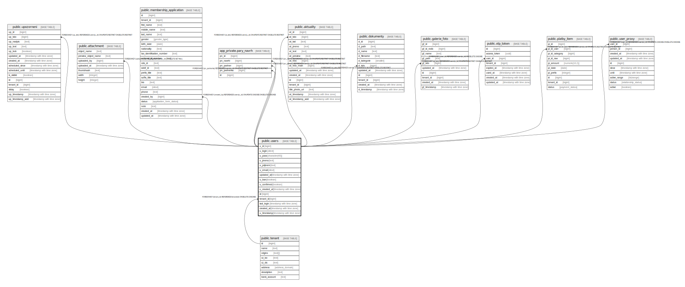

# public.users

## Description

@omit create,update,delete

## Columns

| Name | Type | Default | Nullable | Extra Definition | Children | Parents | Comment |
| ---- | ---- | ------- | -------- | ---------------- | -------- | ------- | ------- |
| u_id | bigint | nextval('users_u_id_seq'::regclass) | false |  | [public.upozorneni](public.upozorneni.md) [public.attachment](public.attachment.md) [public.membership_application](public.membership_application.md) [app_private.pary_navrh](app_private.pary_navrh.md) [public.aktuality](public.aktuality.md) [public.dokumenty](public.dokumenty.md) [public.galerie_foto](public.galerie_foto.md) [public.otp_token](public.otp_token.md) [public.platby_item](public.platby_item.md) [public.user_proxy](public.user_proxy.md) |  |  |
| u_login | citext |  | false |  |  |  |  |
| u_pass | character(40) |  | false |  |  |  | @omit |
| u_jmeno | text |  | true |  |  |  |  |
| u_prijmeni | text |  | true |  |  |  |  |
| u_email | citext |  | false |  |  |  |  |
| updated_at | timestamp with time zone | now() | false |  |  |  |  |
| u_ban | boolean | true | false |  |  |  | @omit |
| u_confirmed | boolean | false | false |  |  |  | @omit |
| u_created_at | timestamp with time zone | CURRENT_TIMESTAMP | false |  |  |  |  |
| id | bigint |  | false | GENERATED ALWAYS AS u_id STORED |  |  |  |
| tenant_id | bigint | current_tenant_id() | false |  |  | [public.tenant](public.tenant.md) |  |
| last_login | timestamp with time zone |  | true |  |  |  |  |
| created_at | timestamp with time zone | CURRENT_TIMESTAMP | true |  |  |  |  |
| u_timestamp | timestamp with time zone |  | true | GENERATED ALWAYS AS updated_at STORED |  |  |  |

## Constraints

| Name | Type | Definition |
| ---- | ---- | ---------- |
| idx_24786_primary | PRIMARY KEY | PRIMARY KEY (u_id) |
| users_tenant_id_fkey | FOREIGN KEY | FOREIGN KEY (tenant_id) REFERENCES tenant(id) ON DELETE CASCADE |
| users_unique_id | UNIQUE | UNIQUE (id) |

## Indexes

| Name | Definition |
| ---- | ---------- |
| idx_24786_primary | CREATE UNIQUE INDEX idx_24786_primary ON public.users USING btree (u_id) |
| users_unique_id | CREATE UNIQUE INDEX users_unique_id ON public.users USING btree (id) |
| u_ban | CREATE INDEX u_ban ON public.users USING btree (u_ban) |
| u_confirmed | CREATE INDEX u_confirmed ON public.users USING btree (u_confirmed) |
| u_jmeno | CREATE INDEX u_jmeno ON public.users USING btree (u_jmeno) |
| u_prijmeni | CREATE INDEX u_prijmeni ON public.users USING btree (u_prijmeni) |
| users_email_key | CREATE UNIQUE INDEX users_email_key ON public.users USING btree (u_email) WHERE (u_id <> ALL (ARRAY[(916)::bigint, (914)::bigint, (915)::bigint, (587)::bigint, (765)::bigint, (696)::bigint, (786)::bigint, (259)::bigint, (306)::bigint, (540)::bigint, (443)::bigint, (1042)::bigint, (585)::bigint, (825)::bigint, (413)::bigint, (428)::bigint, (985)::bigint, (935)::bigint, (218)::bigint, (581)::bigint, (827)::bigint, (826)::bigint, (165)::bigint, (207)::bigint, (232)::bigint, (945)::bigint, (990)::bigint, (1039)::bigint, (1040)::bigint, (606)::bigint, (607)::bigint, (896)::bigint, (975)::bigint, (496)::bigint, (511)::bigint, (898)::bigint, (920)::bigint, (970)::bigint, (724)::bigint, (725)::bigint, (958)::bigint, (542)::bigint, (543)::bigint, (886)::bigint, (223)::bigint, (348)::bigint, (23)::bigint, (973)::bigint, (128)::bigint, (988)::bigint, (517)::bigint, (978)::bigint, (928)::bigint, (930)::bigint, (968)::bigint, (939)::bigint, (951)::bigint, (950)::bigint, (808)::bigint, (723)::bigint, (557)::bigint, (1013)::bigint, (1014)::bigint, (1015)::bigint, (820)::bigint, (841)::bigint, (599)::bigint, (681)::bigint, (31)::bigint, (40)::bigint, (120)::bigint, (360)::bigint, (417)::bigint, (419)::bigint, (545)::bigint, (39)::bigint, (643)::bigint, (670)::bigint, (782)::bigint, (790)::bigint, (668)::bigint, (894)::bigint, (922)::bigint, (925)::bigint, (803)::bigint, (812)::bigint, (153)::bigint, (602)::bigint, (198)::bigint, (239)::bigint, (397)::bigint, (686)::bigint, (846)::bigint, (537)::bigint, (893)::bigint, (974)::bigint, (993)::bigint, (755)::bigint, (805)::bigint, (337)::bigint, (155)::bigint, (629)::bigint, (630)::bigint, (554)::bigint, (994)::bigint, (661)::bigint, (891)::bigint, (434)::bigint, (436)::bigint, (640)::bigint, (829)::bigint, (683)::bigint, (505)::bigint, (1)::bigint, (648)::bigint, (649)::bigint, (677)::bigint, (4)::bigint, (162)::bigint, (17)::bigint, (565)::bigint, (700)::bigint, (701)::bigint, (952)::bigint, (999)::bigint, (1003)::bigint, (1006)::bigint, (346)::bigint, (576)::bigint, (986)::bigint, (582)::bigint, (315)::bigint, (753)::bigint, (76)::bigint, (93)::bigint, (316)::bigint, (359)::bigint, (370)::bigint, (508)::bigint, (506)::bigint, (509)::bigint, (510)::bigint, (754)::bigint, (811)::bigint, (430)::bigint, (654)::bigint, (598)::bigint, (612)::bigint, (698)::bigint, (923)::bigint, (943)::bigint, (971)::bigint, (679)::bigint, (798)::bigint, (799)::bigint])) |
| users_login_key | CREATE UNIQUE INDEX users_login_key ON public.users USING btree (u_login) WHERE (u_id <> ALL (ARRAY[(1050)::bigint, (533)::bigint, (882)::bigint, (1075)::bigint, (489)::bigint, (82)::bigint, (1138)::bigint, (689)::bigint, (45)::bigint, (433)::bigint, (13)::bigint, (142)::bigint, (223)::bigint, (1046)::bigint, (498)::bigint, (1106)::bigint, (105)::bigint, (130)::bigint])) |

## Triggers

| Name | Definition |
| ---- | ---------- |
| _100_timestamps | CREATE TRIGGER _100_timestamps BEFORE INSERT OR UPDATE ON public.users FOR EACH ROW EXECUTE FUNCTION app_private.tg__timestamps() |
| _200_encrypt_password | CREATE TRIGGER _200_encrypt_password BEFORE INSERT OR UPDATE ON public.users FOR EACH ROW EXECUTE FUNCTION app_private.tg_users__encrypt_password() |
| _300_trim_login | CREATE TRIGGER _300_trim_login BEFORE INSERT OR UPDATE ON public.users FOR EACH ROW EXECUTE FUNCTION app_private.tg_users__trim_login() |

## Relations

---

> Generated by [tbls](https://github.com/k1LoW/tbls)
