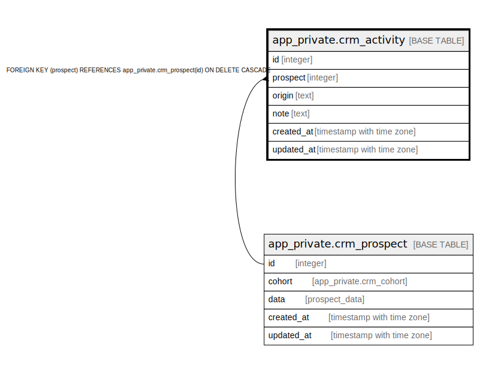

# app_private.crm_activity

## Description

@omit delete

## Columns

| Name | Type | Default | Nullable | Children | Parents | Comment |
| ---- | ---- | ------- | -------- | -------- | ------- | ------- |
| id | integer | nextval('app_private.crm_activity_id_seq'::regclass) | false |  |  |  |
| prospect | integer |  | true |  | [app_private.crm_prospect](app_private.crm_prospect.md) |  |
| origin | text |  | false |  |  |  |
| note | text |  | true |  |  |  |
| created_at | timestamp with time zone | now() | false |  |  |  |
| updated_at | timestamp with time zone | now() | false |  |  |  |

## Constraints

| Name | Type | Definition |
| ---- | ---- | ---------- |
| crm_activity_pkey | PRIMARY KEY | PRIMARY KEY (id) |
| crm_activity_prospect_fkey | FOREIGN KEY | FOREIGN KEY (prospect) REFERENCES app_private.crm_prospect(id) ON DELETE CASCADE |

## Indexes

| Name | Definition |
| ---- | ---------- |
| crm_activity_pkey | CREATE UNIQUE INDEX crm_activity_pkey ON app_private.crm_activity USING btree (id) |

## Triggers

| Name | Definition |
| ---- | ---------- |
| _100_timestamps | CREATE TRIGGER _100_timestamps BEFORE INSERT OR UPDATE ON app_private.crm_activity FOR EACH ROW EXECUTE FUNCTION app_private.tg__timestamps() |

## Relations

---

> Generated by [tbls](https://github.com/k1LoW/tbls)
