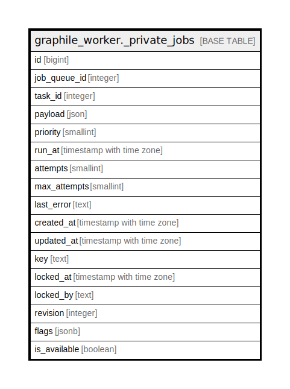

# graphile_worker._private_jobs

## Description

## Columns

| Name | Type | Default | Nullable | Extra Definition | Children | Parents | Comment |
| ---- | ---- | ------- | -------- | ---------------- | -------- | ------- | ------- |
| id | bigint |  | false |  |  |  |  |
| job_queue_id | integer |  | true |  |  |  |  |
| task_id | integer |  | false |  |  |  |  |
| payload | json | '{}'::json | false |  |  |  |  |
| priority | smallint | 0 | false |  |  |  |  |
| run_at | timestamp with time zone | now() | false |  |  |  |  |
| attempts | smallint | 0 | false |  |  |  |  |
| max_attempts | smallint | 25 | false |  |  |  |  |
| last_error | text |  | true |  |  |  |  |
| created_at | timestamp with time zone | now() | false |  |  |  |  |
| updated_at | timestamp with time zone | now() | false |  |  |  |  |
| key | text |  | true |  |  |  |  |
| locked_at | timestamp with time zone |  | true |  |  |  |  |
| locked_by | text |  | true |  |  |  |  |
| revision | integer | 0 | false |  |  |  |  |
| flags | jsonb |  | true |  |  |  |  |
| is_available | boolean |  | false | GENERATED ALWAYS AS ((locked_at IS NULL) AND (attempts < max_attempts)) STORED |  |  |  |

## Constraints

| Name | Type | Definition |
| ---- | ---- | ---------- |
| jobs_key_check | CHECK | CHECK (((length(key) > 0) AND (length(key) <= 512))) |
| jobs_max_attempts_check | CHECK | CHECK ((max_attempts >= 1)) |
| jobs_key_key1 | UNIQUE | UNIQUE (key) |
| jobs_pkey1 | PRIMARY KEY | PRIMARY KEY (id) |

## Indexes

| Name | Definition |
| ---- | ---------- |
| jobs_key_key1 | CREATE UNIQUE INDEX jobs_key_key1 ON graphile_worker._private_jobs USING btree (key) |
| jobs_pkey1 | CREATE UNIQUE INDEX jobs_pkey1 ON graphile_worker._private_jobs USING btree (id) |
| jobs_main_index | CREATE INDEX jobs_main_index ON graphile_worker._private_jobs USING btree (priority, run_at) INCLUDE (id, task_id, job_queue_id) WHERE (is_available = true) |
| jobs_no_queue_index | CREATE INDEX jobs_no_queue_index ON graphile_worker._private_jobs USING btree (priority, run_at) INCLUDE (id, task_id) WHERE ((is_available = true) AND (job_queue_id IS NULL)) |

## Relations

---

> Generated by [tbls](https://github.com/k1LoW/tbls)
