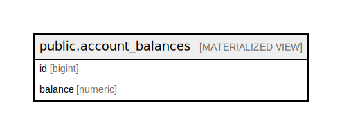

# public.account_balances

## Description

@omit

<details>
<summary><strong>Table Definition</strong></summary>

```sql
CREATE MATERIALIZED VIEW account_balances AS (
 SELECT account.id,
    (COALESCE(account.opening_balance, 0.0) + COALESCE(sum(posting.amount), 0.0)) AS balance
   FROM (account
     LEFT JOIN posting ON ((account.id = posting.account_id)))
  GROUP BY account.id
)
```

</details>

## Columns

| Name | Type | Default | Nullable | Children | Parents | Comment |
| ---- | ---- | ------- | -------- | -------- | ------- | ------- |
| id | bigint |  | true |  |  |  |
| balance | numeric |  | true |  |  |  |

## Referenced Tables

| Name | Columns | Comment | Type |
| ---- | ------- | ------- | ---- |
| [public.account](public.account.md) | 7 | @omit create,update,delete<br>@simpleCollections only | BASE TABLE |
| [public.posting](public.posting.md) | 8 | @omit create,update,delete<br>@simpleCollections only | BASE TABLE |

## Indexes

| Name | Definition |
| ---- | ---------- |
| account_balances_id_idx | CREATE UNIQUE INDEX account_balances_id_idx ON public.account_balances USING btree (id) |

## Relations



---

> Generated by [tbls](https://github.com/k1LoW/tbls)
