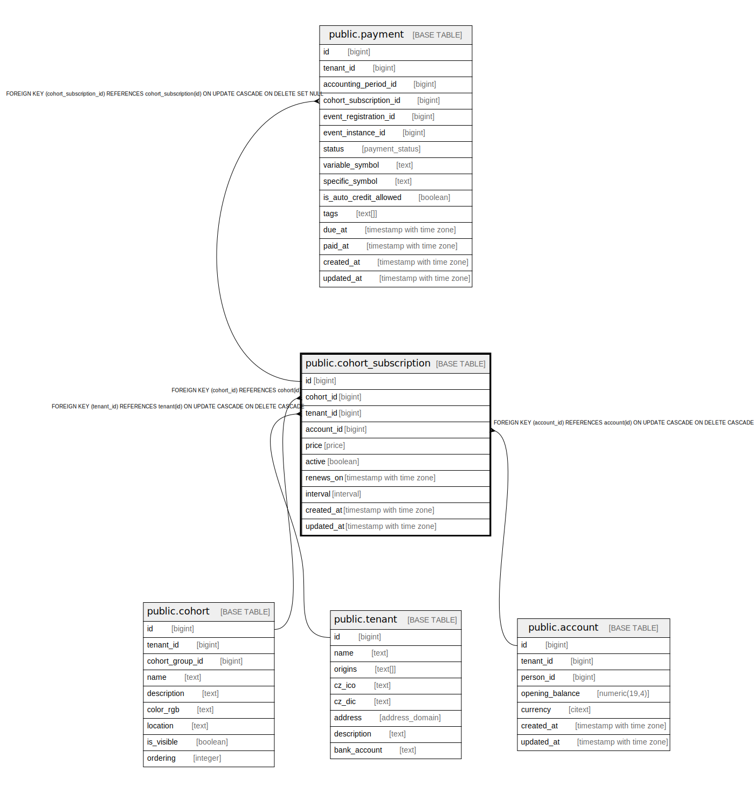

# public.cohort_subscription

## Description

@omit create,update,delete  
@simpleCollections only

## Columns

| Name | Type | Default | Nullable | Children | Parents | Comment |
| ---- | ---- | ------- | -------- | -------- | ------- | ------- |
| id | bigint |  | false | [public.payment](public.payment.md) |  |  |
| cohort_id | bigint |  | false |  | [public.cohort](public.cohort.md) |  |
| tenant_id | bigint | current_tenant_id() | false |  | [public.tenant](public.tenant.md) |  |
| account_id | bigint |  | false |  | [public.account](public.account.md) |  |
| price | price |  | false |  |  |  |
| active | boolean | true | false |  |  |  |
| renews_on | timestamp with time zone |  | true |  |  |  |
| interval | interval | '1 mon'::interval | false |  |  |  |
| created_at | timestamp with time zone | now() | false |  |  |  |
| updated_at | timestamp with time zone | now() | false |  |  |  |

## Constraints

| Name | Type | Definition |
| ---- | ---- | ---------- |
| cohort_subscription_account_id_fkey | FOREIGN KEY | FOREIGN KEY (account_id) REFERENCES account(id) ON UPDATE CASCADE ON DELETE CASCADE |
| cohort_subscription_cohort_id_fkey | FOREIGN KEY | FOREIGN KEY (cohort_id) REFERENCES cohort(id) |
| cohort_subscription_pkey | PRIMARY KEY | PRIMARY KEY (id) |
| cohort_subscription_tenant_id_fkey | FOREIGN KEY | FOREIGN KEY (tenant_id) REFERENCES tenant(id) ON UPDATE CASCADE ON DELETE CASCADE |

## Indexes

| Name | Definition |
| ---- | ---------- |
| cohort_subscription_pkey | CREATE UNIQUE INDEX cohort_subscription_pkey ON public.cohort_subscription USING btree (id) |

## Triggers

| Name | Definition |
| ---- | ---------- |
| _100_timestamps | CREATE TRIGGER _100_timestamps BEFORE INSERT OR UPDATE ON public.cohort_subscription FOR EACH ROW EXECUTE FUNCTION app_private.tg__timestamps() |

## Relations

---

> Generated by [tbls](https://github.com/k1LoW/tbls)
