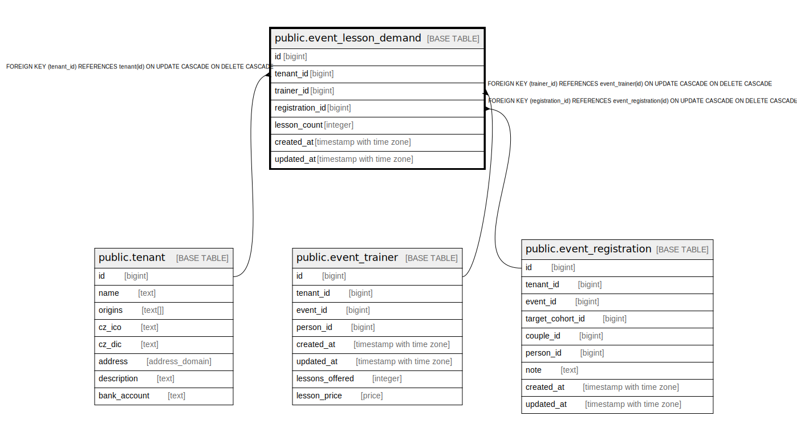

# public.event_lesson_demand

## Description

@omit create,update,delete  
@simpleCollections only

## Columns

| Name | Type | Default | Nullable | Children | Parents | Comment |
| ---- | ---- | ------- | -------- | -------- | ------- | ------- |
| id | bigint |  | false |  |  |  |
| tenant_id | bigint | current_tenant_id() | false |  | [public.tenant](public.tenant.md) |  |
| trainer_id | bigint |  | false |  | [public.event_trainer](public.event_trainer.md) |  |
| registration_id | bigint |  | false |  | [public.event_registration](public.event_registration.md) | @hasDefault |
| lesson_count | integer |  | false |  |  |  |
| created_at | timestamp with time zone | now() | false |  |  |  |
| updated_at | timestamp with time zone | now() | false |  |  |  |

## Constraints

| Name | Type | Definition |
| ---- | ---- | ---------- |
| event_lesson_demand_lesson_count_check | CHECK | CHECK ((lesson_count > 0)) |
| eld_unique_registration_trainer_key | UNIQUE | UNIQUE (registration_id, trainer_id) |
| event_lesson_demand_pkey | PRIMARY KEY | PRIMARY KEY (id) |
| event_lesson_demand_registration_id_fkey | FOREIGN KEY | FOREIGN KEY (registration_id) REFERENCES event_registration(id) ON UPDATE CASCADE ON DELETE CASCADE |
| event_lesson_demand_trainer_id_fkey | FOREIGN KEY | FOREIGN KEY (trainer_id) REFERENCES event_trainer(id) ON UPDATE CASCADE ON DELETE CASCADE |
| event_lesson_demand_tenant_id_fkey | FOREIGN KEY | FOREIGN KEY (tenant_id) REFERENCES tenant(id) ON UPDATE CASCADE ON DELETE CASCADE |

## Indexes

| Name | Definition |
| ---- | ---------- |
| eld_unique_registration_trainer_key | CREATE UNIQUE INDEX eld_unique_registration_trainer_key ON public.event_lesson_demand USING btree (registration_id, trainer_id) |
| event_lesson_demand_pkey | CREATE UNIQUE INDEX event_lesson_demand_pkey ON public.event_lesson_demand USING btree (id) |
| event_lesson_demand_trainer_id_idx | CREATE INDEX event_lesson_demand_trainer_id_idx ON public.event_lesson_demand USING btree (trainer_id) |
| event_lesson_demand_registration_id_idx | CREATE INDEX event_lesson_demand_registration_id_idx ON public.event_lesson_demand USING btree (registration_id) |

## Triggers

| Name | Definition |
| ---- | ---------- |
| _100_timestamps | CREATE TRIGGER _100_timestamps BEFORE INSERT OR UPDATE ON public.event_lesson_demand FOR EACH ROW EXECUTE FUNCTION app_private.tg__timestamps() |

## Relations

---

> Generated by [tbls](https://github.com/k1LoW/tbls)
