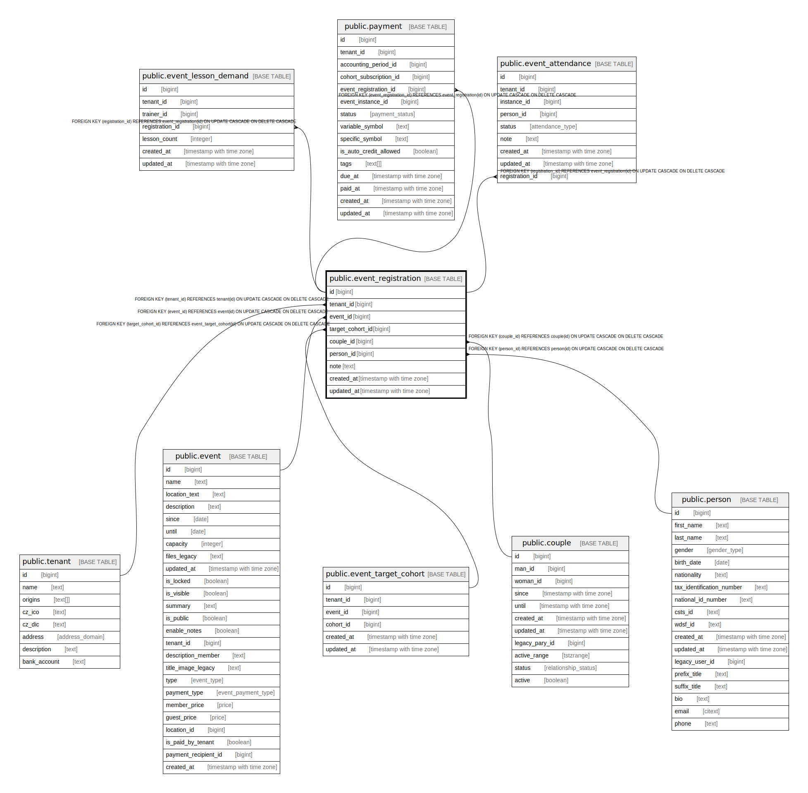

# public.event_registration

## Description

@omit update  
@simpleCollections both

## Columns

| Name | Type | Default | Nullable | Children | Parents | Comment |
| ---- | ---- | ------- | -------- | -------- | ------- | ------- |
| id | bigint |  | false | [public.event_lesson_demand](public.event_lesson_demand.md) [public.payment](public.payment.md) [public.event_attendance](public.event_attendance.md) |  |  |
| tenant_id | bigint | current_tenant_id() | false |  | [public.tenant](public.tenant.md) |  |
| event_id | bigint |  | false |  | [public.event](public.event.md) |  |
| target_cohort_id | bigint |  | true |  | [public.event_target_cohort](public.event_target_cohort.md) |  |
| couple_id | bigint |  | true |  | [public.couple](public.couple.md) |  |
| person_id | bigint |  | true |  | [public.person](public.person.md) |  |
| note | text |  | true |  |  |  |
| created_at | timestamp with time zone | now() | false |  |  |  |
| updated_at | timestamp with time zone | now() | false |  |  |  |

## Constraints

| Name | Type | Definition |
| ---- | ---- | ---------- |
| event_registration_check | CHECK | CHECK ((((couple_id IS NOT NULL) AND (person_id IS NULL)) OR ((couple_id IS NULL) AND (person_id IS NOT NULL)))) |
| event_registration_couple_id_fkey | FOREIGN KEY | FOREIGN KEY (couple_id) REFERENCES couple(id) ON UPDATE CASCADE ON DELETE CASCADE |
| event_registration_pkey | PRIMARY KEY | PRIMARY KEY (id) |
| event_registration_unique_event_person_couple_key | UNIQUE | UNIQUE NULLS NOT DISTINCT (event_id, person_id, couple_id) |
| event_registration_target_cohort_id_fkey | FOREIGN KEY | FOREIGN KEY (target_cohort_id) REFERENCES event_target_cohort(id) ON UPDATE CASCADE ON DELETE CASCADE |
| event_registration_event_id_fkey | FOREIGN KEY | FOREIGN KEY (event_id) REFERENCES event(id) ON UPDATE CASCADE ON DELETE CASCADE |
| event_registration_person_id_fkey | FOREIGN KEY | FOREIGN KEY (person_id) REFERENCES person(id) ON UPDATE CASCADE ON DELETE CASCADE |
| event_registration_tenant_id_fkey | FOREIGN KEY | FOREIGN KEY (tenant_id) REFERENCES tenant(id) ON UPDATE CASCADE ON DELETE CASCADE |

## Indexes

| Name | Definition |
| ---- | ---------- |
| event_registration_pkey | CREATE UNIQUE INDEX event_registration_pkey ON public.event_registration USING btree (id) |
| event_registration_unique_event_person_couple_key | CREATE UNIQUE INDEX event_registration_unique_event_person_couple_key ON public.event_registration USING btree (event_id, person_id, couple_id) NULLS NOT DISTINCT |
| event_registration_couple_id_idx | CREATE INDEX event_registration_couple_id_idx ON public.event_registration USING btree (couple_id) |
| event_registration_event_id_idx | CREATE INDEX event_registration_event_id_idx ON public.event_registration USING btree (event_id) |
| event_registration_person_id_idx | CREATE INDEX event_registration_person_id_idx ON public.event_registration USING btree (person_id) |
| event_registration_target_cohort_id_idx | CREATE INDEX event_registration_target_cohort_id_idx ON public.event_registration USING btree (target_cohort_id) |

## Triggers

| Name | Definition |
| ---- | ---------- |
| _100_timestamps | CREATE TRIGGER _100_timestamps BEFORE INSERT OR UPDATE ON public.event_registration FOR EACH ROW EXECUTE FUNCTION app_private.tg__timestamps() |
| _500_create_attendance | CREATE TRIGGER _500_create_attendance AFTER INSERT ON public.event_registration FOR EACH ROW EXECUTE FUNCTION app_private.tg_event_registration__create_attendance() |

## Relations

---

> Generated by [tbls](https://github.com/k1LoW/tbls)
