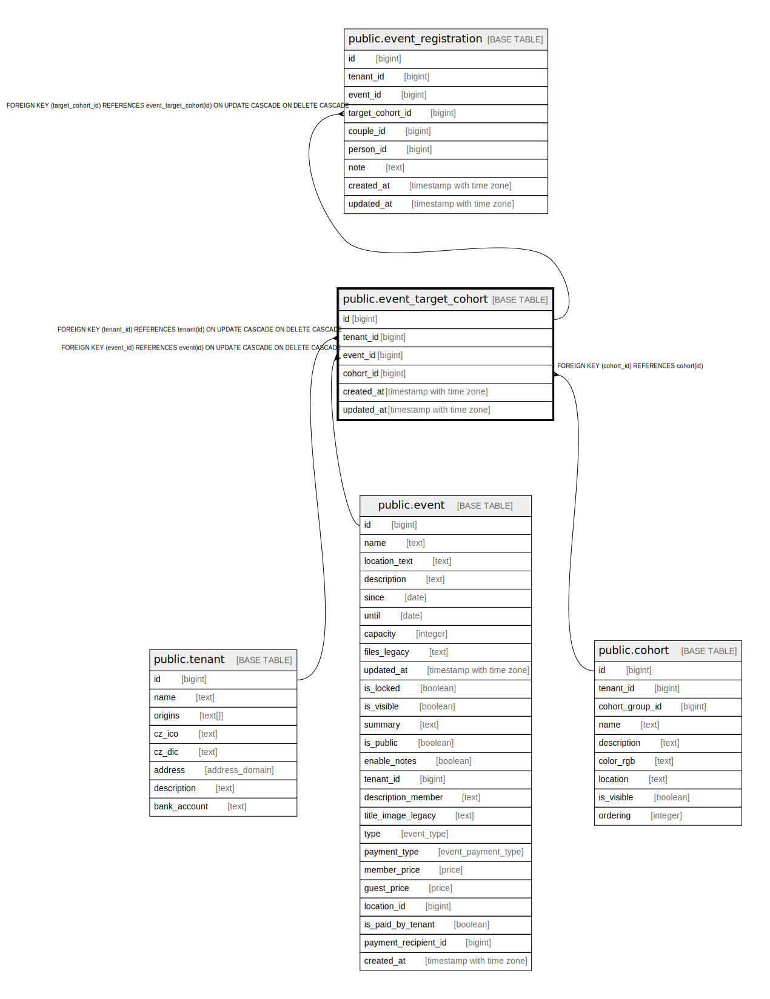

# public.event_target_cohort

## Description

@omit create,update,delete  
@simpleCollections only

## Columns

| Name | Type | Default | Nullable | Children | Parents | Comment |
| ---- | ---- | ------- | -------- | -------- | ------- | ------- |
| id | bigint |  | false | [public.event_registration](public.event_registration.md) |  |  |
| tenant_id | bigint | current_tenant_id() | false |  | [public.tenant](public.tenant.md) |  |
| event_id | bigint |  | false |  | [public.event](public.event.md) |  |
| cohort_id | bigint |  | false |  | [public.cohort](public.cohort.md) |  |
| created_at | timestamp with time zone | now() | false |  |  |  |
| updated_at | timestamp with time zone | now() | false |  |  |  |

## Constraints

| Name | Type | Definition |
| ---- | ---- | ---------- |
| event_target_cohort_cohort_id_fkey | FOREIGN KEY | FOREIGN KEY (cohort_id) REFERENCES cohort(id) |
| event_target_cohort_pkey | PRIMARY KEY | PRIMARY KEY (id) |
| event_target_cohort_event_id_fkey | FOREIGN KEY | FOREIGN KEY (event_id) REFERENCES event(id) ON UPDATE CASCADE ON DELETE CASCADE |
| event_target_cohort_tenant_id_fkey | FOREIGN KEY | FOREIGN KEY (tenant_id) REFERENCES tenant(id) ON UPDATE CASCADE ON DELETE CASCADE |

## Indexes

| Name | Definition |
| ---- | ---------- |
| event_target_cohort_pkey | CREATE UNIQUE INDEX event_target_cohort_pkey ON public.event_target_cohort USING btree (id) |
| event_target_cohort_cohort_id_idx | CREATE INDEX event_target_cohort_cohort_id_idx ON public.event_target_cohort USING btree (cohort_id) |
| event_target_cohort_event_id_idx | CREATE INDEX event_target_cohort_event_id_idx ON public.event_target_cohort USING btree (event_id) |

## Triggers

| Name | Definition |
| ---- | ---------- |
| _100_timestamps | CREATE TRIGGER _100_timestamps BEFORE INSERT OR UPDATE ON public.event_target_cohort FOR EACH ROW EXECUTE FUNCTION app_private.tg__timestamps() |
| _500_register_members | CREATE TRIGGER _500_register_members AFTER INSERT ON public.event_target_cohort FOR EACH ROW EXECUTE FUNCTION app_private.tg_event_target_cohort__register_members() |
| _500_unregister_members | CREATE TRIGGER _500_unregister_members AFTER DELETE ON public.event_target_cohort FOR EACH ROW EXECUTE FUNCTION app_private.tg_event_target_cohort__unregister_members() |

## Relations

---

> Generated by [tbls](https://github.com/k1LoW/tbls)
